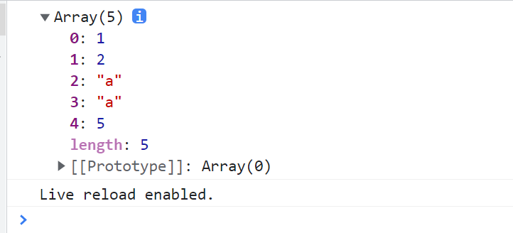

# Array.prototype.fill

## fill

作为 JavaScript 中数组的一个方法，`fill` 可以用指定的值填充数组中的元素。它具有以下含义：

**动词**：填满、充满、装满、堵塞、填补、满足、担任、耗去、吃饱、按订单供应。

**名词**：填满的量、足够的量、吃饱的量、喝足的量。

## 参数

`fill` 方法接受三个参数：填充值、开始下标和结束下标。

- **填充值**：用于填充数组的值。
- **开始下标**（可选）：开始填充的位置，默认为 0。如果为负数，则从数组末尾倒数计算。
- **结束下标**（可选）：结束填充的位置（不包含该位置），默认为数组长度。如果为负数，则从数组末尾倒数计算。

### 示例

```javascript
const arr = [1, 2, 3, 4, 5];
// 填充区间 [2,4)
const newArr = arr.fill('a', 2, 4);
console.log(newArr); // [1, 2, 'a', 'a', 5]

// newArr 返回的是原数组的引用
console.log(arr === newArr); // true

// 全部覆盖，使用默认参数
const newArrUn = arr.fill();
console.log(newArrUn); // [undefined, undefined, undefined, undefined, undefined]

// start 非数字，end 为数字 [0,4)
const arr1 = arr.fill('g', 'a', 4);
console.log(arr1); // ['g', 'g', 'g', 'g', undefined]

// 未定义 start 和 end，全部覆盖
const arr2 = arr.fill('g', undefined, undefined);
console.log(arr2); // ['g', 'g', 'g', 'g', 'g']
```



## 数组转类数组

在某些情况下，我们可能需要将数组转换为类数组对象。类数组对象具有数组的一些特性，如 `length` 属性和索引，但不具备数组的所有方法。以下是一个将数组转换为类数组对象的示例：

```javascript
function makeArrayLike(arr) {
  const arrLike = {
    length: arr.length,
    push: Array.prototype.push,
    splice: Array.prototype.splice,
  };

  arr.forEach((item, index) => {
    Array.prototype.fill.call(arrLike, item, index, index + 1);
  });

  return arrLike;
}

const newObj = makeArrayLike(['a', 'b', 'c', 'd', 'e', 'f']);

console.log(newObj);
// { '0': 'a', '1': 'b', '2': 'c', '3': 'd', '4': 'e', '5': 'f', length: 6, push: [Function: push], splice: [Function: splice] }
```

在上述代码中，我定义了一个 `makeArrayLike` 函数，它接收一个数组并返回一个类数组对象。通过使用 `Array.prototype.fill` 方法，我将数组的每个元素填充到类数组对象中对应的位置。

## 实现 fill

为了更好地理解 `fill` 方法的工作原理，以下是一个自定义实现 `fill` 方法的示例：

```javascript
Array.prototype.myFill = function (value, start, end) {
  // 设置填充值，如果未提供则为 undefined
  const fillValue = typeof value !== 'undefined' ? value : undefined;

  // 转换 this 对象为数组
  if (this == null) {
    throw new TypeError('Cannot convert undefined or null to object');
  }

  const obj = Object(this);
  const len = obj.length >>> 0;

  // 计算开始索引
  let startIndex = typeof start === 'undefined' ? 0 : Number(start);
  startIndex = isNaN(startIndex) ? 0 : startIndex < 0 ? Math.max(len + startIndex, 0) : Math.min(startIndex, len);

  // 计算结束索引
  let endIndex = typeof end === 'undefined' ? len : Number(end);
  endIndex = isNaN(endIndex) ? len : endIndex < 0 ? Math.max(len + endIndex, 0) : Math.min(endIndex, len);

  // 填充数组
  for (let i = startIndex; i < endIndex; i++) {
    obj[i] = fillValue;
  }

  return obj;
};

const arr = [1, 2, 3, 4, 5];
const newArr = arr.myFill('a', 2, 4);
console.log(newArr); // [1, 2, 'a', 'a', 5]
```

在这个实现中，我扩展了 `Array.prototype` 添加了一个 `myFill` 方法。该方法首先验证 `this` 是否为有效的数组对象，然后计算开始和结束索引，最后在指定范围内填充值。

通过这个示例，可以更深入地理解 `fill` 方法的内部工作机制，并了解如何在实际开发中自定义数组方法。
