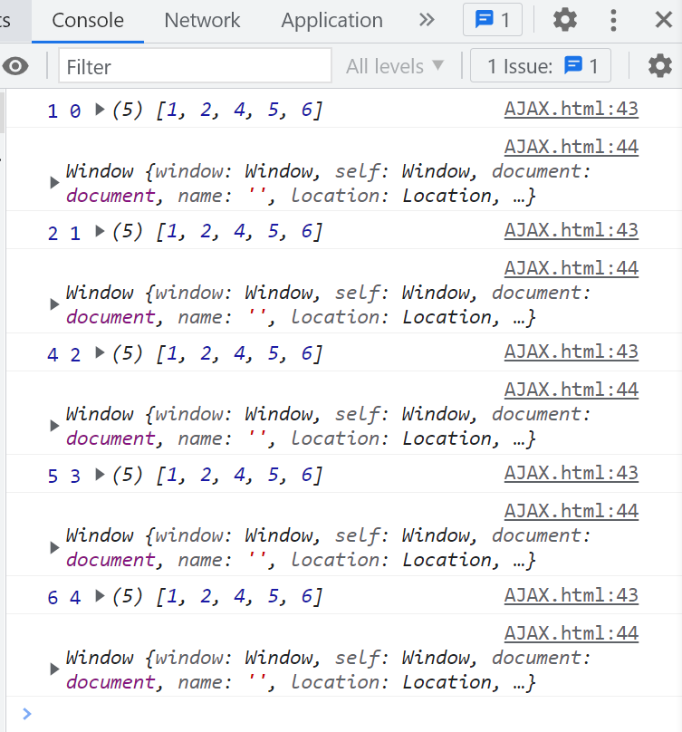
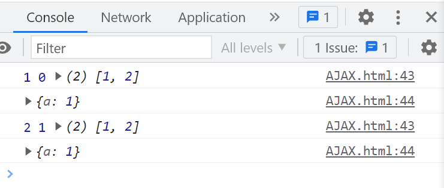

# Array.prototype.findIndex

## findIndex 方法

`findIndex` 方法返回数组中第一个满足提供的测试函数的元素的索引。否则返回 `-1`。

[Array.prototype.findIndex() - JavaScript | MDN](https://developer.mozilla.org/zh-CN/docs/Web/JavaScript/Reference/Global_Objects/Array/findIndex)

## 使用

`findIndex` 方法用于查找数组中第一个满足条件的元素的索引。如果数组为空，返回 `-1`。

```javascript
const numbers = [1, 2, 3, 4, 5];
const index = numbers.findIndex((item) => item > 2);
console.log(index); // 输出: 2
```

## 稀疏数组

`findIndex` 方法会遍历稀疏数组中的所有索引，包括空位，并将空位视为 `undefined`。

```javascript
const sparseArray = [, , , , , , , 2];
const index = sparseArray.findIndex(function (item) {
  console.log(item); // 输出: undefined*7, 2
  return item === 2;
});
// 2 的下标是 7
console.log(index); // 输出: 7
```

## 仅遍历有值的数组方法

以下数组方法不会遍历稀疏数组中的空位：

`some`、`every`、`forEach`、`map`、`filter`、`reduce`

## 参数

### 第一个参数

回调函数接收三个参数：

- 当前遍历的元素
- 当前元素的下标
- 源数组

回调函数的返回值为布尔值。当回调函数在某一次调用后返回 `true`，`findIndex` 方法将停止遍历并返回当前元素的下标。

```javascript
const numbers = [1, 2, 4, 5, 6];

const index = numbers.findIndex(function (item, index, array) {
  console.log(item, index, array);
  console.log(this);
});
```



### 第二个参数

1. 更改回调函数内部的 `this` 指向，使其指向第二个参数。
2. 在严格模式下，如果未提供第二个参数，`this` 为 `undefined`，与严格模式的规定保持一致。

```javascript
const numbers = [1, 2];

const index = numbers.findIndex(
  function (item, index, array) {
    console.log(item, index, array);
    console.log(this);
  },
  { a: 1 }
);
```



## findIndex 实现

以下是一个自定义实现 `findIndex` 方法的示例，命名为 `myFindIndex`。通过这个示例，可以更深入地理解 `findIndex` 方法的内部工作机制。

```javascript
Array.prototype.myFindIndex = function (callback, thisArg) {
  // 检查 this 是否为 null 或 undefined
  if (this == null) {
    throw new TypeError("'this' 为 null 或未定义");
  }

  // 检查回调函数是否为函数
  if (typeof callback !== 'function') {
    throw new TypeError('回调函数必须是函数类型');
  }

  const array = Object(this);
  const length = array.length >>> 0;
  const context = thisArg;

  for (let index = 0; index < length; index++) {
    const currentValue = array[index];
    if (callback.call(context, currentValue, index, array)) {
      return index;
    }
  }

  return -1;
};

// 测试
const numbers = [1, 2, 4, 5];
const index = numbers.myFindIndex(
  function (item, index, array) {
    console.log(this);
  },
  { a: 1 }
);
console.log(index); // 输出: -1
```

在这个实现中，我扩展了 `Array.prototype` 添加了一个 `myFindIndex` 方法。该方法首先验证 `this` 是否为有效的数组对象，然后迭代数组中的元素，调用回调函数并返回第一个满足条件的元素的下标。如果没有满足条件的元素，返回 `-1`。

通过这个示例，可以更好地理解 `findIndex` 方法的工作原理，并在实际开发中根据需要自定义数组方法。
