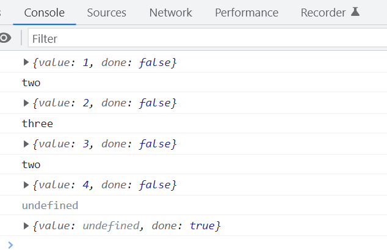

# 生成器与迭代器

在 JavaScript 中，`Promise`的发展最终促成了`async`和`await`的诞生。`async`和`await`的背后，灵感来源于生成器，生成器本身能够创建迭代器。

# 迭代器

迭代器提供了一种统一的方法来遍历各种数据类型。

```javascript
const array = [1, 2, 3, 4];
const string = '123';
const object = {
  a: 1,
  b: 2,
};
console.log(Object.getPrototypeOf(string));
// 获取字符串的原型

const iterator = array[Symbol.iterator]();
// 迭代器对象，具备next方法，通过next方法逐步调用
console.log(iterator.next());
console.log(iterator.next());
console.log(iterator.next());
console.log(iterator.next());
console.log(iterator.next());
```

## 实现一个迭代器

### 数组的迭代

```javascript
const array = [1, 2, 3, 4];

function createIterator(items) {
  let currentIndex = 0;
  return {
    next() {
      if (currentIndex < items.length) {
        return {
          value: items[currentIndex++],
          done: false,
        };
      }
      return {
        value: undefined,
        done: true,
      };
    },
  };
}

const iterator = createIterator(array);
console.log(iterator.next());
```

### 对象的迭代实现

```javascript
const obj = {
  a: 1,
  b: 2,
  c: 3,
  [Symbol.iterator]() {
    let currentIndex = 0;
    const entries = Object.entries(this);
    return {
      next() {
        if (currentIndex < entries.length) {
          return {
            value: entries[currentIndex++],
            done: false,
          };
        }
        return {
          value: undefined,
          done: true,
        };
      },
    };
  },
};

const iterator = obj[Symbol.iterator]();
console.log(iterator.next());
console.log(iterator.next());
console.log(iterator.next());
```

### 迭代一个对象

```javascript
const obj = {
  a: 1,
  b: 2,
  c: 3,
  [Symbol.iterator]() {
    let currentIndex = 0;
    const entries = Object.entries(this);
    return {
      next() {
        if (currentIndex < entries.length) {
          return {
            value: entries[currentIndex++],
            done: false,
          };
        }
        return {
          value: undefined,
          done: true,
        };
      },
    };
  },
};

for (const entry of obj) {
  console.log(entry);
}
```

# 遍历和迭代

## 迭代

迭代是一种模式，按照顺序从目标源中逐个提取数据。目标源通常是有序且连续的数据结构。

## 遍历

遍历指的是将数据按某种方式展示出来，而不考虑其内部的顺序。

# 生成器

生成器用于创建迭代器，简化迭代器的实现过程。

```javascript
function* generateNumbers() {
  yield 1;
  yield 2;
  yield 3;
  yield 4;
}
const iterator = generateNumbers();

for (const number of iterator) {
  console.log(number);
}
```

## yield

`yield`关键字用于在生成器函数中暂停执行，并返回一个值。每次调用`next`方法时，生成器函数会从上一次暂停的地方继续执行。

```javascript
function* generateValues() {
  console.log('开始生成第一个值');
  yield 1;
  console.log('开始生成第二个值');
  yield 2;
  yield 3;
  yield 4;
}

const iterator = generateValues();
console.log(iterator.next());
console.log(iterator.next());
console.log(iterator.next());
```

## next 赋值

`next`方法可以接收一个参数，该参数会被赋值给上一个`yield`表达式。这种传值方式虽然有些奇特，但在某些场景下非常有用。

```javascript
function* interactGenerator() {
  const firstInput = yield 1;
  console.log(`接收到的第一个输入: ${firstInput}`);

  const secondInput = yield 2;
  console.log(`接收到的第二个输入: ${secondInput}`);

  const thirdInput = yield 3;
  console.log(`接收到的第三个输入: ${thirdInput}`);

  const fourthInput = yield 4;
  console.log(`接收到的第四个输入: ${fourthInput}`);
}

const iterator = interactGenerator();
console.log(iterator.next());
console.log(iterator.next('输入一'));
console.log(iterator.next('输入二'));
console.log(iterator.next('输入三'));
console.log(iterator.next('输入四'));
```



## 对象的迭代

使用生成器函数可以简化对象的迭代器实现，无需显式地返回值。

```javascript
const obj = {
  a: 1,
  b: 2,
  c: 3,
  *[Symbol.iterator]() {
    const entries = Object.entries(this);
    for (const entry of entries) {
      yield entry;
    }
  },
};

for (const entry of obj) {
  console.log(entry);
}
```
