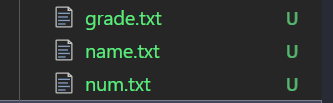

# 异步编程与 Promise

[Getting Started | bluebird](http://bluebirdjs.com/docs/getting-started.html)

ES6 的 `Promise` 本质是将社区中非常成熟的 Promise 实现，纳入到 ECMA 标准中。

## ajax 不同版本请求写法

```html
<script src="https://cdn.bootcdn.net/ajax/libs/jquery/3.6.0/jquery.min.js"></script>
<script>
  // 使用传统的回调方式
  $.ajax({
    url: 'https://jsonplaceholder.typicode.com/posts',
    type: 'GET',
    dataType: 'JSON',
    success: function (data) {
      console.log(data);
    },
  });

  // 使用 $.ajax 返回的 Promise 对象
  const ajaxRequest1 = $.ajax('https://jsonplaceholder.typicode.com/posts');
  ajaxRequest1
    .done(function (data) {
      console.log(data);
    })
    .fail(function (error) {
      console.error(error);
    });

  // 使用 Promise 的 then 方法处理成功和失败
  const ajaxRequest2 = $.ajax('https://jsonplaceholder.typicode.com/posts');
  ajaxRequest2.then(
    function (data) {
      console.log(data);
    },
    function (error) {
      console.error(error);
    }
  );
</script>
```

## node 异步读取文件

回调地狱示例，异步读取下图中的三个文件。



```javascript
const fs = require('fs');

fs.readFile('./name.txt', 'utf-8', function (err, data) {
  if (err) {
    console.error('读取 name.txt 失败:', err);
    return;
  }
  fs.readFile(data, 'utf-8', function (err, data) {
    if (err) {
      console.error('读取第二个文件失败:', err);
      return;
    }
    fs.readFile(data, 'utf-8', function (err, data) {
      if (err) {
        console.error('读取第三个文件失败:', err);
        return;
      }
      console.log('最终读取的数据:', data); // 输出最终文件内容
    });
  });
});
```

## 异步

### DOM 冲突

当一个脚本修改 DOM，另一个脚本添加 DOM 时，为了防止 DOM 冲突，JavaScript 被设计为单线程的。这确保了在任意时刻只有一个任务在操作 DOM，从而避免了竞态条件和不一致的状态。

### 异步任务

由于 JavaScript 是单线程的，但需要处理诸如网络请求、文件读取等耗时操作。实现异步的解决方案是事件轮询机制。

### 事件轮询

1. 当主线程的任务队列为空后，事件轮询机制会检查事件队列中的内容。
2. 当异步任务完成后，其回调函数会被推入到主线程中执行。

事件轮询的核心是回调函数，它确保异步任务在适当的时机执行，而不会阻塞主线程。

[并发模型与事件循环 - JavaScript | MDN](https://developer.mozilla.org/zh-CN/docs/Web/JavaScript/EventLoop)

### 回调函数

回调函数是指将函数作为参数传递给另一个函数的形式。回调函数分为同步回调和异步回调，同步回调函数在调用时立即执行，异步回调函数则在未来某个时间点执行。

```javascript
// sort 是高阶函数，接受一个回调函数作为参数
const numbers = [3, 1, 2];
numbers.sort(function (a, b) {
  // 这个函数作为参数出现，是回调函数
  return a - b;
});
console.log(numbers); // 输出: [1, 2, 3]
```

通过合理使用回调函数，可以有效地处理异步操作，避免阻塞主线程。然而，过多的嵌套回调可能导致代码难以维护，这也是后来 Promise 和 async/await 被引入的原因。

# Promise

在 JavaScript 中，`Promise` 是一种用于处理异步操作的机制。它代表一个在未来可能完成或失败的操作及其结果。通过 `Promise`，可以更清晰地组织异步代码，避免回调地狱的问题。

```javascript
// 创建一个新的 Promise
const fetchData = new Promise((resolve, reject) => {
  setTimeout(() => {
    const data = { id: 1, name: 'John Doe' };
    resolve(data); // 操作成功，调用 resolve
    // reject('Error fetching data'); // 操作失败，调用 reject
  }, 1000);
});

// 使用 Promise
fetchData
  .then((data) => {
    console.log('数据获取成功:', data);
  })
  .catch((error) => {
    console.error('数据获取失败:', error);
  });
```

## Promise 的状态

`Promise` 有三种状态：

1. **Pending（等待中）**: 初始状态，既不是成功，也不是失败。
2. **Fulfilled（已兑现）**: 操作成功完成。
3. **Rejected（已拒绝）**: 操作失败。

状态一旦改变，就不会再改变。

## Promise 链式调用

通过链式调用，可以将多个异步操作按顺序执行，每个操作的结果可以传递给下一个操作。

```javascript
const firstPromise = new Promise((resolve, reject) => {
  setTimeout(() => {
    resolve(1);
  }, 1000);
});

firstPromise
  .then((result) => {
    console.log(result); // 输出: 1
    return result + 1;
  })
  .then((result) => {
    console.log(result); // 输出: 2
    return result + 1;
  })
  .then((result) => {
    console.log(result); // 输出: 3
  })
  .catch((error) => {
    console.error('发生错误:', error);
  });
```

## Promise 的常用方法

- `Promise.all(iterable)`: 当所有的 `Promise` 都成功时，返回一个新的 `Promise`，其结果是一个包含所有 `Promise` 结果的数组。如果有任何一个 `Promise` 失败，返回的 `Promise` 立即失败。
- `Promise.race(iterable)`: 返回一个新的 `Promise`，它的状态由第一个完成的 `Promise` 决定。
- `Promise.allSettled(iterable)`: 等待所有的 `Promise` 完成，无论是成功还是失败，返回一个包含每个 `Promise` 结果的数组。
- `Promise.any(iterable)`: 只要有一个 `Promise` 成功，就返回该 `Promise` 的结果。如果所有的 `Promise` 都失败，返回的 `Promise` 失败。

```javascript
const promise1 = Promise.resolve(3);
const promise2 = 42;
const promise3 = new Promise((resolve, reject) => {
  setTimeout(resolve, 100, 'foo');
});

Promise.all([promise1, promise2, promise3]).then((values) => {
  console.log(values); // 输出: [3, 42, "foo"]
});
```

通过合理使用 `Promise`，可以编写出更清晰、可维护的异步代码，提高代码的健壮性和可读性。
