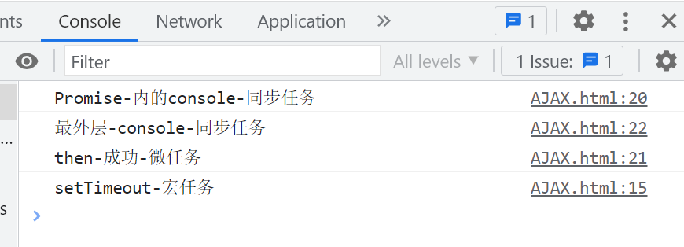
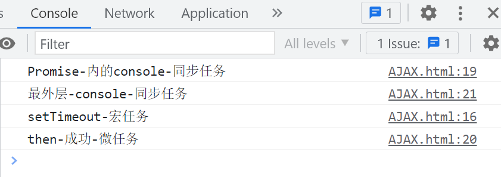
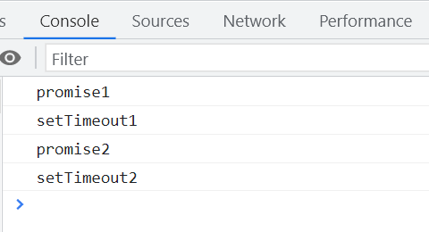

# 浏览器的常驻线程

`JS`引擎线程负责解释和执行`JavaScript`代码。

`GUI`线程用于绘制用户界面，其执行与`JS`主线程是互斥的。

`HTTP`网络请求线程处理网络请求，收到响应后将回调函数推入任务队列。

定时器触发线程负责`setTimeout`和`setInterval`，等待时间结束后将执行函数推入任务队列。

浏览器事件处理线程处理诸如`click`和`mouse`等用户交互事件，事件发生后将其放入事件队列中。

# 任务优先级

## 同步与异步

同步任务的优先级高于异步任务。异步任务又分为**微任务**和**宏任务**。

# 宏任务

## setTimeout

```javascript
setTimeout(function () {
  console.log('timeout');
}, 0); // 实际上为4ms
console.log('hi');
```

# 微任务

微任务由`Promise`产生。

`Promise`具有三种状态：`pending`（进行中）、`fulfilled`（已完成）和`rejected`（以失败）。`Promise`的状态不受外界影响。

`Promise`经历两个阶段：从进行中到完成，以及从进行中到失败。

```javascript
const fs = require('fs');

function readFile(pathname) {
  return new Promise((resolve, reject) => {
    console.log(1);
    fs.readFile(pathname, 'utf-8', (err, data) => {
      if (err) {
        reject(err);
        return;
      }
      resolve(data);
    });
  });
}

const promise = readFile('./name.txt');

promise.then(
  (data) => {
    console.log(data);
  },
  (err) => {
    console.log(err);
  }
);
```

## Promise 的固化

一旦`Promise`的状态确定，不会再改变。

```javascript
const p1 = new Promise((resolve, reject) => {
  resolve(1);
  reject(10);
});

p1.then((res) => console.log(res)).catch((err) => console.log(err));
```

## .then 方法

`then`方法是异步的。

```javascript
new Promise((resolve, reject) => {
  // resolve("一瓶可乐");
  reject('买不到');
}).then(
  (resolve) => {
    console.log(resolve);
  },
  (reject) => {
    console.log(reject);
    // 输出: 买不到
  }
);
```

## 为什么要有`then`方法

有时需要一步步完成任务，完成第一步后才能进行第二步，`then`方法可以逐步完成任务。同时，`then`方法用于处理`Promise`的成功或失败。

```javascript
const p1 = new Promise((resolve, reject) => {
  resolve('fulfilled');
})
  .then(
    (value) => {
      return '成功';
    },
    (reason) => console.log('error' + reason)
  )
  .then((value) => console.log('成功2'));
```

## then 包装

`then`方法在类中会自动包装成一个`Promise`。

```javascript
class Person {
  constructor() {}
  then(resolve, reject) {
    resolve();
  }
}

async function get() {
  await new Person();
  console.log('6666');
}

get();
```

## 执行顺序

执行顺序为同步任务优先，其次是微任务，最后是宏任务。

```javascript
setTimeout(() => {
  console.log('setTimeout-宏任务');
}, 0);

new Promise((resolve) => {
  resolve();
  console.log('Promise-内的console-同步任务');
}).then((value) => console.log('then-成功-微任务'));

console.log('最外层-console-同步任务');
```



## 宏任务内执行微任务

宏任务执行完毕后，才会开始执行微任务。

```javascript
new Promise((resolve) => {
  setTimeout(() => {
    console.log('setTimeout-宏任务');
    resolve();
  }, 0);
  console.log('Promise-内的console-同步任务');
}).then((value) => console.log('then-成功-微任务'));

console.log('最外层-console-同步任务');
```



## 只关注失败的回调函数，简单的写法

```javascript
const p1 = Promise.resolve(1);
const p2 = Promise.reject(2);

p1.then((data) => {
  console.log(data);
});

// 使用.catch方法只关注失败的回调函数
p2.catch((err) => {
  console.log('err' + err);
});
```

# Promise 的检验

`thenable`主要用于检验一个对象是否是`Promise`。判断一个对象是否为`Promise`，只需检查其是否具有`.then`方法。

## Thenable 对象

[第三章: Promise - Thenable 鸭子类型（Duck Typing） - 《你不懂 JS: 异步与性能（You Dont Know JS）（第一版）》 - 书栈网 · BookStack](https://www.bookstack.cn/read/You-Dont-Know-JS-async-performance/ch3.2.md)

```javascript
const obj = {
  then(resolve, reject) {
    resolve(11);
  },
};

const p1 = Promise.resolve(obj);

p1.then((data) => {
  console.log(data); // 输出: 11
});
```

## finally

`finally`方法在`Promise`结束后，无论成功还是失败，都会执行相应的动作。

# 异步任务与微任务

微任务的优先级高于异步任务。

```javascript
// 微任务
Promise.resolve().then(() => {
  console.log('promise1'); // 输出: promise1
  setTimeout(() => {
    console.log('setTimeout2'); // 输出: setTimeout2
  }, 0);
});

// 异步任务
setTimeout(() => {
  console.log('setTimeout1'); // 输出: setTimeout1
  Promise.resolve().then(() => {
    console.log('promise2'); // 输出: promise2
  });
}, 0);
```



# 同步、异步、微任务

```javascript
const p1 = new Promise((resolve, reject) => {
  resolve('fulfilled');
});

// then 返回一个Promise对象
const p2 = p1.then(
  (val) => console.log(val),
  (res) => console.log(res)
);

// 同步任务直接打印
console.log(p1); // 输出: Promise {<fulfilled>: 'fulfilled'}
console.log(p2); // 输出: Promise {<pending>}
```

# 链式调用

`Promise`在链式调用时会返回普通值或`Promise`对象。

## 执行三次

```javascript
const p1 = new Promise((resolve, reject) => {
  setTimeout(() => {
    resolve(10);
  }, 1000);
});

p1.then((res) => {
  console.log(res + 1);
  return res + 1;
});

p1.then((res) => {
  console.log(res + 1);
  return res + 1;
});

p1.then((res) => {
  console.log(res + 1);
  return res + 1;
});

// 输出: 11 11 11
```

## 链式调用三个 Promise

链式调用会创建三个`Promise`，每个`Promise`对应一个状态。

```javascript
p1.then((res) => {
  console.log(res + 1);
  return res + 1;
})
  .then((res) => {
    console.log(res + 1);
    return res + 1;
  })
  .then((res) => {
    console.log(res + 1);
    return res + 1;
  });

// 输出: 11 12 13
```

## 多层嵌套

```javascript
const p1 = new Promise((resolve, reject) => {
  resolve(1);
  reject(10);
});

p1.then((res) => console.log(res)) // 输出: 1
  .then() // 忽略
  .then() // 忽略
  .then((res) => console.log(res)) // 输出: undefined
  .catch((err) => console.log(err));
```

# 状态依赖

如果`Promise`的状态存在依赖，依赖的`Promise`状态将决定自身的状态。

```javascript
const p1 = new Promise((resolve, reject) => {
  setTimeout(() => {
    reject('10000');
  }, 3000);
});

const p2 = new Promise((resolve, reject) => {
  setTimeout(() => {
    resolve(p1);
  }, 1000);
  // p2不会再等待1秒，会直接执行p1的结果
});

p2.then((res) => console.log(res)).catch((err) => console.log(err));
```

# Promise.all

`Promise.all`在一次拿到所有`Promise`的结果后返回结果。如果其中有一个`Promise`失败，则返回错误。

```javascript
const p1 = new Promise((resolve, reject) => {
  setTimeout(() => {
    resolve(10);
  }, 1000);
});

const p2 = new Promise((resolve, reject) => {
  setTimeout(() => {
    resolve(20);
  }, 2000);
});

const p3 = new Promise((resolve, reject) => {
  setTimeout(() => {
    resolve(30);
  }, 3000);
});

const p4 = Promise.all([p1, p2, p3]);

p4.then((res) => {
  console.log(res); // 输出: [10, 20, 30]
});
```

# Promise.race

`Promise.race`返回最快完成的`Promise`的结果，无论是成功还是失败。

```javascript
const p1 = new Promise((resolve, reject) => {
  setTimeout(() => {
    resolve(10);
  }, 1000);
});

const p2 = new Promise((resolve, reject) => {
  setTimeout(() => {
    resolve(20);
  }, 2000);
});

const p3 = new Promise((resolve, reject) => {
  setTimeout(() => {
    resolve(30);
  }, 3000);
});

const p4 = Promise.race([p1, p2, p3]);

p4.then(
  (res) => {
    console.log(res); // 输出: 10
  },
  (err) => {
    console.log(err + 'err');
  }
);
```

# Promise.allSettled()

当有多个彼此不依赖的异步任务完成时，或者需要知道每个`Promise`的结果，通常使用`Promise.allSettled`。

```javascript
const promise1 = Promise.resolve(3);
const promise2 = new Promise((resolve, reject) => setTimeout(reject, 100, 'foo'));

Promise.allSettled([promise1, promise2]).then((results) => results.forEach((result) => console.log(result.status)));
```

# Node 读取文件的 Promise 示例

```javascript
const fs = require('fs');

function readFile(pathname) {
  return new Promise((resolve, reject) => {
    fs.readFile(pathname, 'utf-8', (err, data) => {
      if (err) {
        reject(err);
        return;
      }
      resolve(data);
    });
  });
}

readFile('./name.txt')
  .then((res) => readFile(res))
  .then((res) => readFile(res))
  .then((res) => console.log(res)); // 输出: 100
```
