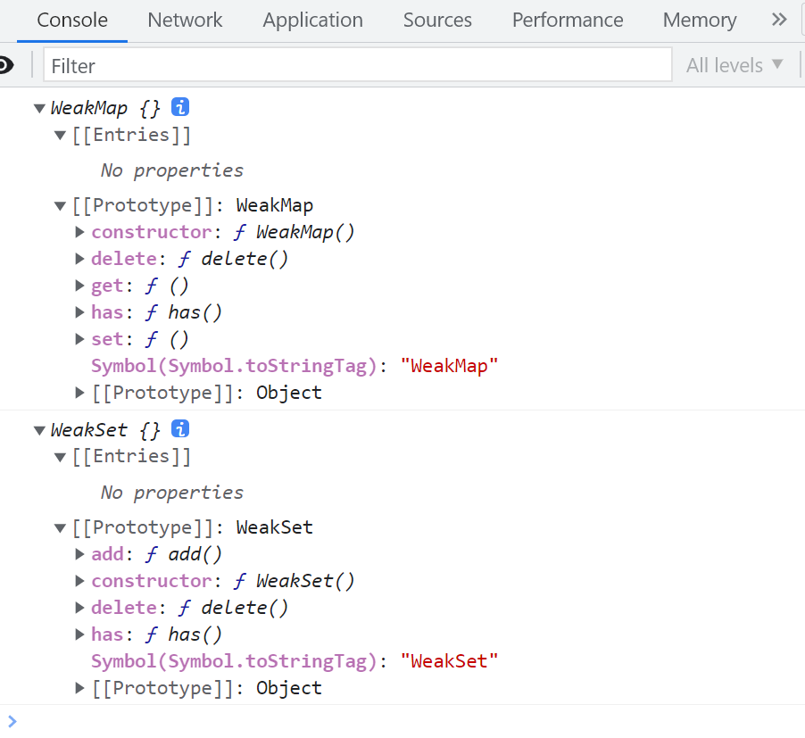

# WeakMap 与 WeakSet、Proxy 与 Reflect

在 JavaScript 中,除了常用的 Map 和 Set 数据结构,还有它们的"兄弟"WeakMap 和 WeakSet。同时,ES6 引入了 Proxy 和 Reflect,为我们提供了拦截和操作对象的更多可能性。下面我就来详细介绍一下它们的特点和用法。

## WeakMap 和 WeakSet

WeakMap 和 WeakSet 与 Map 和 Set 有两点不同:

1. 它们的键(WeakMap)或值(WeakSet)只能是对象,不能是原始类型。
2. 它们是弱引用,即垃圾回收机制不考虑 WeakMap 或 WeakSet 对这些对象的引用。

这意味着,如果 WeakMap 或 WeakSet 引用的对象没有其他引用,那么垃圾回收机制会自动回收该对象占用的内存,不考虑该对象还存在于 WeakMap 或 WeakSet 中。

WeakMap 和 WeakSet 适合临时存放一组对象,以及存放跟对象绑定的信息。当没有其他引用存在时,它们会被自动清除,从而防止内存泄漏。例如,我们可以利用 WeakMap 来存储 DOM 节点的额外信息:

```javascript
const wm = new WeakMap();

const element = document.getElementById('example');

wm.set(element, 'some information');
wm.get(element); // "some information"
```

上面代码中,先新建一个 WeakMap 实例。然后,将一个 DOM 节点作为键名存入该实例,并将一些附加信息作为键值,一起存放在 WeakMap 里面。这时,WeakMap 里面对 element 的引用就是弱引用,不会被计入垃圾回收机制。

另一个用处是部署私有属性:

```javascript
const _counter = new WeakMap();
const _action = new WeakMap();

class Countdown {
  constructor(counter, action) {
    _counter.set(this, counter);
    _action.set(this, action);
  }
  dec() {
    let counter = _counter.get(this);
    if (counter < 1) return;
    counter--;
    _counter.set(this, counter);
    if (counter === 0) {
      _action.get(this)();
    }
  }
}

const c = new Countdown(2, () => console.log('DONE'));

c.dec();
c.dec();
// DONE
```

上面代码中,Countdown 类的两个内部属性\_counter 和\_action,是实例的弱引用,所以如果删除实例,它们也就随之消失,不会造成内存泄漏。

## Proxy 和 Reflect

Proxy 用于修改某些操作的默认行为,等同于在语言层面做出修改,所以属于一种"元编程"(meta programming),即对编程语言进行编程。

Proxy 可以理解成,在目标对象之前架设一层"拦截",外界对该对象的访问,都必须先通过这层拦截,因此提供了一种机制,可以对外界的访问进行过滤和改写。例如,读取属性的操作(get),Proxy 可以这样拦截:

```javascript
const person = {
  name: '张三',
};

const proxy = new Proxy(person, {
  get: function (target, propKey) {
    if (propKey in target) {
      return target[propKey];
    } else {
      throw new ReferenceError('Prop name "' + propKey + '" does not exist.');
    }
  },
});

proxy.name; // "张三"
proxy.age; // 抛出一个错误
```

上面代码表示,如果访问目标对象不存在的属性,会抛出一个错误。如果没有这个拦截函数,访问不存在的属性,只会返回 undefined。

Reflect 对象与 Proxy 对象一样,也是 ES6 为了操作对象而提供的新 API。Reflect 对象的设计目的有这样几个:

1. 将 Object 对象的一些明显属于语言内部的方法(比如 Object.defineProperty),放到 Reflect 对象上。
2. 修改某些 Object 方法的返回结果,让其变得更合理。
3. 让 Object 操作都变成函数行为,如 Reflect.has(obj, name)等价于 name in obj。

下面是一个使用 Reflect 实现观察者模式的例子:

```javascript
const queuedObservers = new Set();

const observe = (fn) => queuedObservers.add(fn);
const observable = (obj) => new Proxy(obj, { set });

function set(target, key, value, receiver) {
  const result = Reflect.set(target, key, value, receiver);
  queuedObservers.forEach((observer) => observer());
  return result;
}

const person = observable({
  name: '张三',
  age: 20,
});

function print() {
  console.log(`${person.name}, ${person.age}`);
}

observe(print);
person.name = '李四';
// 输出
// 李四, 20
```

上面代码中,数据对象 person 是观察目标,函数 print 是观察者。一旦数据对象发生变化,print 就会自动执行。


