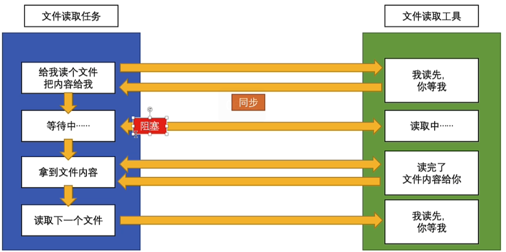
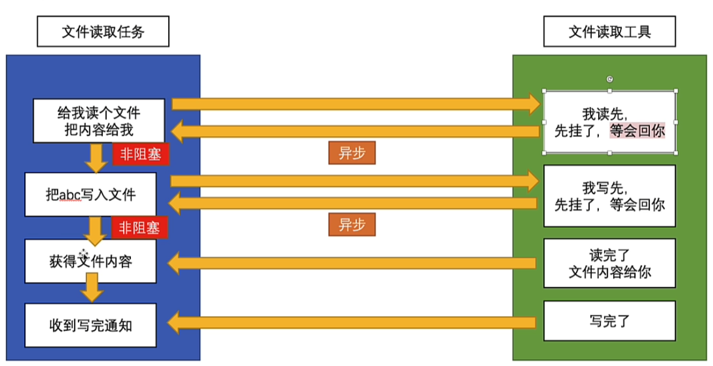

# 同步异步与阻塞非阻塞

在编程领域,同步异步和阻塞非阻塞是两个常见的概念,理解它们的区别对写出高效的程序至关重要。让我们一起深入探讨一下。

## 同步与异步

同步和异步描述的是任务的执行方式:

同步执行: 程序按照代码的顺序,从上到下依次执行。每一行代码都会阻塞后面代码的执行,直到当前代码执行完毕。

异步执行: 程序的执行顺序和代码的编写顺序无关。异步任务通常由事件驱动,不会阻塞后续代码的执行。

在实际开发中,我们经常会遇到一些耗时的操作,比如读写文件、网络请求等。如果使用同步的方式去执行这些操作,程序的性能会大大降低。这时,异步执行就派上了用场。通过异步执行,我们可以在等待耗时操作完成的同时,去执行其他的任务,从而提高程序的并发能力和响应速度。

## 阻塞与非阻塞

阻塞和非阻塞描述的是程序在等待调用结果时的状态:

阻塞: 调用方一直等待调用结果的返回,在结果返回之前不能执行其他任务。

非阻塞: 调用方发起一个调用后,不用等待结果返回,可以继续执行其他任务。

理论上,阻塞和非阻塞可以和同步异步任意组合。但在实际编程中,经常将它们划分为下面两类:

### 同步阻塞

同步阻塞是最常见的形式。程序按照既定顺序执行,每一行代码都会阻塞后面代码的执行。

### 异步非阻塞

异步非阻塞是最高效的组合方式。调用方发起调用后可以继续执行其他任务,被调用方通过事件通知或回调等机制来通知调用方。

至于另外两种组合方式

同步非阻塞: 调用方等待结果返回,但不阻塞后续代码执行。这在实际编程中很难实现,因为如果不阻塞,调用方很可能就拿不到需要的结果了。

异步阻塞: 调用方发起调用后,一直等待结果返回,但实际上执行顺序和代码顺序无关。这也是一种非常罕见的情况,没有太多实际意义。
