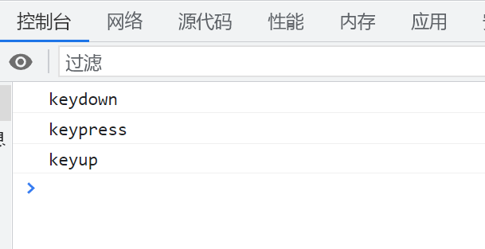
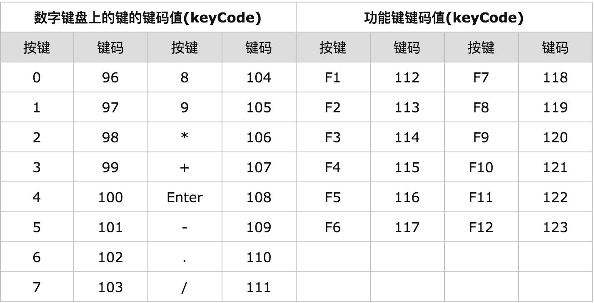
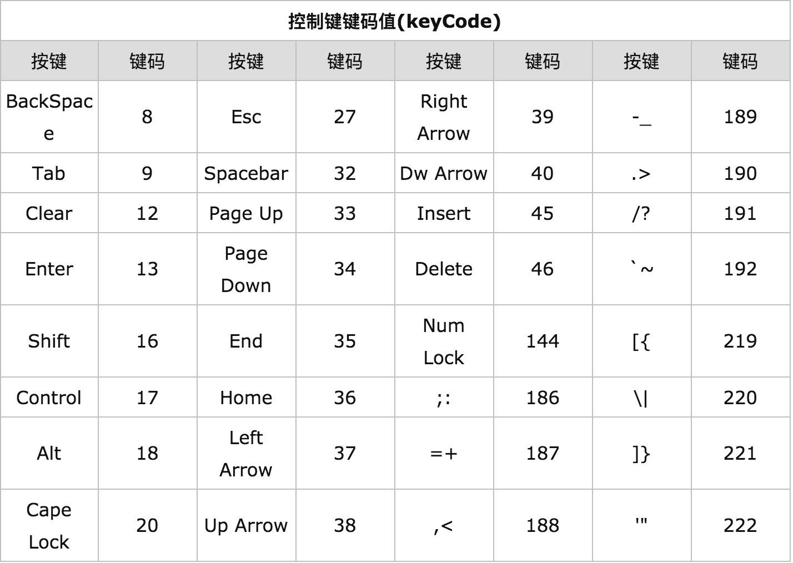
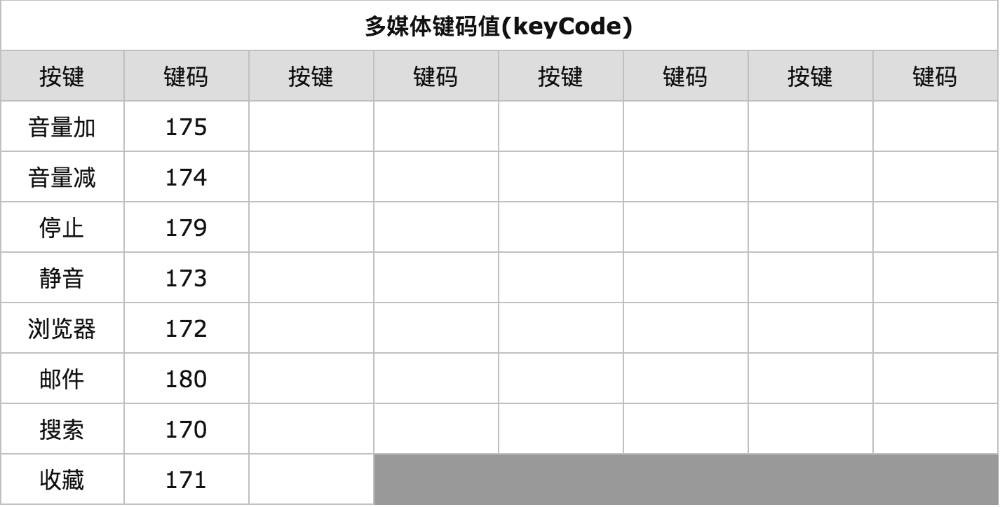

# 键盘事件与贪吃蛇游戏实现

## 常见的键盘事件

在 JavaScript 中,常见的键盘事件有:

```javascript
document.onkeydown = function () {
  console.log('keydown');
};

document.onkeyup = function () {
  console.log('keyup');
};

document.onkeypress = function () {
  console.log('keypress');
};
```

这三个事件的执行顺序如下图所示:



`keypress`事件只能识别`ASCII`编码中有的字符,对于其他按键无法识别,而且只能触发字符类的按键。

`onkeydown`事件可以通过`keyCode`属性来识别按下的按键,它可以触发所有的按键。

## 键盘事件中的编码

在键盘事件中,我们经常会用到一些编码来识别按键,常见的编码有:

### keyCode

`keyCode`表示键盘顺位码,在`onkeydown`和`onkeyup`事件中都可以通过`event.keyCode`获取到。

常见键的键盘码如下图所示:







### charCode

`charCode`表示`ASCII`码,在`onkeypress`事件中可以通过`event.charCode`获取,而`onkeydown`事件中没有`charCode`属性。

通过`charCode`,我们可以识别按下的键并区分大小写,它可以触发`ASCII`编码中的所有字符。示例代码如下:

```javascript
document.onkeypress = function (e) {
  var str = String.fromCharCode(e.charCode);
  console.log(str);
};
```

## 实现方块移动

了解了键盘事件的基本知识后,我们就可以尝试实现一个简单的方块移动功能了。示例代码如下:

```html
<html lang="en">
  <style>
    .div {
      position: absolute;
      left: 0;
      top: 0;
      width: 100px;
      height: 100px;
      background-color: pink;
    }
  </style>

  <body>
    <div class="div"></div>

    <script>
      var box = document.getElementsByClassName('div')[0];

      document.onkeydown = function (e) {
        var e = e || window.event,
          code = e.keyCode,
          boxLeft = getStyles(box, 'left'),
          boxTop = getStyles(box, 'top');

        switch (code) {
          case 37: // 左箭头
            box.style.left = boxLeft - 10 + 'px';
            break;
          case 39: // 右箭头
            box.style.left = boxLeft + 10 + 'px';
            break;
          case 38: // 上箭头
            box.style.top = boxTop - 10 + 'px';
            break;
          case 40: // 下箭头
            box.style.top = boxTop + 10 + 'px';
            break;
          default:
            break;
        }
      };
    </script>
  </body>
</html>
```

在上面的代码中,我们通过监听`onkeydown`事件,判断按下的是哪个方向键,然后修改方块元素的`left`和`top`值,从而实现方块的移动效果。

## 使用文档碎片优化 DOM 操作

当我们需要循环创建大量 DOM 元素时,频繁地操作 DOM 会导致性能问题。这时可以使用文档碎片`DocumentFragment`来优化。示例代码如下:

```javascript
var list = document.getElementsByTagName('ul')[0],
  frag = document.createDocumentFragment();

for (var i = 0; i < 10; i++) {
  var li = document.createElement('li');
  li.innerHTML = 'list item';
  frag.appendChild(li);
}

list.appendChild(frag);
```

使用文档碎片的好处是,我们可以将需要添加的所有子元素先添加到文档碎片中,最后再一次性将文档碎片添加到实际的 DOM 树,这样就大大减少了 DOM 操作的次数,从而提升性能。
