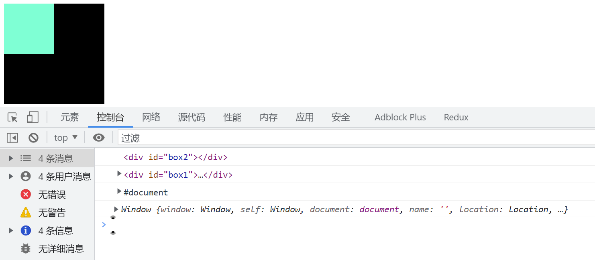

# 鼠标滑入滑出、事件代理与 DOM 事件流

## 滑入滑出事件

### 子元素都生效的滑入滑出

将事件绑定在父元素`oBox`上,父元素下的所有子元素都会触发绑定的事件。有多少子元素,事件就会被触发多少次。

```javascript
oBox.onmouseover = function () {
  this.style.backgroundColor = 'green';
};

oBox.onmouseout = function () {
  this.style.backgroundColor = 'orange';
};
```

### 只对当前元素生效的滑入滑出

使用`onmouseenter`和`onmouseleave`事件可以让滑入滑出事件只对当前绑定的元素生效,不会触发事件冒泡。

```javascript
oBox.onmouseenter = function () {
  this.style.backgroundColor = 'green';
};

oBox.onmouseleave = function () {
  this.style.backgroundColor = 'orange';
};
```

在实际开发中,根据需求选择合适的滑入滑出事件。如果只需要对当前元素生效,使用`onmouseenter`和`onmouseleave`可以避免不必要的事件触发,提高性能。

## 事件代理

当需要为多个同类元素(如列表的`<li>`)绑定事件时,可以利用事件代理(事件委托)来简化代码并提升性能。将事件绑定在它们的父元素上,通过判断`event.target`来执行相应操作。

以下是一个使用事件代理为`<li>`元素批量绑定点击事件的示例

```html
<ul id="list">
  <li>项目1</li>
  <li>项目2</li>
  <li>项目3</li>
</ul>
```

```javascript
const list = document.getElementById('list');

list.addEventListener('click', function (event) {
  if (event.target.tagName === 'LI') {
    console.log('当前点击的是:', event.target.textContent);
    // 执行具体操作...
  }
});
```

使用事件代理的优点

1. 减少内存占用:只需要绑定一个事件处理程序,不需要为每个元素都绑定
2. 动态绑定:对于动态添加的子元素也能自动绑定事件,无需重新绑定

## DOM 事件流

DOM 事件流描述了事件在 DOM 树中的传播过程,分为三个阶段:

1. 捕获阶段(Capturing Phase):事件从`window`开始,逐级向下传播到目标元素。在这个阶段,事件处理程序通常不会被触发。
2. 目标阶段(Target Phase):事件到达目标元素。事件处理程序被触发执行。
3. 冒泡阶段(Bubbling Phase):事件从目标元素开始,逐级向上传播到`window`。同样会触发绑定的事件处理程序。

DOM 事件流的传播顺序如下图所示:



通过`addEventListener`的第三个参数可以控制事件是在捕获阶段还是冒泡阶段被触发:

- `true`:在捕获阶段触发
- `false`(默认):在冒泡阶段触发

```javascript
window.addEventListener(
  'click',
  function () {
    console.log('window 捕获');
  },
  true
);

document.addEventListener(
  'click',
  function () {
    console.log('document 捕获');
  },
  true
);

document.documentElement.addEventListener(
  'click',
  function () {
    console.log('html 捕获');
  },
  true
);

document.body.addEventListener(
  'click',
  function () {
    console.log('body 捕获');
  },
  true
);

box1.addEventListener(
  'click',
  function () {
    console.log('box1 捕获');
  },
  true
);

box2.addEventListener(
  'click',
  function () {
    console.log('box2 捕获');
  },
  true
);

box2.addEventListener(
  'click',
  function () {
    console.log('box2 冒泡');
  },
  false
);

box1.addEventListener(
  'click',
  function () {
    console.log('box1 冒泡');
  },
  false
);

document.body.addEventListener(
  'click',
  function () {
    console.log('body 冒泡');
  },
  false
);

document.documentElement.addEventListener(
  'click',
  function () {
    console.log('html 冒泡');
  },
  false
);

document.addEventListener(
  'click',
  function () {
    console.log('document 冒泡');
  },
  false
);

window.addEventListener(
  'click',
  function () {
    console.log('window 冒泡');
  },
  false
);
```
