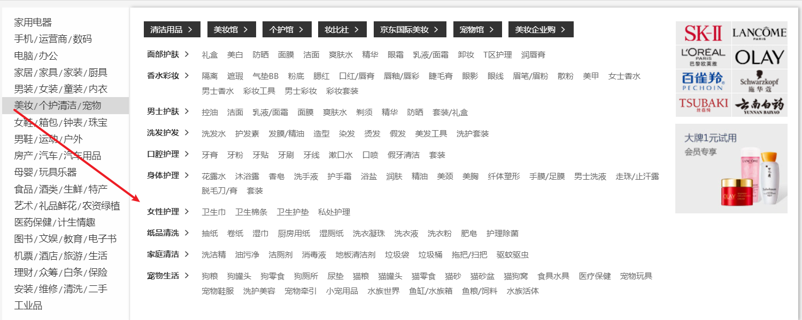
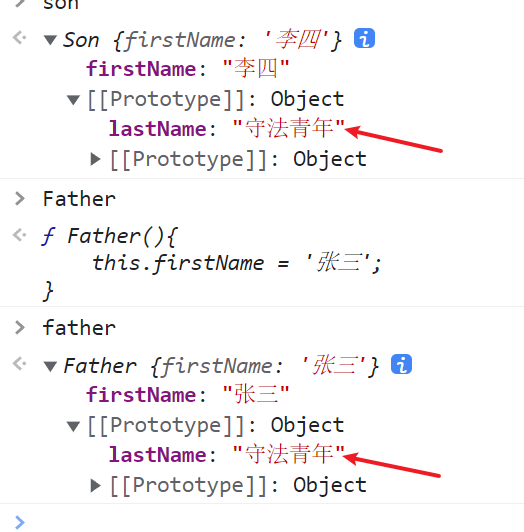

# 鼠标行为预测技术

## 需求

在某些场景下,我们希望鼠标按照箭头的方向移动时,经过菜单项不会触发二级菜单。就像下图所示:



## 实现

我在 GitHub 上有一个 JavaScript 实践仓库,里面有一个专门针对这个需求的实现示例,感兴趣的同学可以参考:
[JavaScript-practise/DOM/鼠标行为预测 at main · sumingcheng/JavaScript-practise](https://github.com/sumingcheng/JavaScript-practise/tree/main/DOM/%E9%BC%A0%E6%A0%87%E8%A1%8C%E4%B8%BA%E9%A2%84%E6%B5%8B)

## 事件代理

在实现过程中,我们会遇到需要给多个元素绑定事件的场景。这时候如果直接循环绑定,会造成内存浪费。更好的方式是利用事件代理,将事件绑定在父元素上。示例代码如下:

```javascript
oUl.onclick = function (e) {
  var e = e || window.event;
  var target = e.target || e.srcElement;
  console.log(target.innerText);
};
```

## 原型继承与圣杯模式

在 JavaScript 中,我们经常会用到原型继承。但是直接让子类的 prototype 指向父类的 prototype,会导致一个问题:修改子类原型时,父类原型也会被修改。示例代码

```javascript
function Father() {
  this.firstName = '张三';
}

Father.prototype.lastName = '法外狂徒';

function Son() {
  this.firstName = '李四';
}

// 直接继承会导致问题
Son.prototype = Father.prototype;

Son.prototype.lastName = '守法青年';

var father = new Father();
var son = new Son();
console.log(father.lastName); // 守法青年
```



为了解决这个问题,我们可以引入一个中间函数,利用这个函数的 prototype 来过渡。这就是著名的圣杯模式。示例代码

```javascript
function Father() {
  this.firstName = '张三';
}

Father.prototype.lastName = '法外狂徒';

function Son() {
  this.firstName = '李四';
}

// 引入中间函数作为过渡
function Bridge() {}
Bridge.prototype = Father.prototype;
Son.prototype = new Bridge();

Son.prototype.lastName = '守法青年';

var father = new Father();
var son = new Son();
console.log(father.lastName); // 法外狂徒
console.log(son.lastName); // 守法青年
```
