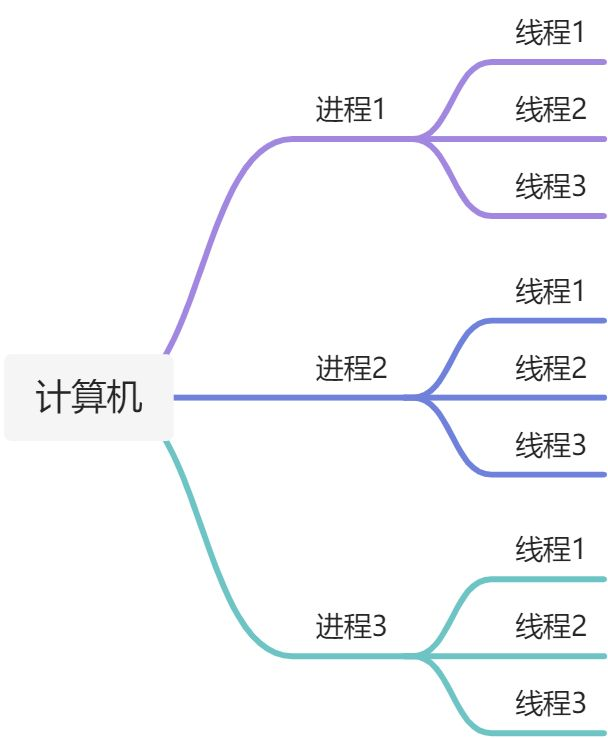
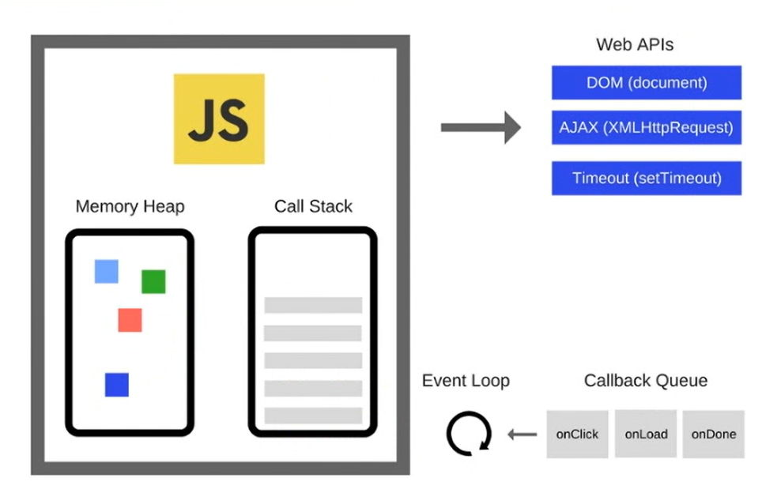

# JavaScript 执行机制详解

## 进程和线程

进程是计算机中正在运行的程序,如 QQ、微信等,是系统进行资源分配和调度的基本单位。同一进程内的线程之间可以相互访问资源。

线程是进程内的一个相对独立、可调度的执行单元,与同属一个进程的其他线程共享进程中的资源。同一时间,一个线程只能做一件事情。

### 孤儿进程

顾名思义,孤儿进程就是没有父进程的进程。当父进程结束后,它的一个或多个子进程还在运行,这些子进程就会成为孤儿进程。这些孤儿进程将被 init 进程收养,由 init 进程负责它们的后续管理。

### 僵尸进程

当子进程比父进程先结束,而父进程没有释放子进程占用的资源时,子进程的进程描述符仍然保留在系统中,这种进程就称为僵尸进程。

### 多进程和多线程

多进程是指启动多个进程,通过轮转时间片的算法来并发执行这些进程。

多线程是指在一个进程内部启动多个线程,这样多个线程可以同时执行多个任务。

下图直观展示了进程和线程的关系:



## 浏览器的多进程架构

现代浏览器普遍采用了多进程架构,主要包括以下几类进程:

1. Browser 进程:浏览器的主进程,负责浏览器界面显示、用户交互、子进程管理等。

2. 第三方插件进程:每种类型的插件对应一个进程,仅当使用该插件时才创建。

3. GPU 进程:最多一个,用于 3D 绘制等。

4. 渲染进程:即浏览器内核,默认每个 Tab 页面一个进程,互不影响。

### 渲染进程的多线程

每个渲染进程是多线程的,主要有以下几个线程:

1. GUI 渲染线程:负责渲染页面,包括解析 HTML/CSS、构建 DOM 树和 CSSOM 树、计算布局、绘制页面等。当页面需要重绘或回流时,该线程就会执行。

2. JavaScript 引擎线程:负责解析执行 JavaScript 代码。注意,一个 Tab 页面只有一个 JS 引擎线程,这是出于安全考虑,防止多个线程同时修改 DOM 导致冲突。GUI 渲染线程与 JS 引擎线程是互斥的,二者不能同时运行。

3. 定时触发器线程:处理 setTimeout 和 setInterval 等定时事件。由于 JS 引擎是单线程的,如果处于阻塞状态就会影响定时器的准确性,因此定时器在单独线程中执行。

4. 异步 HTTP 请求线程:负责 XMLHttpRequest 等异步请求。当请求完成时,如果有回调函数,异步线程就产生状态变更事件,将回调加入任务队列,等待 JS 引擎空闲时执行。

5. 事件触发线程:管理事件循环,当事件满足触发条件时,将事件加入到待处理队列,等待 JS 引擎处理。

## 处理大量数据和复杂运算

当需要处理大量数据或进行复杂运算时,由于 JS 引擎是单线程的,可能会导致页面长时间无响应。此时可以采用以下策略:

使用 Web Worker:将复杂运算放在独立的线程中,避免阻塞主线程。

采用服务端渲染(SSR):将渲染工作转移到服务端,减轻浏览器的压力。

合理利用异步:例如使用 requestAnimationFrame、requestIdleCallback 等 API,在浏览器空闲时执行任务。

## JavaScript 的事件循环

JS 引擎线程在执行代码时,会将不同任务按照类型分到不同的队列中,然后按照一定的规则去执行这些任务,这就是事件循环(Event Loop)。

事件循环中的任务队列分为宏任务队列(Macrotask Queue)和微任务队列(Microtask Queue)。常见的宏任务有:

setTimeout
setInterval
setImmediate(Node 环境)
requestAnimationFrame
I/O
UI rendering

常见的微任务有:

process.nextTick(Node 环境)
Promise
MutationObserver
Object.observe(已废弃)

事件循环的基本流程如下:

1. 执行一个宏任务,比如一段 JS 代码。
2. 执行过程中,同步代码直接执行,宏任务进入宏任务队列,微任务进入微任务队列。
3. 当前宏任务执行完出队,检查微任务队列,有则依次执行,直到微任务队列为空。
4. 执行浏览器 UI 线程的渲染工作。
5. 检查是否有 Web Worker 任务,有则执行。
6. 执行完本轮的宏任务,回到步骤 2,依此循环,直到宏任务和微任务队列都为空。

下图展示了事件循环的完整流程:



## setTimeout 的最小延迟

根据 HTML5 标准,setTimeout 的最短时间间隔是 4ms,即便代码中设定了更小的值,实际上也会被调整到 4ms。这是为了防止某些代码利用 0 延时的 setTimeout 占用过多 CPU 资源。

例如下面的代码:

```javascript
console.log(1);
setTimeout(() => {
  console.log(2);
}, 0);
console.log(3);
```

实际执行顺序是 1 -> 3 -> 2,因为同步代码总是优先执行。setTimeout 的回调函数被放入下一轮的宏任务队列,要等到本轮的同步代码和微任务都执行完才会执行。
