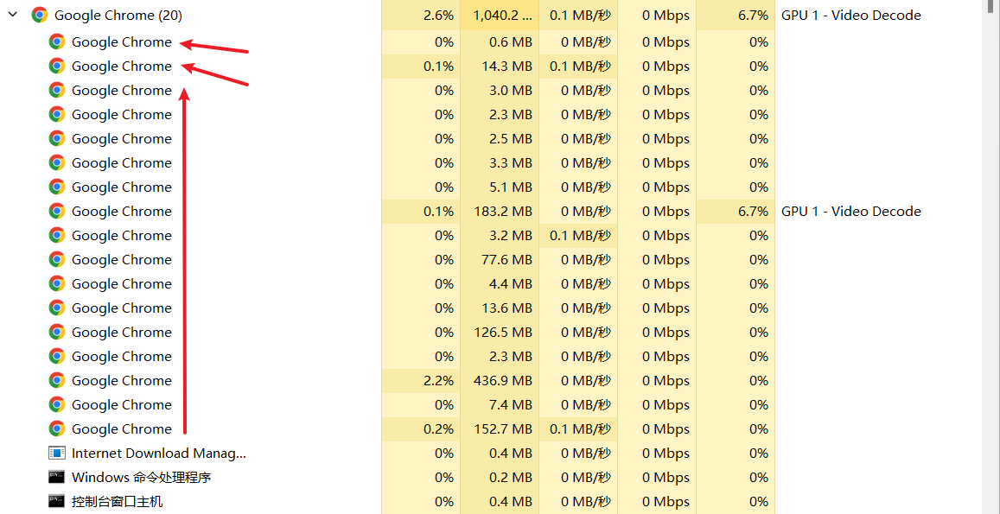

# 浏览器的进程与线程

在现代浏览器中,每个标签页（Tab）都是一个独立的进程。这些进程包括主进程和多个辅助进程,它们各司其职,协同工作,共同支撑起浏览器的运行。

## 主进程

主进程主要负责浏览器的用户界面（UI）渲染和交互,包括地址栏、书签、前进/后退按钮等。它是整个浏览器的控制中心。

## 辅助进程

除了主进程外,每个标签页还包含多个辅助进程:

浏览器内核渲染进程（Renderer）:负责页面的渲染。
网络进程:负责网络资源的加载与缓存。
GPU 进程:负责 3D 图形的绘制。
插件进程:负责浏览器插件的运行,如 Flash、DevTools 等。

## 渲染进程与线程

渲染进程是最复杂的一类辅助进程,它由多个线程组成,包括:

1. GUI 渲染线程:解析 HTML/CSS,构建 DOM 树和渲染树,执行页面的初始布局和绘制,以及后续的重绘与回流。

2. JavaScript 引擎线程:解析并执行 JavaScript 代码。它与 GUI 渲染线程是互斥的,即在 JS 执行期间,页面渲染会被暂停。

3. 事件触发线程:也称为事件环（Event Loop）线程,用于监听和处理各类事件,如用户交互事件、计时器事件、网络事件等。当事件发生时,它会将对应的任务添加到宏任务或微任务队列中。

4. 定时器线程:负责执行 setTimeout 和 setInterval 等定时任务。

5. 网络请求线程:处理 XMLHttpRequest 等网络请求。

## 宏任务与微任务

JavaScript 引擎线程在执行任务时,会区分宏任务和微任务:

宏任务一般是由宿主（如浏览器）提供的异步 API 和任务,如整体代码 script、setTimeout、setInterval、UI 渲染等。
微任务通常是由 JavaScript 语言本身提供的 API 产生,如 Promise 的 then 回调、MutationObserver 等。

在每个宏任务执行完毕后,引擎会检查并执行所有的微任务队列,然后再进入下一个宏任务。这种宏-微的执行模式,保证了微任务的优先级高于宏任务。

了解浏览器的多进程和多线程架构,有助于我们深入理解页面渲染、JavaScript 执行与事件处理的原理,从而写出更加高效、可靠的 Web 应用。
