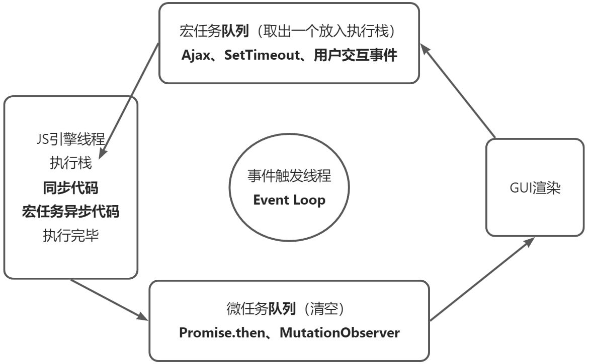

# 事件循环练习

## 练习 1

分析以下代码的执行顺序:

```javascript
Promise.resolve().then(() => {
  console.log('p1');
  setTimeout(() => {
    console.log('s2');
  }, 0);
});

setTimeout(() => {
  console.log('s1');
  Promise.resolve().then(() => {
    console.log('p2');
  });
});
```

执行步骤如下:

1. 初始化宏任务队列: `s1`, `s2`
2. 初始化微任务队列: `p1`, `p2`
3. 执行同步代码,将`Promise.resolve().then`的回调加入微任务队列,`setTimeout`的回调加入宏任务队列
4. 同步代码执行完毕,执行微任务队列
5. 输出`p1`,将`setTimeout`的回调加入宏任务队列
6. 微任务队列执行完毕,执行宏任务队列
7. 输出`s1`,将`Promise.resolve().then`的回调加入微任务队列
8. 执行微任务队列,输出`p2`
9. 微任务队列执行完毕,执行下一个宏任务
10. 输出`s2`

因此最终输出顺序为: `p1`, `s1`, `p2`, `s2`

执行顺序遵循: 同步代码 -> 微任务代码 -> 渲染 -> 宏任务代码

## 练习 2

分析以下代码的执行顺序:

```javascript
console.log(1);

setTimeout(() => {
  console.log(2);
}, 10);

new Promise(function (resolve, reject) {
  console.log(3);
  resolve('');
  console.log(4);
}).then((res) => {
  console.log(5);
});
console.log(6);
```

执行步骤:

1. 输出`1`
2. 将`setTimeout`的回调加入宏任务队列
3. 执行`new Promise`的 executor,输出`3`
4. 遇到`resolve`,将`then`的回调加入微任务队列
5. 继续执行 executor,输出`4`
6. executor 执行完毕,输出`6`
7. 同步代码执行完毕,执行微任务队列
8. 执行`then`的回调,输出`5`
9. 微任务队列执行完毕,执行下一个宏任务
10. 输出`2`

因此最终输出顺序为: `1`, `3`, `4`, `6`, `5`, `2`

## 练习 3

分析以下代码的执行顺序:

```javascript
const oBtn = document.getElementById('btn');

oBtn.addEventListener(
  'click',
  () => {
    console.log(1);

    Promise.resolve('m1').then((str) => {
      console.log(str);
    });
  },
  false
);

oBtn.addEventListener(
  'click',
  () => {
    console.log(2);

    Promise.resolve('m2').then((str) => {
      console.log(str);
    });
  },
  false
);

oBtn.click();
```

执行步骤:

1. 为`btn`元素绑定两个点击事件回调
2. 调用`oBtn.click()`模拟点击事件
3. 执行第一个点击回调,输出`1`
4. 将`Promise.resolve('m1').then`的回调加入微任务队列
5. 执行第二个点击回调,输出`2`
6. 将`Promise.resolve('m2').then`的回调加入微任务队列
7. 点击回调执行完毕(属于宏任务),执行微任务队列
8. 输出`m1`, `m2`

因此最终输出顺序为: `1`, `2`, `m1`, `m2`

`addEventListener`绑定的事件回调属于宏任务

## 练习 4

分析以下代码的执行顺序:

```javascript
setTimeout(() => {
  console.log('setTimeout1');
  setTimeout(() => {
    console.log('setTimeout3');
  }, 1000);
  Promise.resolve().then((data) => {
    console.log('then3');
  });
});

Promise.resolve().then((data) => {
  console.log('then1');
  console.log('then4');
  Promise.resolve().then((data) => {
    console.log('then6');
  });
});

Promise.resolve().then((data) => {
  console.log('then2');
  console.log('then5');
  setTimeout(() => {
    console.log('setTimeout2');
  }, 1000);
});

console.log(2);
```

执行步骤:

1. 将第一个`setTimeout`的回调加入宏任务队列
2. 将第一个`Promise.resolve().then`的回调加入微任务队列
3. 将第二个`Promise.resolve().then`的回调加入微任务队列
4. 输出`2`
5. 执行微任务队列,依次输出`then1`, `then4`, `then2`, `then5`,并将`then6`的回调加入微任务队列
6. 继续执行微任务队列,输出`then6`
7. 微任务队列执行完毕,执行下一个宏任务,即第一个`setTimeout`
8. 输出`setTimeout1`,将内部的`setTimeout`加入宏任务队列,将`then3`加入微任务队列
9. 执行微任务队列,输出`then3`
10. 执行下一个宏任务,即第二个`setTimeout`,输出`setTimeout2`
11. 执行最后一个宏任务,即最内层的`setTimeout`,输出`setTimeout3`

因此最终输出顺序为:`2`, `then1`, `then4`, `then2`, `then5`, `then6`, `setTimeout1`, `then3`, `setTimeout2`, `setTimeout3`

先调用的`then`一定先于后调用的`then`输出

## 练习 5

分析以下代码的执行顺序:

```javascript
async function async1() {
  console.log('a1.start');
  await async2();
  console.log('a1 end');
}

async function async2() {
  console.log('async2');
}

console.log('script start');

setTimeout(function () {
  console.log('setTimeout');
}, 0);

async1();

new Promise(function (resolve) {
  console.log('promise1');
  resolve();
}).then(function () {
  console.log('promise2');
});

console.log('script end');
```

执行步骤:

1. 输出`script start`
2. 将`setTimeout`的回调加入宏任务队列
3. 调用`async1()`,输出`a1.start`
4. 遇到`await`,调用`async2()`,输出`async2`,`await`后面的代码相当于`then`的回调,加入微任务队列
5. 执行`new Promise`的 executor,输出`promise1`
6. 遇到`resolve`,将`then`的回调加入微任务队列
7. 输出`script end`
8. 同步代码执行完毕,执行微任务队列
9. 输出`a1 end`, `promise2`
10. 微任务队列执行完毕,执行下一个宏任务
11. 输出`setTimeout`

因此最终输出顺序为: `script start`、 `a1.start` 、 `async2`、 `promise1`、 `script end`、 `a1 end`、`promise2`、`setTimeout`

`await`后面的代码相当于`Promise.then`的回调,会被加入微任务队列



通过这些练习题,我们可以总结出事件循环的一些规律:

- 同步代码优先执行,将异步任务加入对应的宏任务队列或微任务队列
- 当同步代码全部执行完后,检查并清空微任务队列
- 执行 UI 渲染工作
- 取出宏任务队列的首个任务执行,检查并清空微任务队列,依此循环
- 先绑定的事件回调先执行
- `await`后面的代码相当于`Promise.then`的回调
