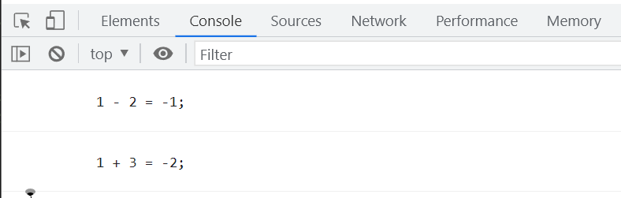

# JavaScript 中的闭包与回调

## 什么是闭包

在 JavaScript 中,当一个函数能够记住并访问其所在的词法作用域时,就产生了闭包,即使函数是在当前词法作用域之外执行。简单来说,闭包让你可以在一个内层函数中访问到其外层函数的作用域。

根据 ECMA262 标准:

1. 闭包让你可以在一个内层函数中访问到其外层函数的作用域,每当创建一个函数,闭包就会在函数创建的同时被创建出来。
2. 一个函数与其所处的环境(作用域)捆绑在一起的这种组合,就叫做闭包。

更多关于闭包的解释可以参考 MDN 文档:[闭包 - JavaScript | MDN](https://developer.mozilla.org/zh-CN/docs/Web/JavaScript/Closures)

## 闭包的原理

当一个函数统一与外界环境(作用域)捆绑在一起时,就形成了闭包。我们来看一个简单的例子:

```javascript
// 全局作用域形成闭包
function outer() {
  // outer函数作用域形成闭包
  function inner() {
    // inner函数作用域形成闭包
  }
}
```

上面的代码中,`outer`函数和`inner`函数都形成了各自的闭包。`inner`函数可以访问`outer`函数作用域中的变量,这就是闭包的作用。

## 使用闭包

闭包的一个常见用法是在函数内部定义另一个函数,内部函数可以访问外部函数的变量。看下面的例子:

```javascript
function compute(type) {
  let baseNum = 100;

  function plus(a, b) {
    return baseNum + a + b;
  }

  function minus(a, b) {
    return baseNum - a - b;
  }

  if (type === '+') {
    return plus;
  } else if (type === '-') {
    return minus;
  }
}

const plusFn = compute('+');
console.log(plusFn(1, 2)); // 输出103

const minusFn = compute('-');
console.log(minusFn(1, 2)); // 输出97
```

上面代码中,`compute`函数根据传入的`type`参数返回`plus`或`minus`函数。这两个内部函数都可以访问`compute`函数的`baseNum`变量,形成了闭包。当我们调用`plusFn(1, 2)`时,实际上是在调用`plus`函数,而`plus`可以访问`baseNum`变量,所以结果是 103。

闭包的另一个特性是可以让函数内部的变量始终保持在内存中。看下面的例子:

```javascript
function test() {
  let a = 1;

  function add() {
    return ++a;
  }

  return add;
}

const fn = test();
console.log(fn()); // 输出2
console.log(fn()); // 输出3
console.log(fn()); // 输出4
```

上面代码中,`test`函数返回了内部函数`add`,`add`函数形成了闭包,可以访问`test`函数内部的变量`a`。当我们连续多次调用`fn`时,`a`的值会不断增加。这是因为`a`始终保存在内存中,每次调用`add`时都会更新`a`的值。

## 回调函数

回调函数是指被作为参数传递给另一个函数,在该函数内部执行的函数。在 JavaScript 中,函数是一等公民,可以作为参数传递。回调函数分为同步回调和异步回调。

同步回调是指在函数返回之前执行回调函数,看下面的例子:

```javascript
function compute(a, b, callback) {
  const result = a + b;
  callback(result);
}

compute(1, 2, function (result) {
  console.log(result); // 输出3
});
```

异步回调是指在函数返回之后执行回调函数,JavaScript 中最常见的异步回调是事件监听:

```javascript
const btn = document.querySelector('#btn');
btn.addEventListener('click', function () {
  console.log('按钮被点击了');
});
```

上面代码给按钮添加了点击事件监听,当按钮被点击时会异步执行回调函数。

## 回调函数与闭包

回调函数经常与闭包一起使用,看下面的例子:

```javascript
function compute() {
  let baseNum = 100;
  return function (a, b, type) {
    let result = 0;
    switch (type) {
      case '+':
        result = baseNum + a + b;
        break;
      case '-':
        result = baseNum - a - b;
        break;
      default:
        break;
    }
    console.log(`${a} ${type} ${b} = ${result}`);
  };
}

const fn = compute();
fn(1, 2, '+'); // 输出: 1 + 2 = 103
fn(1, 2, '-'); // 输出: 1 - 2 = 97
```

上面代码中,`compute`函数返回一个匿名函数,匿名函数形成了闭包,可以访问`compute`函数的`baseNum`变量。我们将匿名函数赋值给`fn`变量,然后调用`fn`并传入参数。匿名函数根据传入的`type`参数执行不同的计算,并输出结果。


