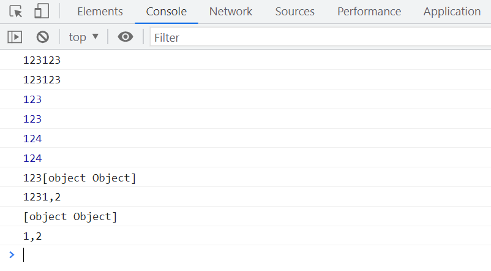
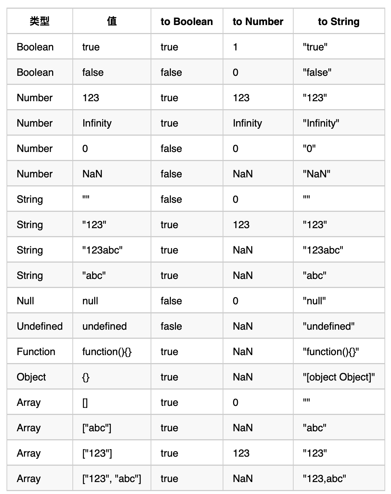

# JS 中的隐式类型转换1

在 JavaScript 中,由于是弱类型语言,变量没有明确的类型声明。这导致任意两个变量都可以进行`+ - * /`等数学运算,从而引入了隐式类型转换的概念。

## 数学运算符中的类型转换

当对非`Number`类型使用数学运算符时,JavaScript 会首先将其转换为`Number`类型,然后再执行运算。这是因为数学运算符期望操作数是数字类型。

```javascript
-true; // -1, 首先把 true 转换为数字 1, 然后执行 - 1
null - 1; // -1, 首先把 null 转换为数字 0, 然后执行 0 - 1
undefined *
  (2)['5'] * // NaN, undefined 转换为数字是 NaN
  2; // 10, ['5']首先会变成 '5', 然后再变成数字 5
```

## "+"号运算符的特殊性

在 JavaScript 中,"+"号不仅用于数学运算,还可以用来拼接字符串。其类型转换规则如下(优先级从高到低):

1. 如果"+"号任意一侧是`String`类型,则将另一侧转化为字符串进行拼接。
2. 如果一侧是`Number`类型,另一侧是原始类型,则将原始类型转化为`Number`后执行加法运算。
3. 如果一侧是`Number`类型,另一侧是引用类型,则先调用引用类型的`toString()`方法转为字符串,再进行字符串拼接。

```javascript
console.log(123 + '123'); // '123123'  (规则1)
console.log('123' + 123); // '123123'  (规则1)
console.log(123 + null); // 123  (规则2)
console.log(null + 123); // 123  (规则2)
console.log(123 + true); // 124  (规则2)
console.log(true + 123); // 124  (规则2)
console.log(123 + {}); // '123[object Object]'  (规则3)
console.log(123 + [1, 2]); // '1231,2'  (规则3)
```



## 逻辑判断中的类型转换

在使用`if`、`while`、`for`等条件语句时,条件表达式的结果需要是一个布尔值。这也会引发隐式类型转换。JavaScript 中以下 6 种值会被转换为`false`,其余都转为`true`:

`false`、`null`、`undefined`、`0`、`NaN`、`''`(空字符串)

[JS 语法、规范、错误、运算符、判断、注释](https://www.yuque.com/sumingcheng/xg4yu5/adb23p#neXUi)

## "=="比较的类型转换规则

使用`==`进行相等比较时,如果两边的类型不同,也会发生隐式类型转换。其规则如下:

1. 如果有一个操作数是`NaN`,则相等比较返回`false`。
2. 如果有一个操作数是`Boolean`,则先将其转换为`Number`再比较。
3. 如果一个操作数是`String`,另一个操作数是`Number`,则先将`String`转为`Number`再比较。
4. 如果一个操作数是`null`,另一个操作数是`undefined`,则相等比较返回`true`。
5. 如果一个操作数是原始类型,另一个是引用类型,则先将引用类型转换为原始类型再比较。转换规则遵循`toPrimitive`规则:
   - 先调用`valueOf()`方法,如果返回原始类型则使用该值。
   - 否则调用`toString()`方法,如果返回原始类型则使用该值。
   - 否则抛出`TypeError`异常。

```javascript
console.log(NaN == NaN); // false
console.log(true == 1); // true
console.log(true == '2'); // false, 先把 true 变成 1,而不是把 '2' 变成 true
console.log(true == ['1']); // true, 先把 true 变成 1, ['1']拆箱成 '1', 再参考规则3
console.log(true == ['2']); // false, 同上
console.log(undefined == false); // false, 首先 false 变成 0,然后参考规则4
console.log(null == false); // false,同上
console.log(123 == '123'); // true, '123' 会先变成 123
console.log('' == 0); // true, '' 会首先变成 0
console.log(null == undefined); // true
console.log([] == ![]); // true
// 第一步 ![] 变成 false
// 第二步 规则2 []==0
// 第三步 规则5 [].valueOf是0, 0==0 true
console.log([undefined] == false); // true
// 规则5 [undefined] toString 变成 '' ''=false
// 规则2 ''==0
// 规则3 0==0 true
```

## JavaScript 类型转换速查表



掌握 JavaScript 中的隐式类型转换规则,可以帮助我们理解一些看似"诡异"的代码行为,写出更加严谨和健壮的 JavaScript 程序。在比较两个值时,尽量使用`===`严格相等运算符,可以避免不必要的类型转换。
