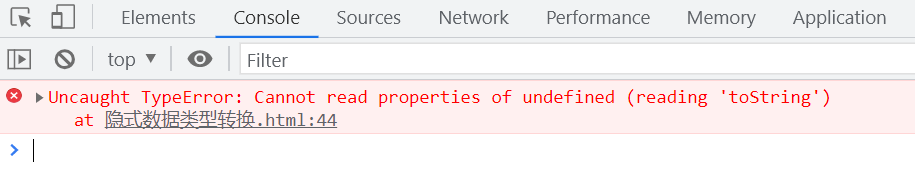

# JS 中的隐式类型转换2

在 JavaScript 中,当不同类型的值进行运算时,会发生隐式类型转换。本文将深入探讨原始值和对象在隐式类型转换过程中的行为。

## 原始值转换为原始值

### 转换为 Number 类型

当原始值需要转换为 Number 类型时,不同类型有不同的转换规则:

```javascript
console.log(Number(undefined)); // NaN
console.log(Number(null)); // 0
console.log(Number(Infinity)); // Infinity (本身就是数字)
```

undefined 转换为 Number 类型的结果是 NaN,null 转换为 0,而 Infinity 本身就是数字,转换后保持不变。

### 转换为 Boolean 类型

在条件判断等场景下,原始值会被隐式转换为 Boolean 类型:

```javascript
console.log(Boolean(undefined)); // false
console.log(Boolean(null)); // false
```

undefined 和 null 转换为 Boolean 类型的结果都是 false。

### 虚值(falsy value)

在 JavaScript 中,有一些特殊的值在经过 Boolean 转换后会变为 false,我们称之为虚值。常见的虚值包括:

|  特殊值   | Number |   字符串   | 布尔值 |
| :-------: | :----: | :--------: | :----: |
| undefined |   0    |     ""     | false  |
|   null    |  NaN   | " "是 true |

需要注意的是," "(空格字符串)转换为 Boolean 类型的结果是 true。

## 对象转换为原始值

### 对象转换为 Boolean

当对象需要转换为 Boolean 类型时,结果总是 true,无论对象的内容是什么:

```javascript
console.log(Boolean([])); // true
console.log(Boolean({})); // true
console.log(Boolean(/d/)); // true
console.log(Boolean(new Error())); // true
console.log(Boolean(Symbol())); // true
```

### 对象转换为 Number

当对象需要转换为 Number 类型时,会先调用对象的 valueOf 方法,如果 valueOf 返回原始值,则直接对该原始值进行 Number 类型转换:

```javascript
var obj = {
  valueOf() {
    return 123;
  },
};
console.log(Number(obj)); // 123
```

如果 valueOf 返回的是对象,则会继续调用对象的 toString 方法,如果 toString 返回原始值,则对该原始值进行 Number 类型转换:

```javascript
var obj = {
  valueOf() {
    return {};
  },
  toString() {
    return '456';
  },
};
console.log(Number(obj)); // 456
```

如果 toString 也返回对象,则会抛出 TypeError 错误。

如果对象没有重写 toString 方法,则会调用 Object.prototype.toString,得到类似"[object Object]"的字符串,转换为 Number 类型的结果为 NaN:

```javascript
console.log(Number({})); // NaN
console.log(Number([])); // 0
console.log(Number([1, 2])); // NaN
```

### 对象转换为 Number 的步骤总结

1. 调用对象的 valueOf 方法,如果返回原始值,则对该原始值进行 Number 类型转换
2. 如果 valueOf 返回对象,则调用对象的 toString 方法
   - 如果 toString 返回原始值,则对该原始值进行 Number 类型转换
   - 如果 toString 返回对象,则抛出 TypeError 错误
3. 如果对象没有重写 toString 方法,则调用 Object.prototype.toString,将得到的字符串进行 Number 类型转换

## Object.prototype.toString 方法

Object.prototype.toString 方法可以用来判断一个值的类型,常见的用法如下:

```javascript
Object.prototype.toString.call(123); // "[object Number]"
Object.prototype.toString.call('abc'); // "[object String]"
Object.prototype.toString.call(true); // "[object Boolean]"
Object.prototype.toString.call(undefined); // "[object Undefined]"
Object.prototype.toString.call(null); // "[object Null]"
Object.prototype.toString.call([]); // "[object Array]"
Object.prototype.toString.call({}); // "[object Object]"
Object.prototype.toString.call(function () {}); // "[object Function]"
Object.prototype.toString.call(/d/); // "[object RegExp]"
Object.prototype.toString.call(new Date()); // "[object Date]"
Object.prototype.toString.call(Symbol()); // "[object Symbol]"
```

特殊的几个例子:

```javascript
Object.prototype.toString.call(new Error()); // "[object Error]"
(function () {
  console.log(Object.prototype.toString.call(arguments)); // "[object Arguments]"
})();
Object.prototype.toString.call(document); // "[object HTMLDocument]"
```

## undefined 和 null 没有对应的包装类型

undefined 和 null 比较特殊,它们没有对应的包装类型,因此不能调用 toString 等方法,否则会抛出错误:

```javascript
undefined.toString(); // TypeError: Cannot read property 'toString' of undefined
null.toString(); // TypeError: Cannot read property 'toString' of null
```


