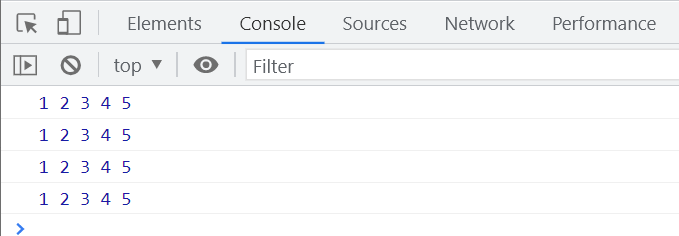

# this 指向总结

## 四种绑定规则

### 默认绑定规则

在默认情况下,`this`指向全局对象。在浏览器环境中,全局对象是`window`。

```javascript
console.log(this === window); // true

// 函数的独立调用
function test() {
  console.log(this === window); // true
}
test();
```

需要注意的是,不同的对象即使内容相同,它们的指针地址也是不一样的。

```javascript
console.log({} === {}); // false 两个对象的指针地址不一样
```

### 隐式绑定规则

隐式绑定是指通过对象属性引用方式调用函数时,函数中的`this`指向该对象。

每个函数在执行时都有自己的`this`,它的指向是由函数的执行方式决定的。

```javascript
var a = 0;
var obj = {
  a: 2,
  foo: function () {
    console.log(this); // 指向obj,因为是通过obj.foo()调用

    function test() {
      console.log(this); // 函数独立调用,内部的this指向window
    }
    test();

    // 立即执行函数(IIFE)中的this指向window
    (function () {
      console.log(this); // window
    })();
  },
};
obj.foo();
```

#### 闭包

闭包是指当函数执行时,导致函数被定义并抛出,产生的作用域链不释放的现象。

```javascript
var a = 0;
var obj = {
  a: 2,
  foo: function () {
    // test 被定义
    function test() {
      console.log(this);
    }
    // 抛出定义的 test
    return test;
  },
};
obj.foo(); // foo 执行
```

#### 执行两次的情况

如果将函数的返回值作为函数调用,虽然在`foo`的作用域中,但实际上等同于将`test()`拿出来单独执行,此时`this`指向`window`。

```javascript
var a = 0;
var obj = {
  a: 2,
  foo: function () {
    function test() {
      console.log(this);
    }
    return test;
  },
};
obj.foo()(); // window
```

#### 隐式绑定的例外

当函数被赋值给一个变量时,会发生隐式丢失,此时的`this`指向全局对象`window`。

```javascript
var a = 0;

function foo() {
  console.log(this);
}

var obj = {
  a: 2,
  foo: foo,
};

obj.foo(); // obj

// 隐式丢失
var bar = obj.foo;
bar(); // window
```

#### 参数赋值的情况

父函数有能力决定子函数的`this`指向。

```javascript
var a = 0;

function foo() {
  console.log(this);
}

function bar(fn) {
  // fn 被赋值为 obj.foo
  fn();
}

var obj = {
  a: 2,
  foo: foo,
};

bar(obj.foo); // window
```

#### API 的 this 指向

某些 API 中回调函数的`this`指向由 API 的文档规定,需要查阅相关文档确定`this`的指向。

例如 [Array.prototype.forEach()](https://developer.mozilla.org/zh-CN/docs/Web/JavaScript/Reference/Global_Objects/Array/forEach) 中的回调函数,其`this`指向由第二个参数决定,默认为`undefined`。

```javascript
var arr = [1, 2, 3];

arr.forEach(function (item, idx, arr) {
  console.log(this); // window
});

arr.sort(function (a, b) {
  console.log(this); // window
  return a - b;
});
```

### 显式绑定

可以通过`call()`、`apply()`、`bind()`方法显式修改函数的`this`指向。

三者的区别在于传参方式不同:

- `call()`以参数列表形式传入
- `apply()`以数组形式传入
- `bind()`返回一个新函数,需要再次调用

```javascript
var a = 0;

function foo(a, b, c, d, e) {
  console.log(a, b, c, d, e);
}

var obj = {
  a: 2,
  foo: foo,
};

var bar = obj.foo;

obj.foo(1, 2, 3, 4, 5);

// 三种传参方式的不同
bar.call(obj, 1, 2, 3, 4, 5);
bar.apply(obj, [1, 2, 3, 4, 5]);
bar.bind(obj)(1, 2, 3, 4, 5);
```



#### 绑定失败的情况

如果显式绑定的第一个参数传入`undefined`或`null`,则无法进行绑定,此时会采用默认绑定,`this`指向全局对象`window`。

```javascript
var a = 0;

function foo(a, b, c, d, e) {
  console.log(this);
}

var obj = {
  a: 2,
  foo: foo,
};

var bar = obj.foo;

// 绑定失败,采用默认绑定,this指向window
bar.call(undefined, 1, 2, 3, 4, 5);
bar.apply(null, [1, 2, 3, 4, 5]);
```

### new 绑定

通过`new`关键字调用构造函数时,函数中的`this`指向新创建的实例对象。

```javascript
function Person() {
  // 实例化的过程
  // 1. 创建一个新对象
  // var this = {};
  // 2. 将this绑定到新对象
  this.a = 1;
  // 3. 返回新对象
  // return this;
}

var person = new Person();
console.log(person.a); // 1
```

构造函数本质上是一个函数,`this`指向的是实例对象,而不是构造函数本身。

## this 指向优先级

`this`绑定规则的优先级从高到低依次为:

**new 绑定 > 显式绑定 > 隐式绑定 > 默认绑定**

## 不同环境下的全局对象

### Web 环境

在浏览器环境中,全局对象是`window`。

```javascript
console.log(this === window); // true
console.log(self === window); // true
console.log(frames === window); // true
```

### Node.js 环境

在 Node.js 环境中,全局对象是`global`。

```javascript
console.log(this === global); // true
```

### Worker 环境

在 Web Worker 环境中,全局对象是`self`。

```javascript
console.log(this === self); // true
```
