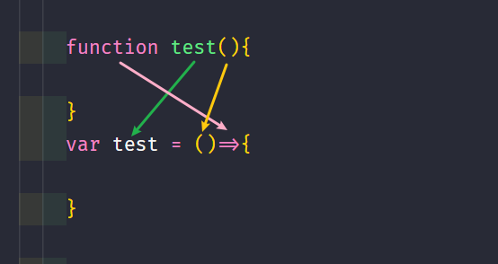
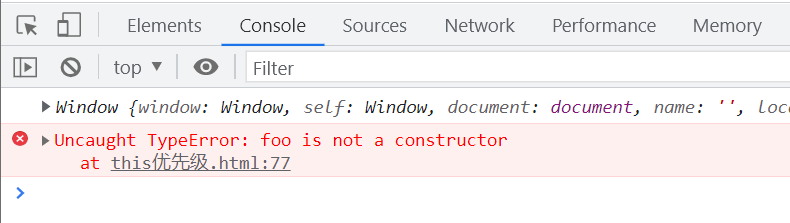
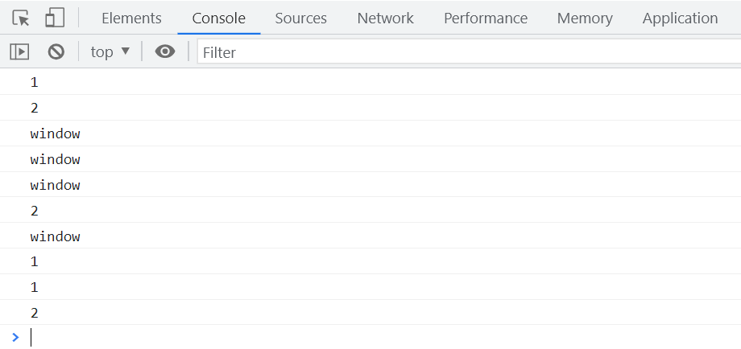
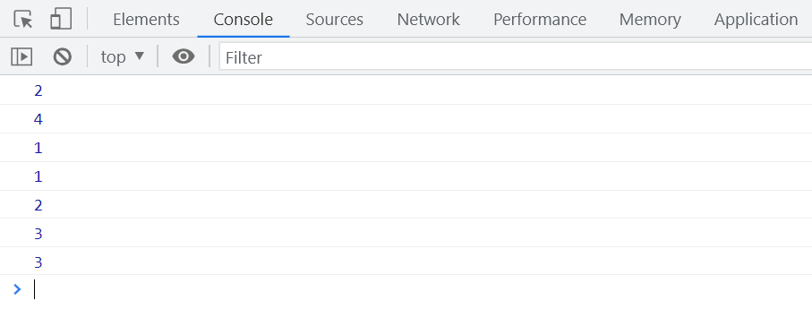

# 箭头函数中的 this 绑定

在 JavaScript 中,箭头函数的`this`绑定与普通函数有所不同。让我们通过一些示例来深入理解箭头函数中`this`的行为。

## new 和 bind 的优先级

首先,我们来看一下`new`和`bind`的优先级:

```javascript
function foo(b) {
  this.a = b;
}

var obj1 = {};
console.log(foo.bind(obj1));
var bar = foo.bind(obj1);
bar(2);

console.log(obj1.a); // 2
// new 把 this 的指向改变成了 baz
var baz = new bar(3);
// obj1.a 的属性没有变化,变化的是实例化后的对象
console.log(obj1.a); // 2
console.log(baz.a); // 3
```

从上面的例子可以看出,`new`的优先级高于`bind`。当使用`new`关键字实例化一个绑定了`this`的函数时,`this`的指向会被`new`改变,而原来绑定的对象不受影响。



## 箭头函数中的 this

箭头函数与普通函数在`this`绑定上有着显著的区别:

1. 箭头函数本身没有自己的`this`指向。
2. 箭头函数的`this`指向由其所在的父级作用域决定。

```javascript
var a = 0;

function foo() {
  console.log(this);
  var test = () => {
    console.log(this);
  };
  test();
}
var obj = {
  a: 1,
  foo: foo,
};
foo(); // window
obj.foo(); // obj
```

在上面的例子中,箭头函数`test`没有自己的`this`,它的`this`由父级作用域`foo`的`this`决定。当`foo`被作为普通函数调用时,`this`指向全局对象`window`;而当`foo`作为对象`obj`的方法调用时,`this`指向`obj`。

## 箭头函数中 this 绑定的特殊性

由于箭头函数的`this`由父级作用域决定,那么常见的`this`绑定规则对箭头函数是否还适用呢?让我们来看一个例子:

```javascript
var a = 0;

function foo() {
  console.log(this);
  var test = () => {
    console.log(this);
  };
  return test;
}

var obj1 = {
  a: 1,
  foo: () => {
    console.log(this);
  },
};
var obj2 = {
  a: 2,
  foo: foo,
};

// obj1.foo()(); // 默认绑定规则对箭头函数无效。
// var bar = foo().call(obj2); // 显式绑定规则无效
// obj1.foo(); // 隐式绑定无效
```

从上面的例子可以看出,默认绑定、显式绑定和隐式绑定等规则都无法改变箭头函数的`this`指向。箭头函数的`this`完全由其父级作用域决定。

此外,箭头函数也不能作为构造函数使用,`new`关键字无法实例化箭头函数:

```javascript
var foo = () => {
  console.log(this);
};
foo();

new foo(); // TypeError: foo is not a constructor
```



## 总结

综上所述,箭头函数的`this`绑定有其特殊性:

箭头函数本身不存在`this`指向,其`this`完全取决于父级作用域的`this`。常见的`this`绑定规则如默认绑定、显式绑定、隐式绑定以及`new`绑定都不适用于箭头函数。

因此,如果想要改变箭头函数的`this`指向,唯一的办法就是改变其父级作用域的`this`指向。

## 练习

为了加深对箭头函数`this`绑定的理解,让我们来做一些练习。

### 练习 1: this 绑定

```javascript
var name = 'window';
var obj1 = {
  name: '1',
  fn1: function () {
    console.log(this.name);
  },
  fn2: () => console.log(this.name),
  fn3: function () {
    return function () {
      console.log(this.name);
    };
  },
  fn4: function () {
    return () => console.log(this.name);
  },
};
var obj2 = {
  name: '2',
};

obj1.fn1(); // 1 (对象调用,this指向obj1)
obj1.fn1.call(obj2); // 2 (call改变this指向为obj2)

obj1.fn2(); // window (箭头函数,直接看父作用域window的name)
obj1.fn2.call(obj2); // window (箭头函数,call无法改变其this指向)

obj1.fn3()(); // window (独立调用,this指向window)
obj1.fn3().call(obj2); // 2 (call改变返回函数的this为obj2)
obj1.fn3.call(obj2)(); // window (独立调用,this仍指向window)

obj1.fn4()(); // 1 (箭头函数,看父作用域fn4的this,即obj1)
obj1.fn4().call(obj2); // 1 (箭头函数,call无法改变其this指向)
obj1.fn4.call(obj2)(); // 2 (call改变父作用域fn4的this为obj2,箭头函数跟随其变化)
```



### 练习 2: 综合练习

```javascript
function Foo() {
  getName = function () {
    console.log(1);
  };
  return this;
}
Foo.getName = function () {
  console.log(2);
};
Foo.prototype.getName = function () {
  console.log(3);
};
var getName = function () {
  console.log(4);
};

function getName() {
  console.log(5);
}

Foo.getName(); // 2 (构造函数的静态方法)
getName(); // 4 (全局的getName函数表达式)
Foo().getName(); // 1 (Foo()返回this,即window,执行window.getName,输出1)
getName(); // 1 (window.getName已被Foo内部的getName覆盖)

new Foo.getName(); // 2 (Foo.getName作为构造函数调用)
new Foo().getName(); // 3 (Foo实例上的原型方法getName)
new new Foo().getName(); // 3 (等价于new (new Foo()).getName())
```


