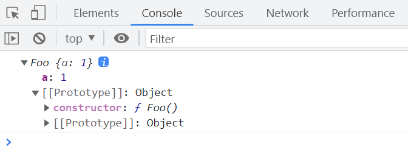
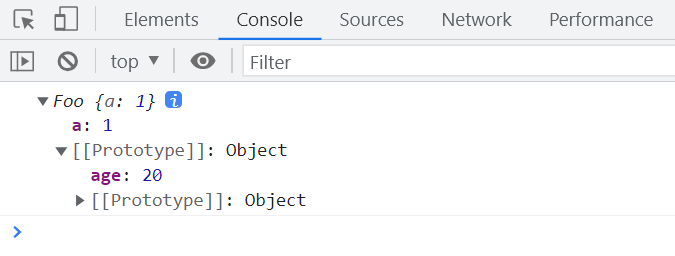
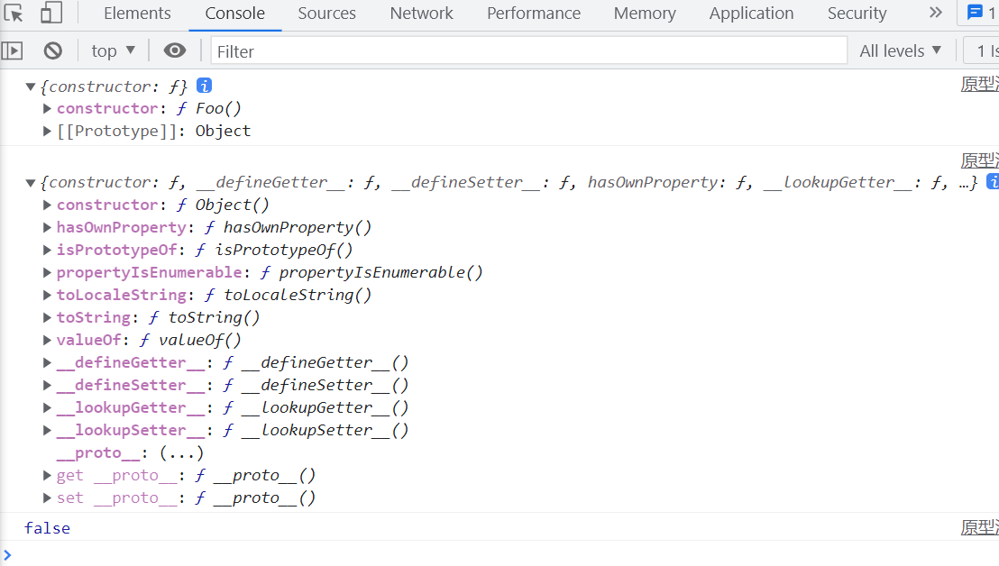
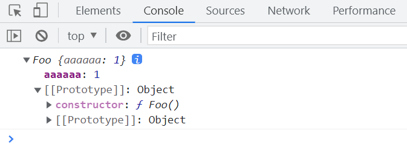
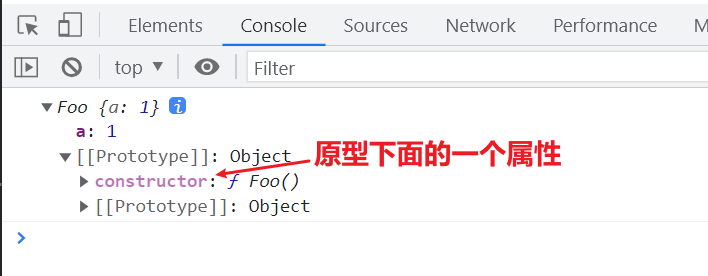
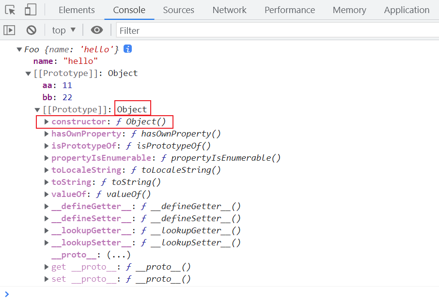
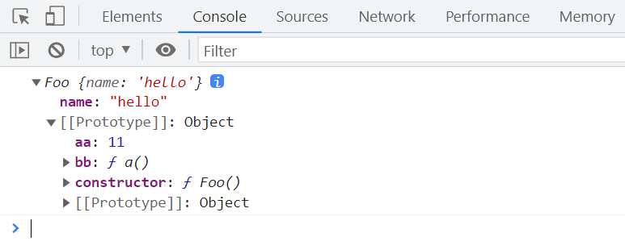

# prototype proto 和 constructor

## new 关键字

当我们使用`new`关键字执行构造函数时,函数内部的`this`会指向新创建的实例对象。

```javascript
function Person() {
  this.name = 'Tom';
}
var person = new Person();
console.log(person);
```

执行上述代码后,实例对象`person`上就挂载了一个属性`name: 'Tom'`。



## 原型对象

在 JavaScript 中,每个函数都有一个`prototype`属性,指向该函数的原型对象。原型对象是所有通过该构造函数创建的实例对象的公共祖先,实例对象可以访问原型对象上的属性和方法。

```javascript
function Person() {
  this.name = 'Tom';
}
Person.prototype.age = 20;

var person = new Person();
console.log(person.age); // 20
```

实例对象`person`可以访问到原型对象上的`age`属性。



## 访问原型对象的两种方式

我们可以通过以下两种方式来访问一个对象的原型:

1. 通过实例对象的`__proto__`属性
2. 通过构造函数的`prototype`属性

```javascript
function Person() {
  this.name = 'Tom';
}
Person.prototype.age = 20;

var person = new Person();
console.log(person.__proto__ === Person.prototype); // true
```

实例对象的`__proto__`属性和构造函数的`prototype`属性指向同一个原型对象。

## 实例对象与 Object 原型的关系

在 JavaScript 中,几乎所有对象都是`Object`的实例,因此它们的原型链最终都会指向`Object.prototype`。但实例对象的原型和`Object.prototype`并不是同一个对象。

```javascript
function Person() {
  this.name = 'Tom';
}
var person = new Person();
console.log(person.__proto__ === Object.prototype); // false
console.log(person.__proto__.__proto__ === Object.prototype); // true
```



实例对象`person`的原型是`Person.prototype`,而`Person.prototype`的原型才是`Object.prototype`。

## 属性的颜色区分

在浏览器控制台中查看对象时,不同颜色的属性有不同的含义:

1. 淡紫色表示系统内置的属性
2. 深紫色表示用户自定义的属性

```javascript
function Person() {
  this.name = 'Tom';
}
var person = new Person();
console.log(person);
```



## 访问原型对象的最佳实践

虽然我们可以通过实例对象的`__proto__`属性来访问原型对象,但这种做法并不推荐。更好的方式是使用`Object.getPrototypeOf()`方法。

```javascript
function Person() {
  this.name = 'Tom';
}
var person = new Person();

console.log(person.__proto__ === Person.prototype); // true
console.log(Object.getPrototypeOf(person) === Person.prototype); // true
```

使用`Object.getPrototypeOf()`可以避免直接访问`__proto__`可能带来的问题。

## constructor 属性

每个原型对象都有一个`constructor`属性,指向与之关联的构造函数。

```javascript
function Person() {
  this.name = 'Tom';
}
var person = new Person();
console.log(person);
```



可以看到,`Person.prototype.constructor`指向了`Person`构造函数本身。

## 重写原型对象与 constructor

如果我们直接重写一个函数的原型对象,那么新原型对象的`constructor`属性会指向`Object`构造函数,而不是原来的构造函数。

```javascript
function Person() {
  this.name = 'Tom';
}
Person.prototype = {
  age: 20,
  sayHi: function () {
    console.log('Hi');
  },
};
var person = new Person();
console.log(person);
```



重写`Person.prototype`后,新原型对象的`constructor`指向了`Object`,而不是`Person`。

为了保持`constructor`属性的正确性,我们在重写原型对象时,需要手动恢复`constructor`属性:

```javascript
function Person() {
  this.name = 'Tom';
}
Person.prototype = {
  age: 20,
  sayHi: function () {
    console.log('Hi');
  },
  constructor: Person,
};
var person = new Person();
console.log(person);
```



这样修改后,`Person.prototype.constructor`又重新指向了`Person`构造函数。
