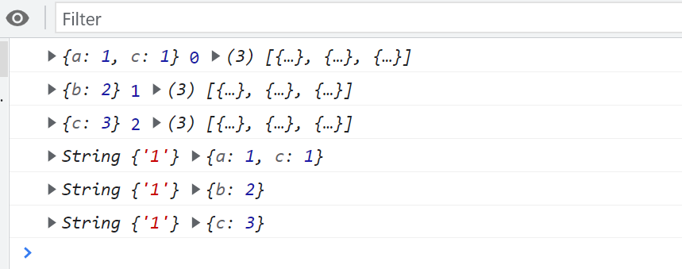

# forEach、filter 和 map

## Array.prototype.forEach()

`forEach` 方法在 `ES5` 中引入，用于对数组的每个元素执行一次指定的函数。它不会返回结果，而是对数组进行遍历操作。

### 参数

回调函数接收三个参数：

- 当前元素 (`element`)
- 当前元素的索引 (`index`)
- 整个数组 (`array`)

第二个参数可选，用于指定回调函数中的 `this` 值。如果传入的是原始值，会进行包装，但不会包装 `null` 和 `undefined`。

```javascript
const arr = [{ a: 1, c: 1 }, { b: 2 }, { c: 3 }];

// 普通循环
for (let i = 0; i < arr.length; i++) {
  console.log(arr[i], i, arr);
}

// 使用 forEach
arr.forEach(function (element, index, array) {
  console.log(this, element);
}, '1');
```



### 重写 forEach

以下是 `forEach` 方法的自定义实现：

```javascript
Array.prototype.myForEach = function (callback) {
  const array = this;
  const length = array.length;
  const thisArg = arguments[1] || window;

  for (let i = 0; i < length; i++) {
    callback.call(thisArg, array[i], i, array);
  }
};

// 示例使用
const sampleArray = [{ a: 1 }, { b: 2 }, { c: 3 }];
sampleArray.myForEach(function (element, index, array) {
  console.log(this, element);
}, '1');
```

**注意事项**

- `forEach` 不会中途停止，即使回调函数中使用了 `return` 也不会影响遍历过程。
- 无法链式调用，因为 `forEach` 返回 `undefined`。

## Array.prototype.filter()

`filter` 方法用于筛选数组中的元素，返回一个新的数组，包含所有通过测试的元素。

### 特点

- 对数组中的每一项进行判断。
- 通过返回布尔值来决定元素是否保留在新数组中。

```javascript
const filteredArray = data.filter(function (element) {
  return element.is_free === '1';
});

console.log(filteredArray);
```

### 重写 filter

以下是 `filter` 方法的自定义实现：

```javascript
Array.prototype.myFilter = function (callback) {
  const array = this;
  const length = array.length;
  const thisArg = arguments[1] || window;
  const resultArray = [];

  for (let i = 0; i < length; i++) {
    if (callback.call(thisArg, array[i], i, array)) {
      // 假设 deepClone 是一个已定义的深拷贝函数
      resultArray.push(deepClone(array[i]));
    }
  }
  return resultArray;
};

// 示例使用
const filteredData = data.myFilter(function (element) {
  return element.is_free === '1';
  console.log(this);
});
```

**最佳实践**

- 确保回调函数不修改原数组，以避免副作用。
- 使用箭头函数可以更简洁地编写回调。

## Array.prototype.map()

`map` 方法创建一个新数组，其结果是对原数组的每个元素调用一个提供的函数后的返回值。

```javascript
const newArray = data.map(
  function (element, index, array) {
    // 操作数组不会修改原数组，因为返回的是新元素
    return { ...element, course: this.name + element.course };
  },
  { name: 'title' }
);

console.log(newArray);
```

### 重写 map

以下是 `map` 方法的自定义实现：

```javascript
Array.prototype.myMap = function (callback) {
  const array = this;
  const length = array.length;
  const thisArg = arguments[1] || window;
  const resultArray = [];

  for (let i = 0; i < length; i++) {
    // 假设 deepClone 是一个已定义的深拷贝函数
    const clonedElement = deepClone(array[i]);
    resultArray.push(callback.call(thisArg, clonedElement, i, array));
  }
  return resultArray;
};

// 示例使用
const mappedData = data.myMap(
  function (element) {
    return { ...element, course: this.name + element.course };
  },
  { name: 'title' }
);

console.log(mappedData);
```

**最佳实践**

- 使用 `map` 进行不可变操作，避免直接修改原数组。
- 返回新的对象或值，以保持数据的纯粹性。
