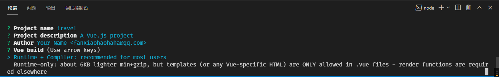
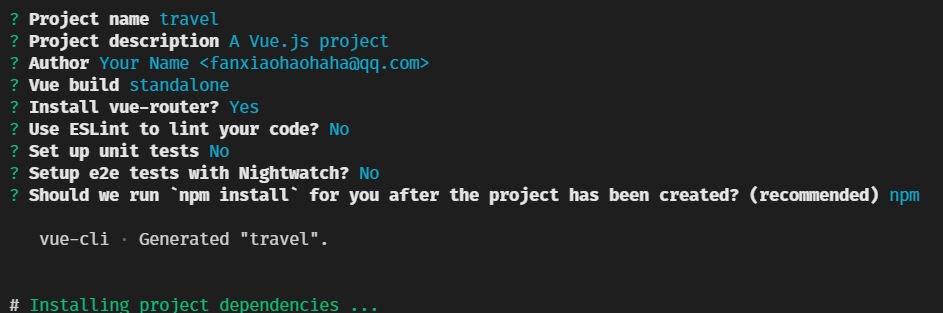
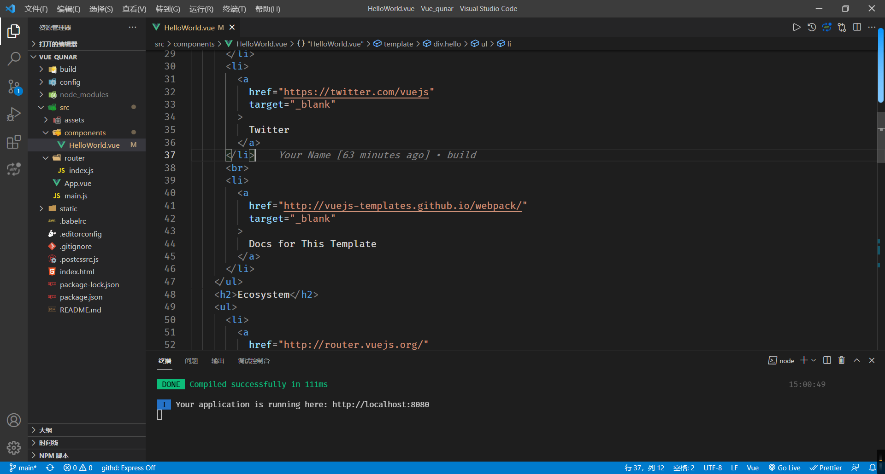
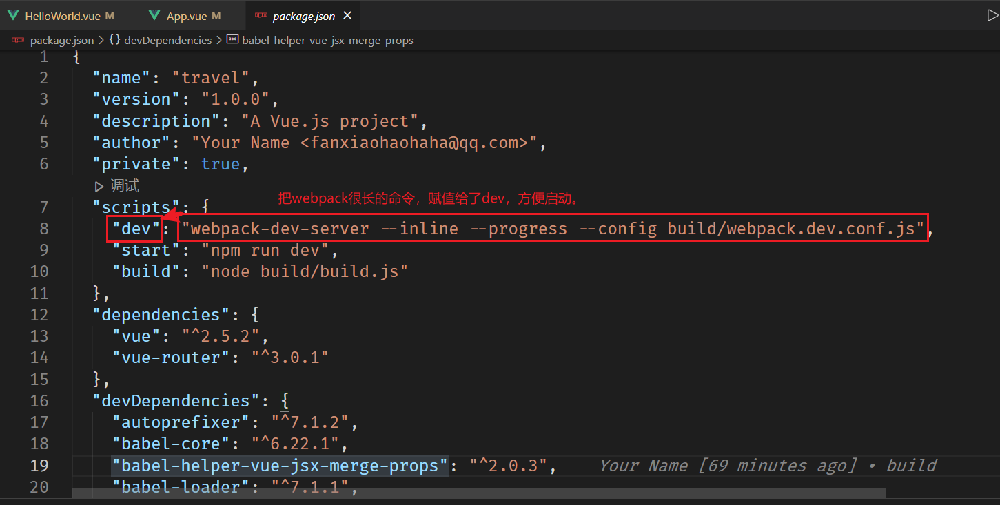
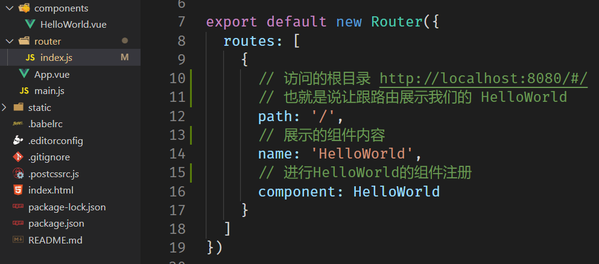
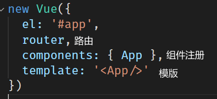

# 安装 Node.js

安装 Node.js 后，可以通过以下命令检查是否安装成功：

```shell
node -v
```

安装 Node.js 时会自动安装 npm。使用以下命令查看 npm 版本：

```shell
npm -v
```

使用 Git 进行代码管理可以参考[Git/Vue_qunar](https://github.com/ReMuling/Vue_qunar)。

# 使用模板（Webpack）

全局安装 Vue CLI 初始化工具，然后使用 Webpack 模板创建项目：

```shell
npm install -g @vue/cli-init
vue init webpack travel
```

运行上述命令后，您可以定义项目名称、作者名称等信息，如下图所示。



接下来，选择是否使用默认的编译方式，是否安装 `Vue-router`，是否启用 `Eslint` 代码检查，是否需要单元测试，是否需要 `e2e` 测试，以及选择使用 `npm` 还是 `yarn` 来安装依赖包。以下是我的选择内容。



等待依赖安装完成并生成目录结构。当您看到以下提示时，说明安装成功。

```vue
project initialization finished!
```



项目创建成功后，访问本地 `8080` 端口即可运行项目。

# package.json 文件



为了简洁起见，我们可以在 `package.json` 中设置一些简短的脚本指令。

## 如果没有这个文件

输入以下命令创建一个 `package.json` 文件：

```shell
npm init -y
```

在创建的 `package.json` 文件中，您可以进行所需的配置。除了使用 `npm` 创建，`yarn` 也可以创建 `package.json` 文件。但建议在项目初期选择一个包管理工具并坚持使用，避免中途更换导致的依赖问题。

# 分析创建的目录

## package.json

`package.json` 文件在产品上线后仍然有其作用，它不仅在开发阶段保存项目的依赖信息，还在生产环境中用于安装和管理依赖包。

## index.html

`index.html` 提供了一个挂载点，是应用的根挂载点。

```vue
<div id="app"></div>
```

## .gitignore

`.gitignore` 文件帮助我们忽略一些不需要上传到版本控制的文件，例如 `node_modules` 目录。由于 `node_modules` 包体积较大，并且可以通过 `npm install` 重新生成，因此不需要上传到仓库。

## .editorconfig

`.editorconfig` 文件用于配置编辑器的相关设置，这些配置会覆盖编辑器自身的设置，确保团队成员在不同编辑器中保持一致的代码风格。

## .babelrc

`.babelrc` 文件用于配置 Babel 插件，编译 `ES6` 语法，将其转换为浏览器能够理解的 `JavaScript` 代码。

## static

`static` 目录用于存放静态文件，如图片、字体等，这些文件不会经过 Webpack 处理，直接在项目中引用。

## src

`src` 目录是源代码的主要存放位置，包含组件、路由等核心代码。

### src/main.js

```javascript
import Vue from 'vue';
import App from './App';
import router from './router';

Vue.config.productionTip = false;

/* eslint-disable no-new */
new Vue({
  el: '#app',
  router,
  components: { App },
  template: '<App/>',
});
// 这是一个根组件，可以在这里引入一些子组件。
```

`main.js` 是应用的入口文件，负责创建根 Vue 实例，并挂载到 `#app` 元素上。您可以在这里引入并注册全局组件或插件。

## config

`config` 目录用于存放项目的配置文件，包括开发环境和生产环境的不同配置。

## router/index.js



`router/index.js` 文件配置了应用的路由，定义了不同路径对应的组件，管理应用的导航和视图切换。

# 单文件组件

### App.vue

```vue
<template>
  <div id="app">
    <router-view />
  </div>
</template>

<script>
export default {
  name: 'App',
};
</script>

<style>
#app {
  font-family: 'Avenir', Helvetica, Arial, sans-serif;
  -webkit-font-smoothing: antialiased;
  -moz-osx-font-smoothing: grayscale;
  text-align: center;
  color: #2c3e50;
  margin-top: 60px;
}
</style>
```

单文件组件的显著特点是将模板、脚本和样式统一定义在一个文件中，便于组件的维护和管理。



通过这种方式，组件的结构更加清晰，开发效率也得到了提升。

# 使用 Git 进行代码管理

使用 Git 进行版本控制可以帮助您管理代码的历史版本，协作开发更加高效。以下是一些常用的 Git 命令示例：

初始化 Git 仓库：

```shell
git init
```

添加文件到暂存区：

```shell
git add .
```

提交更改：

```shell
git commit -m "Initial commit"
```

添加远程仓库：

```shell
git remote add origin https://github.com/YourUsername/YourRepository.git
```

推送代码到远程仓库：

```shell
git push -u origin master
```

通过合理使用 Git，可以有效地管理项目的代码版本，避免因代码冲突导致的问题。

# 配置 ESLint

在项目中配置 ESLint 可以帮助您保持代码风格的一致性，并及时发现潜在的错误。以下是配置 ESLint 的步骤：

安装 ESLint 及相关插件：

```shell
npm install eslint eslint-plugin-vue --save-dev
```

初始化 ESLint 配置：

```shell
npx eslint --init
```

根据提示选择适合您的配置选项，例如选择 `Vue` 相关的规则。

配置完成后，您可以在编辑器中集成 ESLint 插件，实时检查代码中的问题，并根据提示进行修正。

# 使用 Vue Router

Vue Router 是 Vue.js 官方的路由管理器，用于构建单页应用。以下是基本的使用步骤：

安装 Vue Router：

```shell
npm install vue-router --save
```

在 `src/router/index.js` 中配置路由：

```javascript
import Vue from 'vue';
import Router from 'vue-router';
import Home from '@/components/Home.vue';
import About from '@/components/About.vue';

Vue.use(Router);

export default new Router({
  routes: [
    {
      path: '/',
      name: 'Home',
      component: Home,
    },
    {
      path: '/about',
      name: 'About',
      component: About,
    },
  ],
});
```

在 `main.js` 中引入并使用路由：

```javascript
import router from './router';

new Vue({
  el: '#app',
  router,
  components: { App },
  template: '<App/>',
});
```

在组件中使用 `<router-link>` 和 `<router-view>` 实现导航和视图切换。

通过 Vue Router，可以轻松管理应用的不同页面和组件，实现流畅的用户体验。

# 参考链接

- [Node.js 官方下载页面](https://nodejs.org/en/download/releases/)
