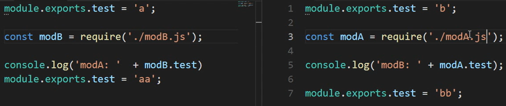
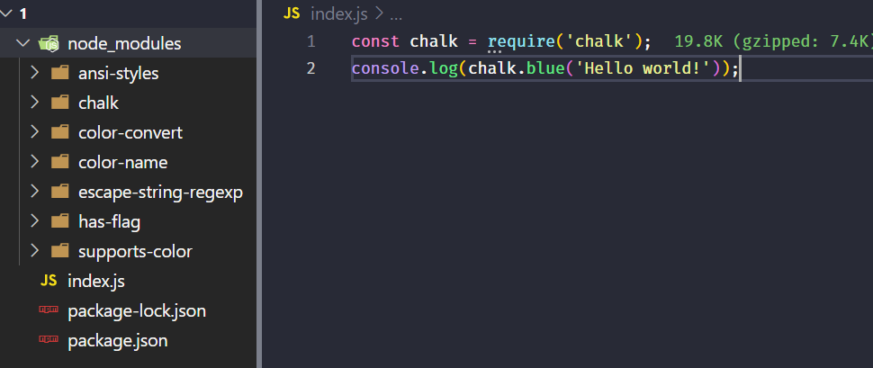

# CommonJS 模块规范

CommonJS 是 Node.js 使用的模块规范,它有以下几个特点:

1. 一个文件就是一个模块,拥有单独的作用域。
2. 普通定义的变量、函数、对象都属于模块内部,外部无法访问。
3. 通过`require()`函数来加载模块。
4. 通过`exports`或`module.exports`来暴露模块中的内容。
5. 在 Node.js 中,`global`对象代表全局作用域,类似于浏览器中的`window`对象。

下面是一个简单的示例,展示了模块的基本用法:

```javascript
// 在一个模块内部定义变量
var a = 100;
console.log(a); // 输出100
console.log(arguments);
// 一个文件就是一个模块,在单个文件内部无法访问全局作用域中的变量a
// 每个模块都有自己独立的作用域
```

## 模块的分类

### 核心模块

Node.js 内置的模块称为核心模块,在引入时会被自动加载,加载速度最快。例如:

```javascript
const fs = require('fs');
```

引入核心模块时,也可以使用解构赋值的方式:

```javascript
const { readFile } = require('fs');
```

### 文件模块

除了核心模块外,我们也可以自定义模块并引入。引入文件模块需要提供文件的路径,引入速度相对较慢。如果多次引用同一个文件模块,那么只会执行一次,之后会直接从缓存中读取。文件模块会被缓存到`Module._cache`对象中。

```javascript
const myModule = require('./myModule');
```

### 循环依赖

当多个模块之间存在循环依赖时,Node.js 模块机制不会出现死循环。Node.js 只会输出已经执行完毕的部分,还未执行的部分不会被加载。



## 模块加载流程

当使用`require()`加载一个模块时,Node.js 会按照以下顺序查找模块:

1. 检查是否是核心模块,如果是则直接返回核心模块,不再继续查找。
2. 确定模块标识,将相对路径转为绝对路径。
3. 检查是否有缓存,如果有则直接返回缓存。
4. 加载模块,如果是文件模块则按照文件扩展名的不同加载,如果是目录则按照`package.json`中的`main`字段查找入口文件。
5. 输出模块的`exports`对象。

下图展示了`require()`加载一个目录时的查找流程:



## module 对象

每个模块中都有一个`module`对象,它包含了当前模块的信息。下面是一个例子:

```javascript
// index.js
const modA = require('./modA');
console.log(module);
```

```javascript
// modA.js
module.exports.a = 1;
exports.b = 2;
console.log(exports === module.exports); // 输出true
```

运行`node index.js`,输出结果如下:

```
true
Module {
  id: '.',
  path: '/path/to/example',
  exports: {},
  parent: null,
  filename: '/path/to/example/index.js',
  loaded: false,
  children: [
    Module {
      id: '/path/to/example/modA.js',
      path: '/path/to/example',
      exports: { a: 1, b: 2 },
      parent: [Circular],
      filename: '/path/to/example/modA.js',
      loaded: true,
      children: [],
      paths: [Array]
    }
  ],
  paths: [
    '/path/to/example/node_modules',
    '/path/to/node_modules',
    '/path/node_modules'
  ]
}
```

## exports 和 module.exports 的区别

`exports`是`module.exports`的一个引用,当需要暴露多个变量或函数时,可以使用`exports`对象:

```javascript
exports.a = 1;
exports.b = 2;
exports.c = 3;
```

而`module.exports`可以直接暴露一个对象、函数或变量:

```javascript
module.exports = function () {
  console.log('hello world');
};
```

需要注意的是,如果给`exports`赋值一个新对象,那么它将不再是`module.exports`的引用,无法被外部访问:

```javascript
exports = { a: 1 }; // 错误的用法
```

区别:

1. `module.exports`初始值为一个空对象`{}`,所以`exports`初始值也是`{}`。
2. `exports`只能通过点语法向外暴露内部变量,`module.exports`既可以通过点语法,也可以直接赋值一个对象。
3. 使用`require()`导入模块时,得到的是`module.exports`指向的对象。
4. `exports`是`module.exports`的一个引用,如果`module.exports`指向变了,那么`exports`也会变。
