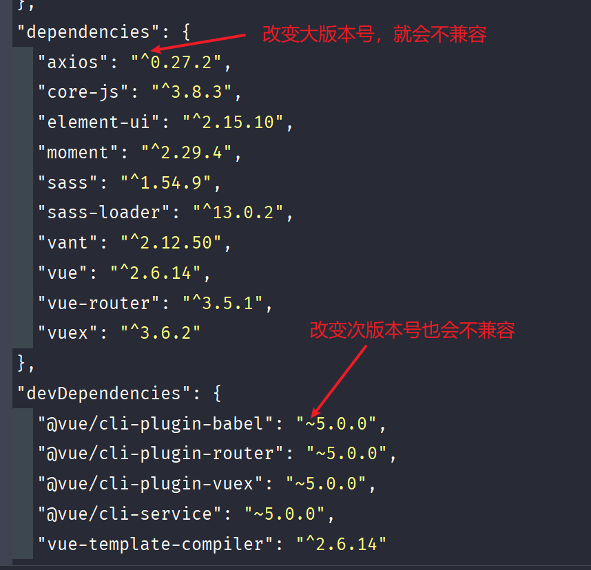

# package.json 文件配置详解

一个标准的 `package.json` 文件在 Node.js 项目中扮演着至关重要的角色。它不仅记录了项目的基本信息，还管理着项目的依赖和脚本。本文将详细解释 `package.json` 文件的各个字段及其用法，帮助你更好地理解和使用它。

## package.json 的基本结构

一个标准的 `package.json` 文件通常包含以下基本结构：

```json
{
  "name": "my-project",
  "version": "1.0.0",
  "description": "A sample Node.js project",
  "main": "index.js",
  "scripts": {
    "start": "node index.js"
  },
  "dependencies": {},
  "devDependencies": {}
}
```

接下来，详细解释每个字段的含义和用法。

## 基本字段解析

`package.json` 文件中有一些基本字段，它们提供了项目的关键信息：

**name** 项目的名称。必须是小写的，可以包含字母、数字、下划线和连字符。

**version** 项目的当前版本号，遵循[语义化版本](https://semver.org/)规范。

**description** 项目的简要描述，用于说明项目的用途和功能。

**main** 项目的入口文件路径，通常是 `index.js`。当其他项目引用该项目时，就会加载这个文件。

**scripts** 定义了一组可以使用 `npm run` 命令执行的脚本。例如：

```json
{
  "scripts": {
    "start": "node index.js",
    "dev": "nodemon index.js",
    "test": "jest"
  }
}
```

通过 `npm run start`、`npm run dev`、`npm run test` 等命令可以方便地执行相应的脚本。

## 依赖管理

`package.json` 文件的一个重要作用是管理项目的依赖。通过 `dependencies` 和 `devDependencies` 字段指定项目运行时和开发时所需的依赖包。

**dependencies** 项目运行时所需的依赖包。例如：

```json
{
  "dependencies": {
    "express": "^4.17.1",
    "mongoose": "^5.12.5"
  }
}
```

**devDependencies** 项目开发时所需的依赖包，例如测试框架、代码检查工具等。例如：

```json
{
  "devDependencies": {
    "jest": "^26.6.3",
    "eslint": "^7.25.0"
  }
}
```

**peerDependencies** 指定当前项目与其他项目共享的依赖包。例如：

```json
{
  "peerDependencies": {
    "react": "^17.0.0",
    "react-dom": "^17.0.0"
  }
}
```

这表示当前项目需要与使用它的项目共享 `react` 和 `react-dom` 依赖。

**optionalDependencies** 可选依赖包，即项目可以在没有这些依赖的情况下运行。例如：

```json
{
  "optionalDependencies": {
    "fsevents": "^2.3.2"
  }
}
```

在指定依赖版本时，使用以下规则：

- 使用 `^` 符号：`^1.2.3` 表示兼容 1.x.x 的最新版本  
- 使用 `~` 符号：`~1.2.3` 表示兼容 1.2.x 的最新版本  
- 精确版本：`1.2.3` 表示精确的 1.2.3 版本
- 版本范围：
  - `大于 1.2.3` 表示大于 1.2.3 的版本
  - `大于等于 1.2.3` 表示大于等于 1.2.3 的版本
  - `小于 1.2.3` 表示小于 1.2.3 的版本  
  - `小于等于 1.2.3` 表示小于等于 1.2.3 的版本

## 其他常用配置项

`package.json` 文件还有一些其他常用的配置项：

**engines** 指定项目所需的 Node.js 和 npm 版本。例如：

```json
{
  "engines": {
    "node": ">=12.0.0",
    "npm": ">=6.0.0"
  }
}
```

**private** 设置为 `true` 可以防止意外发布私有仓库。

**repository** 指定项目的代码仓库地址。例如：

```json
{
  "repository": {
    "type": "git",
    "url": "https://github.com/username/repo.git"
  }
}
```

**keywords** 包的关键字，用于 npm 搜索和分类。使用一个字符串数组表示。

**license** 包的许可证信息，表明代码的使用和分发规则。常见的如 MIT、Apache-2.0 等。

**author** 包的作者信息，可以是字符串或对象。对象包含 `name`、`email` 等信息。

**contributors** 代码的贡献者信息，是一个数组，每个元素代表一位贡献者，格式与 `author` 类似。

**homepage** 包的主页地址，让使用者方便找到更多相关信息。

**bugs** 提交 bug 的地址，可以是一个 URL 地址，也可以是包含 `url` 和 `email` 的对象。例如：

```json
{
  "bugs": {
    "url": "https://github.com/username/repo/issues",
    "email": "support@example.com"
  }
}
```

**files** 指定发布到 npm 包中的文件和目录。如：

```json
{
  "files": ["lib/", "index.js"]
}
```

**browserslist** 用于指定支持的浏览器列表，常用于前端项目。例如：

```json
{
  "browserslist": [">0.2%", "not dead", "not op_mini all"]
}
```

## Node.js 包的目录结构

一个标准的 Node.js 包通常包含以下几个重要目录：

**bin** 存放可执行的二进制文件，例如命令行工具等  
**lib** 存放 JavaScript 代码文件，是包的核心功能实现  
**doc** 存放文档说明，包括 API 文档、使用指南等  
**test** 存放单元测试代码，确保包的质量和可靠性

## package.json 文件详解

`package.json` 是 Node.js 包的配置清单，记录了包的各种元信息。详细介绍一些常见且重要的字段：

### name

包的名称，必须是全局唯一的。发布到 npm 时名称不能与已有包重复。

### version

包的版本号，遵循语义化版本规范。格式为主版本号.次版本号.修订号，例如 `1.0.0`。

### description

包的描述信息，简要说明包的用途和功能，方便使用者快速了解。

### keywords

包的关键字，用于 npm 搜索和分类。使用一个字符串数组表示。

### repository

包的代码仓库信息，一般是个对象，包含 `type`（仓库类型，如 `git`）和 `url`（仓库地址）。

### license

包的许可证信息，表明代码的使用和分发规则。常见的如 MIT、Apache-2.0 等。

### dependencies

包的生产环境依赖，即代码运行时所需的依赖包。使用一个对象表示，`key` 为包名，`value` 为版本范围。

### devDependencies

包的开发环境依赖，仅在开发和测试时需要，发布时不包含。格式与 `dependencies` 相同。

### scripts

定义一些常用的 npm 命令脚本，如启动应用、执行测试等。是一个 key-value 对象。

### main

包的主入口文件，当其他模块 `require` 该包时，实际加载的就是这个文件。默认为根目录下的 `index.js`。

### author

包的作者信息，可以是字符串或对象。对象包含 `name`、`email` 等信息。

### contributors

代码的贡献者信息，是一个数组，每个元素代表一位贡献者，格式与 `author` 类似。

### homepage

包的主页地址，让使用者方便找到更多相关信息。

### bugs

提交 bug 的地址，可以是一个 URL 地址，也可以是包含 `url` 和 `email` 的对象。例如：

```json
{
  "bugs": {
    "url": "https://github.com/username/repo/issues",
    "email": "support@example.com"
  }
}
```

### engines

指定包运行所需的 Node.js 版本范围，���如 `{"node": ">=6.0.0"}`。

### private

标记包是否私有，设为 `true` 时 npm 会拒绝发布它。



## npm 常用命令

查看 npm 全局安装路径：

```powershell
npm root -g
```

查看某个包的安装信息：

```powershell
npm ls <package-name>
npm info <package-name>
```

### npm run 命令的执行过程

执行 `npm run <script-name>` 命令时，npm 会执行以下步骤：

1. 在 `node_modules/.bin` 目录中寻找对应的可执行文件并执行。
2. 如果第一步未找到，则读取 `package.json` 的 `scripts` 字段，找到 `<script-name>` 对应的命令并执行。

## 实战示例

假设需要配置一个包含 Express 和 Mongoose 的项目，并添加开发依赖 Jest 和 ESLint。`package.json` 文件如下：

```json
{
  "name": "my-express-app",
  "version": "1.0.0",
  "description": "An Express application with MongoDB",
  "main": "app.js",
  "scripts": {
    "start": "node app.js",
    "dev": "nodemon app.js",
    "test": "jest"
  },
  "dependencies": {
    "express": "^4.17.1",
    "mongoose": "^5.12.5"
  },
  "devDependencies": {
    "jest": "^26.6.3",
    "eslint": "^7.25.0"
  },
  "engines": {
    "node": ">=14.0.0",
    "npm": ">=6.0.0"
  },
  "repository": {
    "type": "git",
    "url": "https://github.com/username/my-express-app.git"
  },
  "keywords": ["express", "mongoose", "nodejs"],
  "author": "John Doe <john.doe@example.com>",
  "license": "MIT",
  "private": true
}
```

通过这种配置，可以有效管理项目的依赖，并使用脚本简化开发流程。

## 最佳实践

在配置 `package.json` 时，遵循以下最佳实践可以提升项目的可维护性和可扩展性：

- **保持版本准确**：尽量使用精确版本号，避免使用 `*`，以防止引入不兼容的更新。
- **分离依赖类型**：将生产环境依赖和开发依赖分开管理，确保部署时只包含必要的包。
- **使用语义化版本**：遵循语义化版本规范，帮助团队成员理解版本变更的影响。
- **定义脚本**：将常用的命令定义为脚本，简化命令执行，提高开发效率。
- **维护仓库信息**：确保 `repository` 字段正确指向代码仓库，方便协作和问题追踪。
- **设置私有包**：对于私有项目，设置 `private` 为 `true`，防止意外发布到公共仓库。

通过遵循这些最佳实践，可以确保 `package.json` 文件的清晰性和项目的稳定性。
