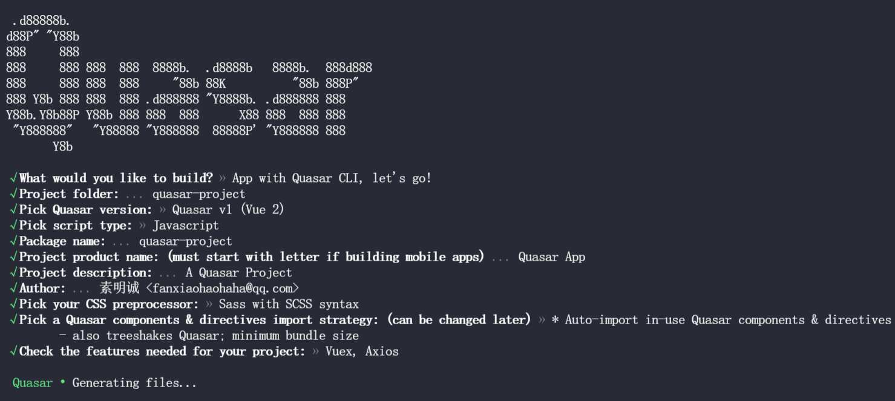
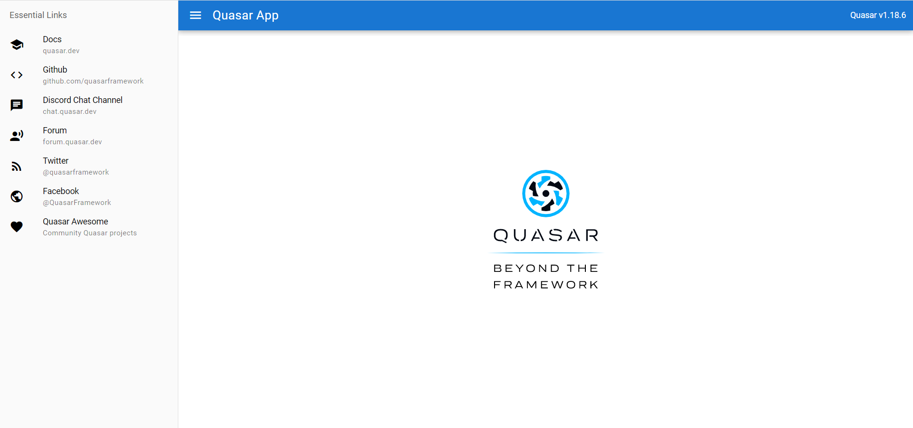

# Quasar CLI

```shell
yarn global add @quasar/cli
# 或者
npm install -g @quasar/cli
```

# 创建项目

```shell
yarn create quasar
# 或
npm init quasar
```



# 启动项目

```shell
npx quasar dev
```



# 构建生产版本资源

```shell
# 构建生产版本
 quasar build

# SSR
 quasar build -m ssr

# PWA
 quasar build -m pwa

# 手机应用
quasar build -m [android|ios]

# 将额外的参数和/或选项传递给
# 底层“cordova”或“electron”可执行文件：
 quasar build -m ios -- some params --and options --here

# Electron应用
 quasar build -m electron
```
