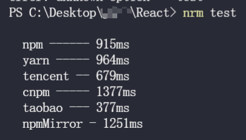
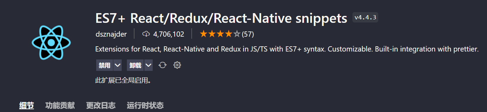
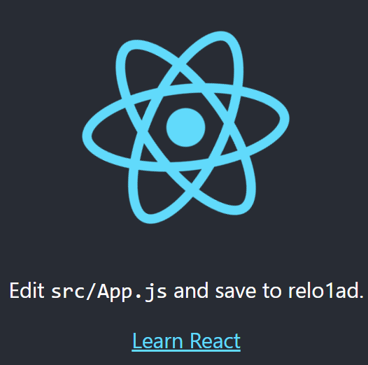

# React 入门指南

[React 官方中文文档 – 用于构建用户界面的 JavaScript 库](https://react.docschina.org/)

## 为什么要设计 React

React 是一个专注于视图层渲染的 JavaScript 库,它有以下特点:

1. 仅负责`View`层渲染,不做其他事情,保持专注和简洁
2. 是一个视图渲染的工具库,而不是一个大而全的框架

## 使用准备

在开始使用 React 之前,我们需要做一些准备工作。

### nrm

nrm 是一个管理 npm 源的工具,可以快速切换不同的源。建议使用`yarn`作为包管理器。

安装 nrm:

```bash
npm install nrm -g
```

#### 测试速度

使用以下命令测试不同源的速度:

```bash
nrm test
```



#### 选择快一点的源

根据测试结果,选择速度较快的源,例如:

```shell
nrm use taobao
```

### VSCode 插件

推荐安装以下 VSCode 插件,提高 React 开发效率:



#### 常用快捷导入

使用插件可以快速导入常用的代码片段,例如:

```jsx
// imrd
import ReactDOM from 'react-dom';
// imrc
import React, { Component } from 'react';
// nfn
const functionName = (params) => {};
// exp
export default moduleName;
// imr
import React from 'react';
```

### 更多的代码片段

可以参考这个仓库了解更多有用的 React 代码片段:
[vscode-react-javascript-snippets/Snippets.md at master · dsznajder/vscode-react-javascript-snippets](https://github.com/dsznajder/vscode-react-javascript-snippets/blob/master/docs/Snippets.md)

## 安装 React 脚手架

使用官方的`create-react-app`脚手架可以快速创建一个 React 项目。它内部集成了`Babel`、`Webpack`等工程化工具。

全局安装`create-react-app`:

```shell
npm install create-react-app -g
```

### 创建 React 项目

使用以下命令创建一个名为`todo`的 React 项目:

```shell
create-react-app todo
```



## JSX 简介

JSX 是一个 JavaScript 的语法扩展,在 React 中可以使用 JSX 来声明式地描述 UI 的结构。JSX 具有 JavaScript 的全部功能。

[JSX 简介 – React](https://react.docschina.org/docs/introducing-jsx.html)

### JSX 的优势

1. 提供了一种直观的方式来描述 UI 应该呈现出的交互形式
2. 可以生成 React 元素

### 为什么 React 不把视图和逻辑分开

1. 渲染逻辑和 UI 标记天然耦合在一起
2. 即使存在这种耦合,React 也能很好地实现关注点分离

### JSX 语法示例

```jsx
import ReactDOM from 'react-dom';
import React from 'react';

function App() {
  return (
    // 使用JSX语法,需要引入React
    <div className="root">
      <ul className="list">
        <li>1</li>
        <li>2</li>
      </ul>
    </div>
  );
}

// 将组件挂载到DOM元素上
ReactDOM.render(<App />, document.getElementById('root'));
```
