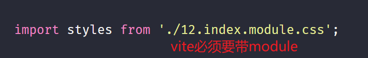

# React 组合与 CSS Module 使用指南

## 组件组合之 children prop

在 React 组件开发过程中,我们经常需要组合多个组件来实现复杂的 UI 界面。React 提供了一个特殊的 prop `children`来方便我们进行组件嵌套组合。

`children` prop 的规则如下:

当组件标签内部有内容时,React 会在 props 中自动添加 children 属性,其值由以下情况决定:

如果内部是非 React 元素的内容,如文本,children 的值就是该内容
如果只有一个子元素,children 的值就是该 React 元素对象
如果有多个子元素,children 的值就是所有 React 子元素对象组成的数组

利用 children 这个 prop,我们就可以方便地在组件内部渲染子组件或其他内容。这为构建灵活可复用的 UI 组件提供了基础。

## CSS Module 实战

在 React 项目中,我们还经常需要组织组件的样式。传统的做法是编写全局 CSS 样式表,但这容易导致样式冲突问题。

CSS Module 提供了一种更加模块化的 CSS 解决方案。它允许我们像导入 JS 模块一样导入 CSS 文件,并且生成一个独特的类名,从而避免了全局命名空间污染。

下面我们通过一个实际的例子来演示如何在 React 组件中使用 CSS Module:



首先定义一个 CSS Module 样式表`index.module.css`:

```css
.container {
  position: relative;
  width: 100%;
  height: 100%;
}

.header {
  position: absolute;
  top: 0;
  left: 0;
  z-index: 3;
  width: 100%;
  height: 60px;
  background-color: #000;
}

.sidebar {
  position: absolute;
  top: 0;
  left: 0;
  z-index: 2;
  width: 300px;
  height: 100%;
  padding-top: 80px;
  box-sizing: border-box;
  background-color: orange;
}

.main {
  position: absolute;
  top: 0;
  left: 0;
  z-index: 1;
  width: 100%;
  height: 100%;
  padding: 80px 0 0 320px;
  background-color: green;
}
```

然后在 React 组件中导入该 CSS Module,并应用相应的类名:

```jsx
import styles from './index.module.css';

class Container extends React.Component {
  render() {
    return (
      <div className={styles.container}>
        <div className={styles.header}>{this.props.header}</div>
        <div className={styles.sidebar}>{this.props.sidebar}</div>
        <div className={styles.main}>{this.props.main}</div>
      </div>
    );
  }
}
```

可以看到,通过`styles`对象,我们可以方便地引用 CSS Module 中定义的类名。这些类名经过编译处理,可以保证在全局环境下不会冲突。

同时,我们还利用了 children prop 来渲染 header、sidebar、main 等子组件,使整个布局更加灵活可定制。

## 为什么 JSX 可以通过 props 传递元素?

在上面的例子中,我们看到可以通过 props 来传递 React 元素,这是 React 组件组合的一个重要特性。之所以可行,是基于以下原因:

JSX 最终会被编译为 React.createElement 调用,返回的就是普通的 JavaScript 对象,我们称之为"React 元素"
React 元素可以像其他数据类型一样在 props 中传递
React 没有像 Vue 那样内置 slot 插槽的概念,而是统一使用 props 来进行组件组合
正是由于 props 可以传递任何数据,包括回调函数、React 元素等,才使得 React 的组件组合模式如此灵活多变。我们完全可以通过组合 prop 来替代继承。

## 组件继承?

在实际的 React 开发中,我很少见到使用组件继承的场景。这是因为:

通过 children prop 或者传递 React 元素,我们已经可以很好地实现组件的嵌套组合,满足大部分场景需求
对于可复用的逻辑,我们可以抽取到单独的 JavaScript 模块中,通过导入使用,而不需要继承

当然,如果你确实需要继承一些基础的组件逻辑,完全可以使用 ES6 的 class 继承特性。但我的经验是,这种需求是比较少见的。组合优于继承,这也是 React 的设计理念之一。

以上就是我对 React 组合和 CSS Module 的一些见解和使用指南,希望对你有所帮助。在实际项目中多加练习,就能够熟练掌握这些技巧,编写出可维护、高复用的 React 组件。
