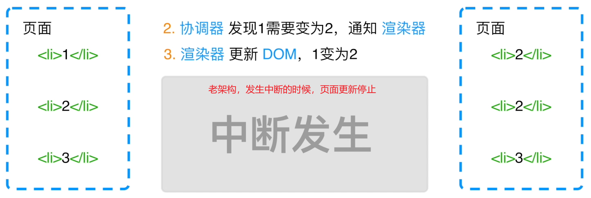
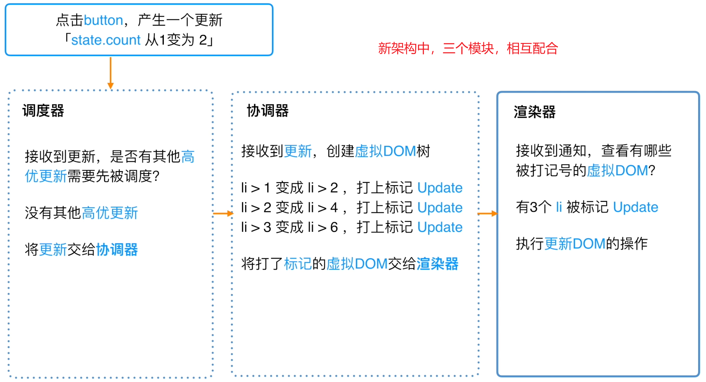
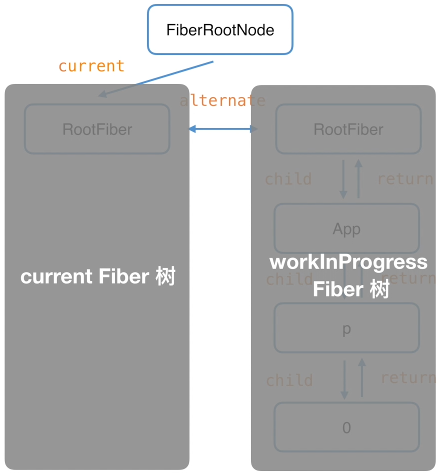
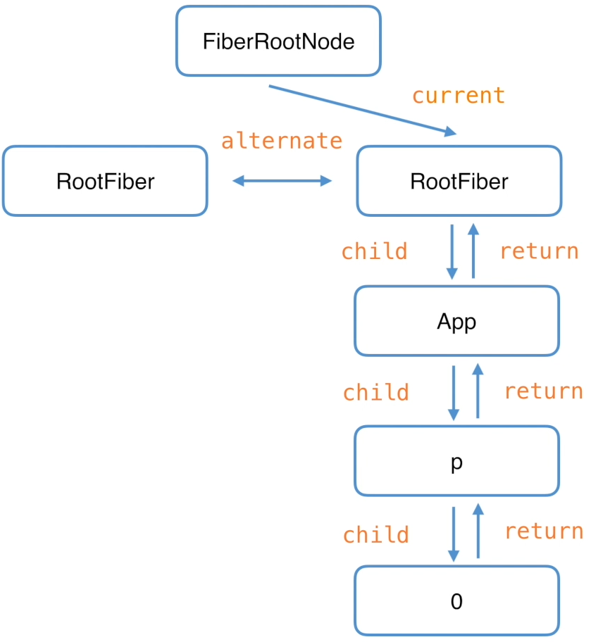

# React 设计理念与核心架构

## React15 及之前的 Stack Reconciler

在 React15 及更早的版本中,使用的是 Stack Reconciler 架构。它在更新组件时必须一口气完成整个更新过程,无法中断。这可能会导致复杂的用户界面在更新时出现卡顿的现象。另外,如果在更新过程中有新的更新需求,它也无法及时响应,必须等到当前更新完成后才能处理新的更新。

## React16 及之后的 Fiber Reconciler

从 React16 开始,引入了全新的 Fiber Reconciler 架构。它最大的特点是可以将更新过程分成多个小的任务单元,实现异步可中断的更新。这样即使在更新复杂界面时,也能保持界面的流畅度,提升用户体验。同时,当有新的更新需求时,可以灵活地中断当前更新,优先处理更重要的任务,如用户交互等。

Fiber Reconciler 的核心理念可以概括为:

1. 异步可中断的更新
2. 快速响应新的更新需求
3. 提升复杂界面的流畅度

## 代数效应(Algebraic Effects)

代数效应是函数式编程中一个重要的概念,它允许我们将副作用从函数调用中分离出来。React 内部也借鉴了代数效应的思想,使得组件的渲染和状态更新可以与其他副作用分离,从而获得更清晰的代码逻辑和更好的性能。

## Fiber

在 Fiber 架构中,React 应用的任务调度和执行都是基于一个叫做"Fiber"的数据结构。可以将 Fiber 看作是一个工作单元,每个组件实例对应有一个 Fiber 节点。Fiber 节点保存了组件的状态、待处理的变更、对应的 DOM 节点等信息。React 应用就是由一个个 Fiber 节点构成的树形结构。

## 双缓存

传统的 DOM 更新方式是直接在当前屏幕上进行,可能会导致页面闪烁。React 使用双缓存技术,在内存中构建并直接替换 DOM 树,然后再与浏览器刷新调度流程配合,减少页面闪烁,提高渲染性能。

值得注意的是,在首屏渲染时并不会触发 diff 算法,因为此时 DOM 树还未构建。只有在后续的更新过程中,才会通过 diff 算法找出需要变更的部分,再把变更应用到真实 DOM 上。
