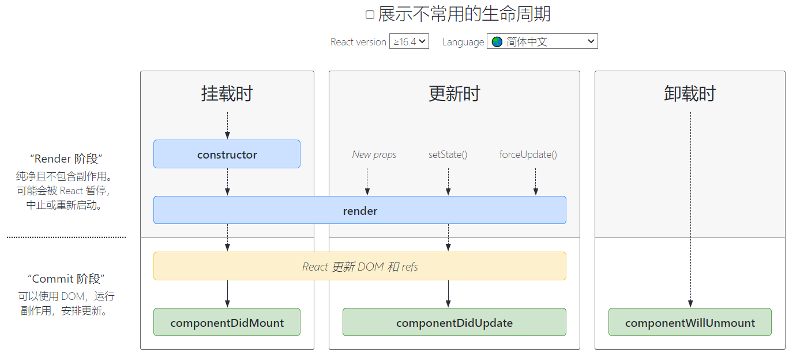

# React 组件生命周期

[React Lifecycle Methods diagram](https://projects.wojtekmaj.pl/react-lifecycle-methods-diagram/)

React 组件的生命周期分为三个主要阶段:

1. 挂载阶段 (Mounting)
2. 更新阶段 (Updating)
3. 卸载阶段 (Unmounting)



## 挂载阶段 (Mounting)

挂载阶段是组件被创建并插入到 DOM 中的过程。这个阶段包括以下生命周期方法:

### constructor(props)

`constructor(props)` 是组件的构造函数,通常用于初始化组件的 state 和绑定事件处理函数。在构造函数中,我们可以通过 `this.state` 设置组件的初始状态,并使用 `bind` 方法绑定事件处理函数的 `this` 上下文。

```jsx
constructor(props) {
  super(props);
  this.state = {
    count: 0
  };
  this.handleClick = this.handleClick.bind(this);
}
```

### static getDerivedStateFromProps(props, state)

`static getDerivedStateFromProps(props, state)` 方法在组件创建时以及在接收到新的 props 时被调用。它应该返回一个对象来更新 state,或者返回 null 表示不需要更新任何内容。这个方法适用于根据 props 的变化来更新组件的 state。

```jsx
static getDerivedStateFromProps(props, state) {
  if (props.count !== state.count) {
    return { count: props.count };
  }
  return null;
}
```

### render()

`render()` 是组件的渲染方法,返回要在屏幕上显示的内容。在 `render` 方法中,我们可以根据组件的 props 和 state 来构建 UI。需要注意的是,`render` 方法应该是一个纯函数,不应该在其中执行任何副作用操作。

```jsx
render() {
  return (
    <div>
      <p>Count: {this.state.count}</p>
      <button onClick={this.handleClick}>Increment</button>
    </div>
  );
}
```

### componentDidMount()

`componentDidMount()` 是组件已经被挂载到真实 DOM 中后运行的方法。通常用于执行副作用操作,如发送网络请求、添加事件监听器等。在这个方法中,我们可以安全地操作 DOM,因为组件已经被渲染到页面上了。

```jsx
componentDidMount() {
  document.title = `Count: ${this.state.count}`;
  window.addEventListener('resize', this.handleResize);
}
```

## 更新阶段 (Updating)

当组件的 props 或 state 发生变化时,组件会重新渲染。这个阶段包括以下生命周期方法:

### shouldComponentUpdate(nextProps, nextState)

`shouldComponentUpdate(nextProps, nextState)` 在组件重新渲染之前被调用。可以通过比较当前和下一个 props 和 state 来决定是否需要更新组件,返回 true 表示需要更新,false 表示不需要。这个方法可以用于性能优化,避免不必要的重新渲染。

```jsx
shouldComponentUpdate(nextProps, nextState) {
  return nextState.count !== this.state.count;
}
```

### getSnapshotBeforeUpdate(prevProps, prevState)

`getSnapshotBeforeUpdate(prevProps, prevState)` 在最近一次渲染输出被提交到 DOM 节点之前调用。它使组件能够在 DOM 更新之前捕获一些信息(例如滚动位置)。返回值将作为参数传递给 `componentDidUpdate()`。这个方法适用于在 DOM 更新之前保存一些状态信息。

```jsx
getSnapshotBeforeUpdate(prevProps, prevState) {
  if (prevState.items.length < this.state.items.length) {
    const list = this.listRef.current;
    return list.scrollHeight - list.scrollTop;
  }
  return null;
}
```

### componentDidUpdate(prevProps, prevState, snapshot)

`componentDidUpdate(prevProps, prevState, snapshot)` 在更新发生后立即调用。首次渲染不会执行此方法。可以在这里对 DOM 进行操作,也可以执行网络请求等副作用操作。如果组件实现了 `getSnapshotBeforeUpdate()` 生命周期,则它返回的值将作为 `componentDidUpdate()` 的第三个参数 "snapshot" 传递。

```jsx
componentDidUpdate(prevProps, prevState, snapshot) {
  if (snapshot !== null) {
    const list = this.listRef.current;
    list.scrollTop = list.scrollHeight - snapshot;
  }
}
```

## 卸载阶段 (Unmounting)

当组件从 DOM 中移除时,会进入卸载阶段。这个阶段只有一个生命周期方法:

### componentWillUnmount()

`componentWillUnmount()` 在组件卸载和销毁之前立即调用。可以在此方法中执行任何必要的清理操作,例如清除计时器、取消网络请求或清除在 `componentDidMount()` 中创建的任何订阅。这个方法适用于避免内存泄漏。

```jsx
componentWillUnmount() {
  window.removeEventListener('resize', this.handleResize);
}
```

通过深入理解 React 组件的生命周期,我们可以更好地控制组件的行为,优化性能,并避免常见的陷阱。在开发 React 应用时,要根据具体需求合理地使用这些生命周期方法,充分利用它们提供的功能和特性,打造出高质量、高性能的应用。
