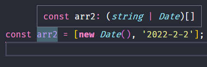
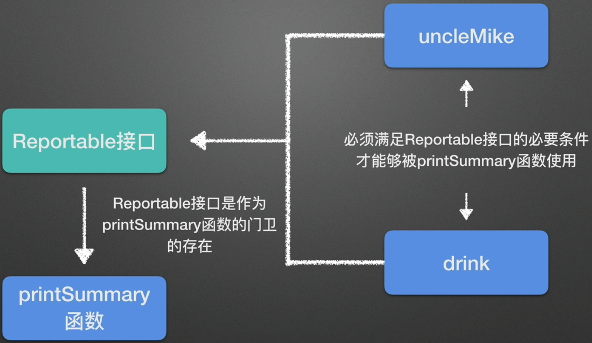

# TypeScript 类型化数组与元组

在 TypeScript 中,我们可以使用类型注解来明确指定数组中元素的类型。这样做可以提高代码的可读性和可维护性,同时也能在编译阶段就发现潜在的类型错误。下面我们来看看如何定义类型化数组。

## 类型化数组

最简单的方式是在数组字面量后面添加`:type[]`的类型注解:

```typescript
const arr: string[] = ['Kobe', 'James', 'Pierce'];
```

这表示 `arr` 是一个字符串类型的数组。TypeScript 会在编译阶段检查数组中的元素是否都是字符串类型,如果不是则会报错。

当然,我们也可以使用 `Array<type>` 的语法来定义类型化数组:

```typescript
const arr: Array<string> = ['Kobe', 'James', 'Pierce'];
```

这两种写法是等价的,可以根据个人喜好选择。

## 数组取值的类型推断

当我们从类型化数组中取值时,TypeScript 会自动推断出变量的类型:

```typescript
const arr: string[] = ['Kobe', 'James', 'Pierce'];

const player = arr[0]; // player 被推断为 string 类型
```

TypeScript 能够根据数组的类型注解,推断出 `player` 变量一定是 `string` 类型。这个特性让我们在使用数组元素时更加安全。

类似地,数组方法的返回值类型也能被正确推断:

```typescript
const arr: string[] = ['Kobe', 'James', 'Pierce'];

const poppedPlayer = arr.pop(); // poppedPlayer 被推断为 string | undefined
```

注意 `pop` 方法有可能返回 `undefined`(当数组为空时),所以推断的类型是 `string | undefined`。

## 容纳不同类型的元素

TypeScript 的类型化数组并不局限于单一类型。我们可以定义元素类型不同的数组:

```typescript
const arr = [new Date(), '2022-2-2'];
```



可以看到,TypeScript 推断 `arr` 的类型是 `(string | Date)[]`,也就是一个可能包含字符串或日期的数组。这种多类型数组在实际开发中很常见。

## 元组(Tuple)

元组是另一种形式的数组类型,它确切地知道包含多少个元素,以及特定索引对应的类型。可以把元组看作是一种特殊的数组。

我们用中括号 `[]` 来定义元组,其中每个元素的类型都要显式注明:

```typescript
const pepsi: [string, boolean, number] = ['brown', true, 35];
```

上面的代码定义了一个名为 `pepsi` 的元组,它包含三个元素,类型分别为 `string`、`boolean` 和 `number`,对应可乐的颜色、是否含气、含糖量。

元组的好处是可以明确每个元素的意义,让代码更易理解。但缺点是使用起来没有那么灵活。

### 使用类型别名简化元组定义

如果某个元组类型在代码中多处使用,我们可以通过类型别名(Type Alias)来简化它的定义:

```typescript
type Drink = [string, boolean, number];

const pepsi: Drink = ['brown', true, 35];
const sprite: Drink = ['transparent', true, 30];
```

这样可以避免重复编写元组的类型注解,让代码更加简洁。

## 接口

接口(Interface)是 TypeScript 中另一个重要的类型,它用来描述对象应该有哪些属性及其类型。

我们可以用 `interface` 关键字来定义接口:

```typescript
interface Person {
  name: string;
  age: number;
  married: boolean;
}
```

上面的代码定义了一个 `Person` 接口,它要求对象必须包含 `name`、`age`、`married` 三个属性,分别对应姓名、年龄、婚姻状况,类型分别为 `string`、`number`、`boolean`。

有了接口的定义后,我们就可以用它来约束对象的形状:

```typescript
const uncleMike: Person = {
  name: 'Mike',
  age: 28,
  married: false,
};
```

如果对象不满足接口的要求,比如缺少某个必需的属性,或者属性类型不匹配,TypeScript 就会报错。这种类型检查可以帮助我们尽早发现代码中的问题。

### 接口与函数

接口的另一个常见用途是描述函数的参数和返回值的类型。比如我们可以定义一个打印个人信息的函数:

```typescript
const printPersonInfo = (person: Person): void => {
  console.log(`姓名: ${person.name}`);
  console.log(`年龄: ${person.age}`);
  console.log(`婚姻状况: ${person.married}`);
};

printPersonInfo(uncleMike);
```

函数 `printPersonInfo` 接受一个 `Person` 类型的参数,返回值为 `void`(表示没有返回值)。这样可以保证传入的参数必须满足 `Person` 接口的要求。

### 接口与类

接口还可以用来约束类(Class)的实现。我们可以在接口中声明一些方法,然后要求类必须实现这些方法:

```typescript
interface Reportable {
  summary(): string;
}

const uncleMike = {
  name: 'Mike',
  age: 20,
  married: false,
  summary(): string {
    return `名字: ${this.name}`;
  },
};

const drink = {
  color: '棕色',
  carbonated: true,
  sugar: 35,
  summary(): string {
    return `这个饮料的颜色是: ${this.color}`;
  },
};

const printSummary = (item: Reportable): void => {
  console.log(item.summary());
};

printSummary(uncleMike);
printSummary(drink);
```



在上面的例子中,我们定义了一个 `Reportable` 接口,它要求实现一个 `summary` 方法并返回字符串。然后创建了两个对象 `uncleMike` 和 `drink`,它们都满足 `Reportable` 接口的要求。

最后定义了一个 `printSummary` 函数,它接受一个 `Reportable` 类型的参数,可以调用参数的 `summary` 方法。

这个例子展示了接口的一个重要作用:它可以让不同的对象实现同一种"协议",从而以统一的方式来使用它们。这种"面向接口编程"的思想是面向对象设计的精髓。

## 类

TypeScript 支持使用 `class` 关键字来定义类,并以面向对象的方式组织代码。下面是一个简单的 `Person` 类:

```typescript
class Person {
  scream(): void {
    console.log('hahha');
  }

  sing(): void {
    console.log('lalala');
  }
}

const person = new Person();
person.scream(); // 输出: hahha
person.sing(); // 输出: lalala
```

我们定义了一个 `Person` 类,其中包含两个方法 `scream` 和 `sing`,分别用来"尖叫"和"唱歌"。然后创建了一个 `Person` 类的实例 `person`,并调用它的方法。

### 继承

TypeScript 中的类支持单继承,我们可以使用 `extends` 关键字来实现:

```typescript
class Men extends Person {
  sing(): void {
    console.log('Men singing: lalala');
  }
}

const men = new Men();
men.scream(); // 输出: hahha
men.sing(); // 输出: Men singing: lalala
```

`Men` 类继承自 `Person` 类,它重写(override)了父类的 `sing` 方法。创建 `Men` 实例后,可以调用它继承自父类的 `scream` 方法,以及重写后的 `sing` 方法。

这展示了面向对象中的继承特性:子类可以继承父类的属性和方法,还可以重写父类的方法来实现自己的逻辑。这种层次化的结构可以很好地复用代码。

### 修饰符

在 TypeScript 中,类的属性和方法可以添加修饰符来控制它们的可见性和访问方式。常用的修饰符有:

1. `public`:这是默认的修饰符,表示属性或方法可以在任何地方被访问。

2. `private`:表示属性或方法只能在当前类的内部访问,子类和外部都无法访问。

3. `protected`:表示属性或方法可以在当前类和子类中访问,但外部无法访问。

下表总结了这三种修饰符的区别:

|  修饰符   | 当前类 | 子类 | 实例 |
| :-------: | :----: | :--: | :--: |
|  public   |   ✅   |  ✅  |  ✅  |
| protected |   ✅   |  ✅  |  ❌  |
|  private  |   ✅   |  ❌  |  ❌  |

合理使用修饰符可以帮助我们更好地封装类的实现细节,提高代码的可维护性。

### 构造函数与属性初始化

在创建类的实例时,我们通常需要给实例的属性赋予初始值。TypeScript 提供了构造函数(constructor)来完成这个任务:

```typescript
class Person {
  name: string;

  constructor(name: string) {
    this.name = name;
  }
}

const person = new Person('Tom');
console.log(person.name); // 输出: Tom
```

构造函数 `constructor` 接受一个 `name` 参数,并将其赋值给实例的 `name` 属性。创建 `Person` 实例时,我们需要传入一个字符串作为名字。

TypeScript 还支持在构造函数的参数上添加修饰符,可以简化属性的定义:

```typescript
class Person {
  constructor(public name: string) {}
}
```
