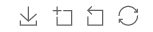
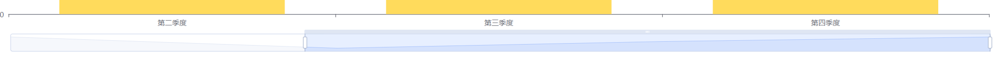

# 常用配置项
## toolbox
`echatrs`提供的工具，可以进行图片下载和图片的放大操作



```javascript
      toolbox: {
        feature: {
          saveAsImage: {},
          dataZoom: {
            // 配置 yAxisIndex 可以解决图表不显示的问题
            yAxisIndex: false
          },
          restore: {}
        }
      },
```

## dataZoom
区域缩放

```javascript
      dataZoom: {
        show: true,
        start: 30,
        end: 100
      },
```



## grid
设置图表位置，可以设置上下左右，宽高。可以设置很多。

`grid.containLabel`防止溢出，可以通过设置多个对象，来让多个图表分开。

```javascript
      grid: {
        left: 90,
        right:0
      },
```

## legend
设置图例

```javascript
      legend: {
        data: ['饼图', '折线图', '条形图'],
        left: 150
      },
```

# 坐标系
`xAxis`，`yAxis`如果不写横坐标和纵坐标，会直接使用`source`内的数据作为自己的渲染的位置，然后自动生成横坐标和纵坐标。

```javascript
    const option = {
      /** @type EChartsOption */
      xAxis: {},
      yAxis: {},
      dataset: {
        source: [
          [12, 13],
          [122, 173],
          [182, 139],
          [2, 13],
          [12, 183]
        ]
      },
      series: {
        // scatter 散点图 
        type: 'scatter',
        encode: {
          x: 0,
          y: 1
        }
      }
    };
```

## 多个坐标系
配置两个`Y`轴，`splitLine`取消交叉线

```javascript
 const option = {
      /** @type EChartsOption */
      xAxis: {
        type:'category'
      },
      // 在Y轴创建两个对象，来设置两个Y轴
      yAxis: [{},{
      	splitLine:false,
      }],
      dataset: {
        source: [
          ['product', '2018', '2019', '2020'],
          ['coke', 50, 60, 70, 80],
          ['milk', 10, 20, 30, 40]
        ]
      },
      series: [{
        type: 'bar',
        seriesLayoutBy: 'row',
        // 指定柱状图使用第一个Y轴
        yAxisIndex:0
      }, {
        type: 'line',
        seriesLayoutBy: 'row',
        // 指定柱状图使用第二个Y轴
        yAxisIndex:1
      }]
    };
```

# 取数据
可以使用`xAxisIndex`和`yAxisIndex`，来指定到底使用拿列或者是拿行的数据为该图表的数据

```javascript
 dataset: {
        // 二维数组管理数据
        source: [
          ['quarter', 'v1', 'v2', 'kind', 'v3'],
          ['第一季度', 55, 30, '种类1', 60],
          ['第二季度', 50, 35, '种类2', 80],
          ['第三季度', 53, 40, '种类3', 70],
          ['第四季度', 55, 24, '种类4', 90],
        ]
      },
```

# X轴文字换行
```javascript
					axisLabel: {
              show: true,
              color: '#7D8CBD',
              interval: 0,
              formatter: function (value) {
                var ret = ""; //拼接加\n返回的类目项  
                var maxLength = 1; //每项显示文字个数  
                var valLength = value.length; //X轴类目项的文字个数  
                var rowN = Math.ceil(valLength / maxLength); //类目项需要换行的行数  
                if (rowN > 1) //如果类目项的文字大于5,  
                {
                  for (var i = 0; i < rowN; i++) {
                    var temp = ""; //每次截取的字符串  
                    var start = i * maxLength; //开始截取的位置  
                    var end = start + maxLength; //结束截取的位置  
                    temp = value.substring(start, end) + "\n";
                    ret += temp; //凭借最终的字符串  
                  }
                  return ret;
                } else {
                  return value;
                }
              }
            },
```


