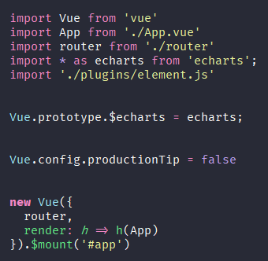
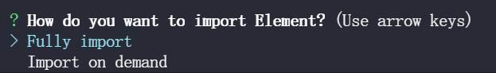

# 构建项目
```bash
    vue credte vue-datav
    yarn install echarts --save
```

## 配置
`main.js`，配置后可以通过`$echarts`访问`echarts`对象

```javascript
import * as echarts from 'echarts';

Vue.prototype.$echarts = echarts;
```



## 测试
```javascript
<script>
  export default{
    mounted(){
      console.log('home',this.$echarts);
    }
  }
</script>
```

## 添加elementUI插件
采用插件的方式进行按需引入

```javascript
vue add element  
```

全量引入：`fully import`d

按需引入：`import on demand`



# 画三角形
原理，`border`

```css
    width: 0;
    height: 0;
    border-width: 5px;
    border-style: solid;
		// 控制上下左右的颜色来控制
    border-color: green transparent transparent transparent;
```

