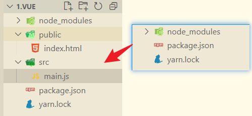

# Vue2 构建

## 初始化 package.json

我首先在项目根目录下初始化 `package.json` 文件。

```shell
npm init -y
```

## 安装 webpack4

接下来，我安装 webpack4 及其相关的开发工具。

```shell
yarn add webpack@4.44.2 webpack-cli@3.3.12 webpack-dev-server@3.11.2 -D
```

## 安装 Vue 相关依赖

为了支持 Vue 文件的编译和处理，我安装了以下依赖。

```shell
yarn add vue-loader vue-template-compiler html-webpack-plugin@4.5.0 -D
```

### 安装 compiler 和 vue-loader

`vue-loader` 的作用是解析和转换 `.vue` 文件，使其能够被 webpack 处理。

## 修改 package.json

我在 `package.json` 文件中添加了开发服务器的启动脚本。

```javascript
"scripts": {
    "dev": "webpack-dev-server"
},
```

## 创建文件和文件夹

接下来，我创建了项目所需的文件和文件夹结构。



## 导入 main.js

在 `index.html` 中，我导入了 `main.js` 作为入口脚本。

```html
<body>
  <div id="app"></div>
  <script src="../src/main.js"></script>
</body>
```

# 使用 CDN 的方式

## 引入 Vue 的 CDN

我通过 CDN 引入 Vue.js，以便快速搭建项目。

```html
<script src="https://cdn.jsdelivr.net/npm/vue@2.6.14/dist/vue.js"></script>
```

## 切换镜像源（如果使用 yarn 安装）

为了提高安装速度，我切换了 yarn 的镜像源。

```javascript
yarn config set registry https://registry.npm.taobao.org
```

## 安装依赖并运行

我安装了 `@vue/compiler-sfc` 和 `vue-loader`，然后启动开发服务器。

```javascript
npm install -D @vue/compiler-sfc
yarn add vue-loader@next -D
npm run dev
```

## 配置 webpack.config.js

在 `webpack.config.js` 中，我进行了以下配置：

```javascript
const { resolve } = require('path');
const HtmlWebpackPlugin = require('html-webpack-plugin');
const VueLoaderPlugin = require('vue-loader/lib/plugin');

module.exports = {
  mode: 'development',
  entry: './src/main.js',
  output: {
    path: resolve(__dirname, 'dist'),
    filename: 'main.js',
  },
  externals: {
    vue: 'Vue',
  },
  devtool: 'source-map',
  module: {
    rules: [
      {
        test: /\.vue$/,
        loader: 'vue-loader',
      },
    ],
  },
  plugins: [
    new VueLoaderPlugin(),
    new HtmlWebpackPlugin({
      template: resolve(__dirname, 'public/index.html'),
    }),
  ],
};
```

在 `src` 目录下，我新建了 `App.vue` 文件。

我运行 `npm run dev` 后，可以通过访问 [http://localhost:8080/](http://localhost:8080/) 进入项目。

```javascript
<template>
  <div>{{ title }}</div>
</template>

<script>
export default {
    name: 'App',
    data () {
        return {
            title: 'hello vue!'
        };
    }
}
</script>

<style>
</style>
```

我修改了 `main.js` 的内容，如下：

```javascript
import App from './App.vue';
new Vue({
  render: (h) => h(App),
}).$mount('#app');
```

# 切换到 Vue3 版本

## 修改 CDN

首先，我更新了 Vue 的 CDN 链接到 Vue3 版本。

```javascript
<script src="https://cdn.jsdelivr.net/npm/vue@3.1.2/dist/vue.global.js"></script>
```

## 修改 main.js

在 `main.js` 中，我调整了 Vue 实例的创建方式。

```javascript
Vue.createApp(App).mount('#app');
```

## 更新 webpack.config.js

我在 `webpack.config.js` 中调整了 `VueLoaderPlugin` 的导入方式。

```javascript
const { VueLoaderPlugin } = require('vue-loader');
```

## 安装并运行

我安装了适用于 Vue3 的编译器和 `vue-loader`，然后启动开发服务器。

```javascript
npm install -D @vue/compiler-sfc
yarn add vue-loader@next -D
npm run dev
```

对于大型项目，我建议使用脚手架工具或 Vite 来搭建项目环境，以提高开发效率。
