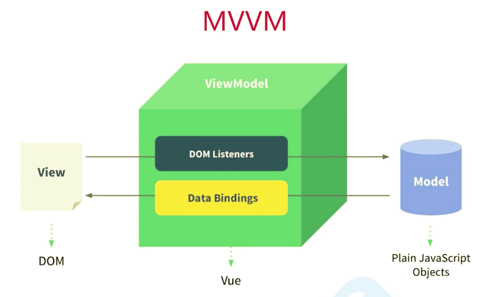

# Vue 基础入门

## Vue 的核心

Vue 的核心是通过模版语法,让核心库去编译模版,最终渲染成 DOM。当我们操作数据时,视图就会自动更新。这个过程是由 Vue 内部通过 ViewModel 来完成的。

## Vue 组件的三个部分

一个 Vue 组件通常由三个部分组成:

| 标签         | 作用     |
| ------------ | -------- |
| `<template>` | 组件模版 |
| `<script>`   | 组件逻辑 |
| `<style>`    | 组件样式 |



组件逻辑的本质是一个包含许多特定属性的对象。通过这个对象,我们可以定义组件的数据、方法、生命周期钩子等。

## 环境搭建

参考[https://www.yuque.com/sumingcheng/gs6i1z/fgsnwb](https://www.yuque.com/sumingcheng/gs6i1z/fgsnwb)进行 Vue3 的搭建。

## 常用指令介绍

### v-if 和 v-else

`v-if`指令可以根据表达式的值在 DOM 中有条件地渲染元素。当表达式为真时,元素会被渲染;当表达式为假时,元素会被移除。

`v-else`指令可以为`v-if`添加一个"else 块"。`v-else`元素必须紧跟在带`v-if`或者`v-else-if`的元素后面,否则它将不会被识别。

```vue
<button v-if="isLogin" @click="likeArticle">点赞</button>
<button v-else disabled>请先登录</button>
```

### v-bind

`v-bind`指令用于动态地绑定一个或多个 attribute,或一个组件 prop 到表达式。在绑定 attribute 时,`v-bind`可以省略,直接写一个冒号`:`。

常见的用法是动态绑定 class 和 style,以及绑定 props 到子组件。

```vue
<p :title="content">{{content}}</p>
```

### v-on

`v-on`指令用于绑定事件监听器。事件类型由参数指定,表达式可以是一个方法的名字或一个内联语句。

在绑定原生 DOM 事件时,方法以事件为唯一的参数。如果使用内联语句,语句可以访问一个`$event`property:` v-on:click="handle('ok', $event)"`。

`v-on`也有简写,就是`@`符号。

```vue
<button @click="submitComment">提交评论</button>
```

### v-for

`v-for`指令基于一个数组来渲染一个列表。`v-for`指令需要使用`item in items`形式的特殊语法,其中`items`是源数据数组,而`item`则是被迭代的数组元素的别名。

`v-for`还支持一个可选的第二个参数,即当前项的索引。

```vue
<li v-for="(item, index) in commentList" :key="item.id">
  <span>{{index + 1}}. {{item.content}}</span>
</li>
```

注意`v-for`必须配合`key`属性使用,以便 Vue 跟踪每个节点的身份,从而重用和重新排序现有元素。

### v-model

`v-model`指令在表单控件或者组件上创建双向绑定。它会根据控件类型自动选取正确的方法来更新元素。

`v-model`本质上不过是语法糖。它负责监听用户的输入事件以更新数据,并在某种极端场景下进行一些特殊处理。

```vue
<input v-model="searchText" placeholder="搜索...">
```

### v-text 和 v-html

`v-text`指令更新元素的`textContent`。如果要更新部分的`textContent`,需要使用`{{Mustache}}`插值。

`v-html`指令更新元素的`innerHTML`。内容按普通 HTML 插入,不会作为 Vue 模板进行编译。

```vue
<p v-text="rawHtml"></p>
<p v-html="rawHtml"></p>
```

## 测试代码

`index.html`:

```html
<!DOCTYPE html>
<html lang="en">
  <head>
    <meta charset="UTF-8" />
    <meta name="viewport" content="width=device-width, initial-scale=1.0" />
    <title>Vue 常用指令</title>
  </head>
  <body>
    <div id="app">
      <div class="article">
        <h1>{{title}}</h1>
        <p>
          <span>{{author}} {{dateTime}}</span>
        </p>
        <p>
          <span>点赞: {{likeCount}}</span>
          <button v-if="isLogin" @click="likeArticle">点赞</button>
          <button v-else disabled>请先登录</button>
        </p>
        <p>
          <button @click="toggleFollow">{{isFollowed ? '已关注' : '关注'}}</button>
        </p>
        <p :title="content">{{content}}</p>

        <div class="comment-form">
          <p>{{comment}}</p>
          <input type="text" placeholder="请输入评论" v-model="comment" />
          <button @click="submitComment">提交评论</button>
        </div>

        <ul class="comment-list">
          <li v-for="(item, index) in commentList" :key="item.id">
            <p>
              <span>{{index + 1}}. {{item.content}}</span>
              <span>{{item.dateTime}}</span>
            </p>
          </li>
        </ul>
      </div>
    </div>

    <script src="https://unpkg.com/vue@next"></script>
    <script src="./main.js"></script>
  </body>
</html>
```

`main.js`:

```javascript
const { createApp } = Vue;

const app = createApp({
  data() {
    return {
      title: 'Vue 常用指令示例',
      author: '峰华',
      dateTime: '2023年4月18日',
      content: '这是一篇介绍 Vue 常用指令的文章',
      likeCount: 0,
      isLogin: true,
      isFollowed: false,
      comment: '',
      commentList: [],
    };
  },
  methods: {
    likeArticle() {
      this.likeCount++;
    },
    toggleFollow() {
      this.isFollowed = !this.isFollowed;
    },
    submitComment() {
      if (this.comment.trim()) {
        this.commentList.unshift({
          id: Date.now(),
          content: this.comment,
          dateTime: new Date().toLocaleString(),
        });
        this.comment = '';
      }
    },
  },
});

app.mount('#app');
```

以上是一个使用 Vue 3 常用指令的示例。它包含了文章标题、作者、发布时间、点赞、关注、评论等功能。

通过这个例子,我们可以看到`v-if`、`v-else`、`v-bind`、`v-on`、`v-for`、`v-model`等指令的实际运用。这些指令可以帮助我们方便地进行条件渲染、事件绑定、列表渲染、表单输入绑定等常见操作。
