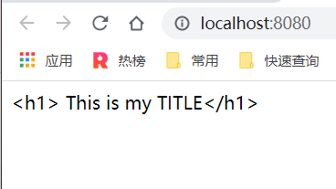

# 插值表达式-内置制定

在通常情况下，我们认为的模版语法仅仅是包含在 `template` 里面的内容，实际上它还包含了 `Vue` 的特性，如表达式、指令和属性等。`Vue` 的模版基于 `HTML`，这意味着模板中直接编写的 `HTML` 代码能够被浏览器的 `HTML` 解析器正确解析。然而，模版中的指令和表达式需要 `Vue` 提供的模板编译系统来处理。

开发者在编写 `template` 内容时，`Vue` 会将其解析为 `HTML` 字符串，然后转换成抽象语法树（AST）。通过遍历 `AST`，`Vue` 将表达式、属性和指令转换为虚拟 DOM 树，最终生成真实的 DOM 并渲染到页面上。

```javascript
// 简单函数
function square(n) {
    return n * n;
}

// 转换后的AST
{
   type: "FunctionDeclaration",
   id: {
       type: "Identifier",
       name: "square"
   },
   params: [
      {
           type: "Identifier",
           name: "n"
      }
   ],
   // 其他属性省略
}
```

# 为什么要有虚拟 DOM？

虚拟 DOM 的引入主要是为了优化性能。当直接操作真实 DOM 时，每一次的修改都可能导致浏览器的重绘和重排，影响性能。通过引入虚拟 DOM，`Vue` 可以在内存中高效地对比新旧虚拟 DOM 树的差异，仅将必要的部分更新到真实 DOM，从而减少不必要的渲染操作。

```javascript
<span>123</span>;
span.innerText = 123;

// span.innerText 的直接修改会影响 DOM 节点的变化
// 而使用虚拟 DOM 后，Vue 可以避免不必要的更新
```

实际上，网页中大多数的变化本质上都是数据的变化。`Vue` 的核心思想是“数据驱动”，即通过数据的变化来驱动视图的更新。这种设计理念使得 `Vue` 能够高效地管理和更新界面。

# 插值表达式

插值表达式允许我们在模板中动态地显示数据。`Vue` 使用双花括号 `{{ }}` 来绑定数据。

```javascript
const App = {
  data() {
    return {
      title: 'This is my title',
    };
  },
  template: `
        <div>
            <h1 class="title">
            {{ title }}
            </h1>
        </div>
    `,
};
Vue.createApp(App).mount('#app');
```

在上述示例中，`{{ title }}` 会被替换为 `data` 中定义的 `title` 的值。当 `title` 的值发生变化时，视图会自动更新以反映新的值。

# Mustache（八字胡）

插值表达式的由来可以追溯到 Mustache 模板引擎。Mustache 使用 `\{{ \}}` 来表示模板中的变量，这种语法被 `Vue` 采纳并加以扩展。

[GitHub - janl/mustache.js: Minimal templating with `\{{mustaches\}}` in JavaScript](https://github.com/janl/mustache.js)

# 数据绑定的绑定的是什么？

数据绑定是 `Vue` 的核心特性之一，它负责将数据模型与视图层连接起来。

绑定的内容主要包括：

1. **`App.data` 中的数据**：这是组件内部的数据，直接绑定到模板中的插值表达式或属性上。

2. **父组件传递进来的属性值**：通过 `props`，父组件可以向子组件传递数据。这种方式使得组件之间能够高效地共享和传递数据。

   使用组件的流程：

   - **定义父组件**：父组件中包含子组件，并通过属性向子组件传递数据。

   - **定义子组件**：子组件通过 `props` 接收来自父组件的数据。

   - **在父组件中声明子组件**：在父组件的模板中使用子组件，并绑定相应的属性。

# directive 指令

`Vue` 提供了大量的内置指令，开发者可以通过 `v-` 前缀来使用这些指令。此外，开发者也可以扩展自定义指令，但需要遵循 `v-` 命名规范。

## v-once

`v-once` 指令用于一次性渲染元素或组件。使用 `v-once` 的元素及其所有子节点只会渲染一次，之后即使数据发生变化，也不会重新渲染。这对于静态内容的渲染可以提升性能。

1. **使用 `v-once` 时，�� 会影响其内部的子元素，使内部的指令仅执行一次。**
2. **视图中，`Vue` 指定的插值表达式的数据变量必须在实例上声明。**

## v-html

`v-html` 指令用于将原始的 HTML 字符串插入到 DOM 中。需要注意的是，`v-html` 不会解析插值表达式中的 HTML，而是将其作为原始 HTML 插入。

```javascript
const App = {
  data() {
    return {
      title: 'This is my TITLE',
    };
  },
  template: `
    <div>
        {{ '<h1>' + title + '</h1>' }}
    </div>  
    `,
};

Vue.createApp(App).mount('#app');
```

**结果**



1. 插值表达式 `{{ '<h1>' + title + '</h1>' }}` 会解析为 `HTML`，因为插值表达式是未经加工的 `rawHTML`，没有对 `DOM` 进行操作。
2. 类似于相机的 `RAW` 文件，这些 `rawHTML` 是未经处理的 `HTML` 内容。
3. 不要尝试使用 `v-html` 来渲染子模板，因为 `Vue` 的编译系统需要处理模板内容。

   ```javascript
   const App = {
     data() {
       return {
         title: '<h1>This is my TITLE</h1>',
       };
     },
     template: `
           <div v-html="title"></div>
       `,
   };
   // 不要使用这种方式去做子模板
   Vue.createApp(App).mount('#app');
   ```

4. `Vue` 底层有自己的一 �� 编译系统，模板内容必须经过 `Vue` 的编译系统才能正确渲染为真实的 `DOM`。
   - 字符串 → `AST` 树 → 虚拟 `DOM` → 真实 `DOM` → 渲染到 `#app`
5. 应遵循 `Vue` 的规则，将子模板放入子组件中，以实现模板的复用和组合的强大功能。

# v-html 会引发的问题

使用 `v-html` 需要谨慎，特别是当插入的内容来自用户输入时，因为这可能导致 `XSS` 攻击。

## 什么是 XSS 攻击?

`XSS`（跨站脚本攻击）通常指攻击者利用网页开发中的漏洞，通过注入恶意脚本代码到网页中，使用户在浏览器中执行这些恶意脚本。这些脚本通常是 `JavaScript`，但也可以是 `Java`、`VBScript`、`ActiveX`、`Flash`，甚至是普通的 `HTML`。攻击成功后，攻击者可能窃取用户的敏感信息，如会话 `cookie`，或者执行一些未授权的操作。

## 被利用的 innerHTML

1. **`v-html` 动态渲染 `HTML` 的实现机制**：`v-html` 基本上是通过设置元素的 `innerHTML` 来实现的。

2. **`innerHTML` 容易导致 `XSS` 攻击**。例如：

   ```javascript
   // 插入到 DIV 中，虽然 HTML5 对某些标签有严格限制
   var text = '<script>alert(123)</script>';
   document.getElementById('app').innerHTML = text;

   // 但 img 标签可以执行 onerror 事件
   var text = '';
   document.getElementById('app').innerHTML = text;
   ```

3. **潜在风险**：攻击者可以利用一些标签和事件来注入和执行恶意脚本，因此在使用 `v-html` 时必须格外小心。

4. **安全建议**：
   - 不要将用户提供的内容直接作为 `v-html` 的插值。
   - 对用户输入的内容进行严格的过滤和消毒，防止恶意代码的注入。
   - 尽量避免在处理用户输入时使用 `v-html`，以确保网站的安全性。
