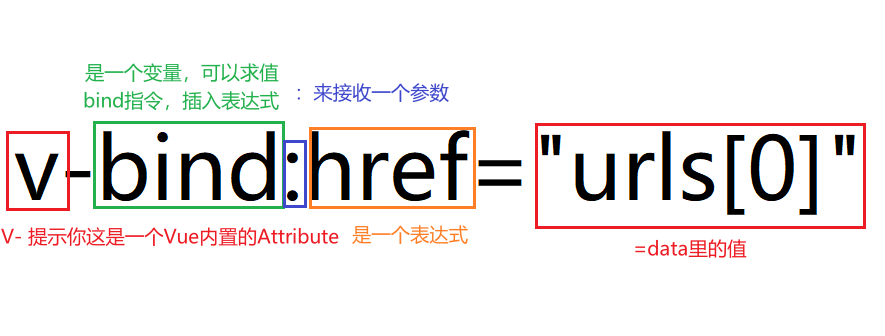

# Vue.js 条件渲染详解

## v-if 删除节点

示例代码（可以在控制台进行查看 DOM 结构，方便理解更深刻）

```javascript
const App = {
  data() {
    return {
      currentLinkIndex: 0,
      urls: ['www.taobao.com', 'www.tmall.com', 'www.jd.com'],
    };
  },
  template: `
    <div>
        <p v-if="currentLinkIndex === 0">
            <a :href="urls[0]" target="_blank">淘宝商城</a>
        </p>
        <p v-else-if="currentLinkIndex === 1">
            <a :href="urls[1]">天猫商城</a>
        </p>
        <p v-else>
            <a :href="urls[2]">京东商城</a>
        </p>
    </div>
    <div>
        <button @click="changeIndex(0)">淘宝</button>
        <button @click="changeIndex(1)">天猫</button>
        <button @click="changeIndex(2)">京东</button>
    </div>
    `,
  methods: {
    changeIndex(index) {
      this.currentLinkIndex = index;
    },
  },
};

Vue.createApp(App).mount('#app');
```

## v-show 隐藏节点

示例代码（可以在控制台进行查看`DOM`结构，方便理解更深刻）

```javascript
const App = {
  data() {
    return {
      currentLinkIndex: 0,
      urls: ['www.taobao.com', 'www.tmall.com', 'www.jd.com'],
    };
  },
  template: `
    <div>
        <p v-show="currentLinkIndex === 0">
            <a :href="urls[0]" target="_blank">淘宝商城</a>
        </p>
        <p v-show="currentLinkIndex === 1">
            <a :href="urls[1]">天猫商城</a>
        </p>
        <p v-show="currentLinkIndex === 2">
            <a :href="urls[2]">京东商城</a>
        </p>
    </div>
    <div>
        <button @click="changeIndex(0)">淘宝</button>
        <button @click="changeIndex(1)">天猫</button>
        <button @click="changeIndex(2)">京东</button>
    </div>
    `,
  methods: {
    changeIndex(index) {
      this.currentLinkIndex = index;
    },
  },
};

Vue.createApp(App).mount('#app');
```

## 理解指令



## 动态属性名的使用

动态的属性名参数不能出现空格和引号，因为 HTML 的合法属性名不能出现空格和引号。

```javascript
<!-- <h1 v-bind:['data-'+attr]="tag">{{title}}</h1> -->
<h1 :[attr]="tag">{{title}}</h1>
```

`null` 作为属性是无效的。但是 `null` 可以解除属性绑定，我们可以定义方法来解除属性绑定。

```javascript
<h1 :[null]="tag">{{title}}</h1>
```

## 插值表达式访问的问题

自己定义的全局变量，插值表达式是访问不到的

插值表达式有一个受限列表，可以点击查看

[Vuejs/vue-next](https://github.com/vuejs/vue-next/tree/master/packages/shared/src)
