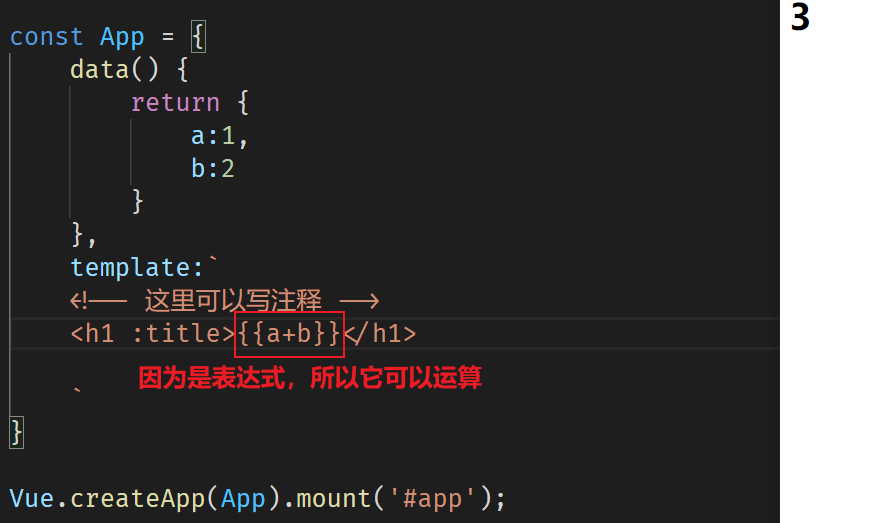

# Vue.js 属性与插值详解

## 属性

### Attribute（attr）

属性通常指的是 HTML 的扩展，例如`title`、`src`、`href`。

### Property（prop）

属性通常用来描述数据结构，在对象内部存储数据。

### Mustache 与 Vue 的插值方式

Mustache 语法在属性中默认不支持插值。然而，Vue 通过其底层的模板编译系统，使得在属性中进行插值成为可能。

## HTML 的`id`与指令`id`的区别

```html
<h1 v-bind:id="title"></h1>
<h1 id="title"></h1>
```

`v-bind:id`后面的`title`是一个表达式，用于动态绑定数据。而 HTML 的`id`属性则是一个静态的字符串。

## 插入表达式的不同情况

使用`{{ }}`在标签内部插入内容时，如果是静态页面，可能会出现闪烁现象。相比之下，使用`v-bind:xx=""`在属性上插入内容，可以更稳定地处理动态数据。

## 示例代码

```javascript
const App = {
  data() {
    return {
      imageUrl: 'https://cdn4.buysellads.net/uu/1/3386/1525189943-38523.png',
      titleText: 'ads via Carbon',
      contentText: 'All-in-one',
      isUserLoggedIn: true,
    };
  },
  template: `
    <article>
        <h1>{{ titleText }}</h1>
        <div>
            
        </div>
        <p :title="contentText" :id="null" :class="undefined">
            {{ contentText }}
        </p>
        <p>
            <textarea :disabled="!isUserLoggedIn" placeholder="请填写评论"></textarea>
        </p>
    </article>
    `,
};

Vue.createApp(App).mount('#app');
```

## 代码解释

- `disabled="true"` 对于模板解析，`true` 是一个字符串，不代表逻辑上的真。
- `:disabled="true"` 则表示逻辑上的真。
- `!isUserLoggedIn` 为真时，`isUserLoggedIn` 为假。

**总结：** Vue 的指令`v-*`后面一定是一个表达式，用于动态绑定数据。

## Truthy 与 Falsy

### Falsy

包括以下值：

- `false`
- `0`
- `""`（空字符串）
- `null`
- `undefined`
- `NaN`

### Truthy

除了 Falsy 之外的所有值都是 Truthy。

**注意：** 只有`true`、`false`、`""`和 Truthy 值会在解析过程中将`disabled`属性包含在元素上。

## 插值插入的内容

1. 插值插入的是一个表达式。
2. 不是语句、函数、声明、赋值或模块。



### 可进行插值的几种情况

```html
<!-- 字符串拼接 -->
<h2>{{ 'a+b=' + (a + b) }}</h2>

<!-- 判断表达式：if语句无法正常解析，会被当作data中的内容 -->
<h3>{{ if (a + b > 5) { return } else { return '小于等于5' }}}</h3>

<!-- 三元表达式 -->
<h3>{{ a + b > 5 ? '大于5' : '小于等于5' }}</h3>

<!-- 逻辑或 -->
<h3>{{ title || subTitle }}</h3>

<!-- 逻辑与 -->
<h3>{{ title && subTitle }}</h3>

<!-- 使用JavaScript API -->
<h4>{{ title.replace('MAIN', '') }}</h4>
<h4>{{ subTitle.split('').reverse().join('-') }}</h4>

<!-- 绑定多个表达式 -->
<!-- 一个插值只能绑定一个表达式，不能绑定多个表达式 -->
<h5>{{ a + b > 5 ? '大于5' : '小于等于5' }}</h5>

<!-- 绑定语句 -->
<!-- 语句无法绑定，声明和赋值语句不可以 -->
{{ var a = 1; }}

<!-- 赋值表达式可以 -->
{{ a = 1 }}
```

**注意事项：**

- 插值中不能使用语句，如`if`语句。
- 每个插值只能包含一个表达式，不能包含多个表达式或语句。
- 赋值表达式可以在插值中使用，但不推荐这样做，以保持模板的纯粹性和可维护性。
