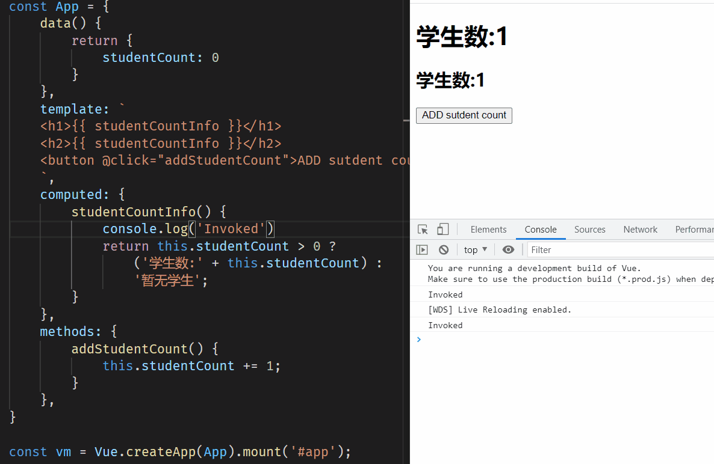
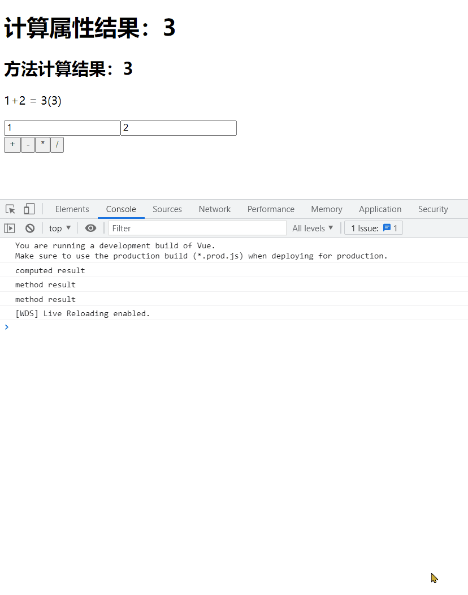
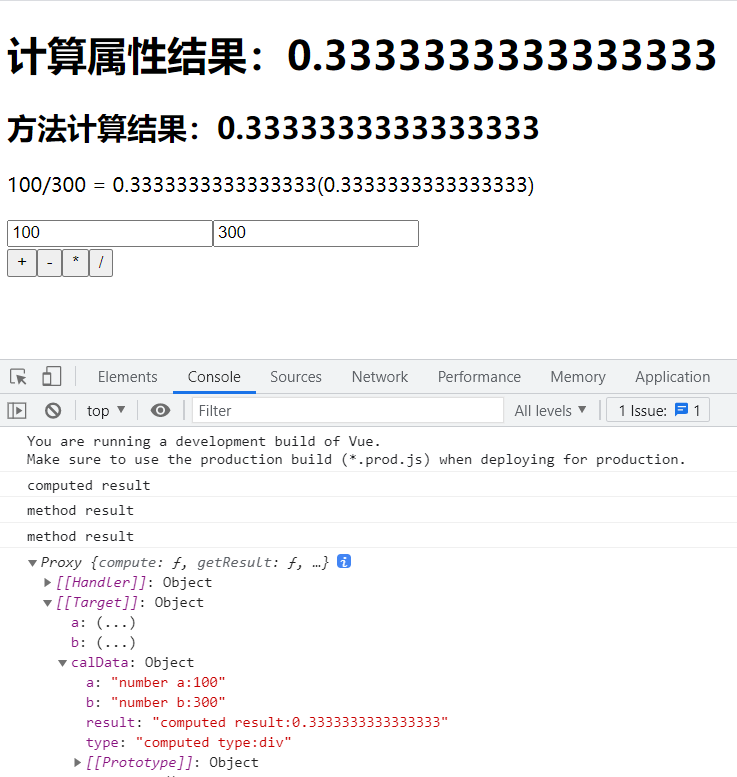

# 计算属性的作用与优化实践

计算属性在模板中解决复杂逻辑运算和复用问题，只有在其依赖的数据发生变化时才会重新计算。

## 模板中存在过多逻辑

```javascript
const App = {
  data() {
    return {
      studentCount: 1,
    };
  },
  // 模板逻辑和样式尽可能地分离
  template: `
    <h1>{{ studentCount > 0 ? '学生数:' + studentCount : '暂无学生' }}</h1>
    <h2>{{ studentCount > 0 ? '学生数:' + studentCount : '暂无学生' }}</h2>
    `,
};
const vm = Vue.createApp(App).mount('#app');
```

在上述代码中，模板中的样式和逻辑混合在一起，并且在模板中分别对`h1`和`h2`进行了两次相同的运算。这不仅增加了代码的复杂性，还导致了不必要的计算开销。

## 优化后的模板逻辑

```javascript
const App = {
  data() {
    return {
      studentCount: 0,
    };
  },
  template: `
    <h1>{{ studentCountInfo }}</h1>
    <h2>{{ studentCountInfo }}</h2>
    `,
  computed: {
    studentCountInfo() {
      return this.studentCount > 0 ? '学生数:' + this.studentCount : '暂无学生';
    },
  },
};
const vm = Vue.createApp(App).mount('#app');
```

通过引入计算属性`studentCountInfo`，逻辑运算仅执行一次。计算属性只有在依赖的数据`studentCount`发生变化时才会重新计算，并且其结果会被缓存，避免了多次计算的开销。

## 数据依赖变化时的重新调用

逻辑运算结果需要被复用。当`studentCount`的值发生变化时，计算属性`studentCountInfo`会重新计算，从而更新模板中的显示内容。

## methods 与 computed 的比较



设计一个计算器示例，比较 methods 和 computed 的性能。

```javascript
const App = {
  data() {
    return {
      a: 1,
      b: 2,
      operationType: 'plus',
    };
  },
  template: `
      <div>
          <h1>计算属性结果：{{ result }}</h1>
          <h2>方法计算结果：{{ getResult() }}</h2>
          <p>
              <span>{{ a }}</span>
              <span>{{ symbol }}</span>
              <span>{{ b }}</span>
              <span> = </span>
              <span>{{ result }}</span>
              <span> ({{ getResult() }})</span>
          </p>
          <div>
              <input type="number" v-model="a"/>
              <input type="number" v-model="b"/>
          </div>
          <div>
              <button @click="setOperation('plus')">+</button>
              <button @click="setOperation('minus')">-</button>
              <button @click="setOperation('multiply')">*</button>
              <button @click="setOperation('divide')">/</button>
          </div>
      </div>  
    `,
  computed: {
    symbol() {
      switch (this.operationType) {
        case 'plus':
          return '+';
        case 'minus':
          return '-';
        case 'multiply':
          return '*';
        case 'divide':
          return '/';
        default:
          return '';
      }
    },
    result() {
      console.log('computed result');
      const numA = Number(this.a);
      const numB = Number(this.b);

      switch (this.operationType) {
        case 'plus':
          return numA + numB;
        case 'minus':
          return numA - numB;
        case 'multiply':
          return numA * numB;
        case 'divide':
          return numA / numB;
        default:
          return NaN;
      }
    },
  },
  methods: {
    setOperation(type) {
      this.operationType = type;
    },
    getResult() {
      console.log('method result');
      const numA = Number(this.a);
      const numB = Number(this.b);

      switch (this.operationType) {
        case 'plus':
          return numA + numB;
        case 'minus':
          return numA - numB;
        case 'multiply':
          return numA * numB;
        case 'divide':
          return numA / numB;
        default:
          return NaN;
      }
    },
  },
};
const vm = Vue.createApp(App).mount('#app');
```

### 结果比较



### 结果分析

计算属性`result`只有在其依赖的数据发生改变时才会重新计算，并且其结果被缓存。相比之下，`getResult`方法在模板中被调用时，每次都会重新计算，没有缓存机制。因此，使用计算属性在性能上更具优势。

## 将每次计算结果保存为对象

### 代码示例

```javascript
const App = {
  data() {
    return {
      a: 1,
      b: 2,
      operationType: 'plus',
    };
  },
  template: `
    <div>
        <h1>计算属性结果：{{ result }}</h1>
        <h2>方法计算结果：{{ getResult() }}</h2>
        <p>
            <span>{{ a }}</span>
            <span>{{ symbol }}</span>
            <span>{{ b }}</span>
            <span> = </span>
            <span>{{ result }}</span>
            <span> ({{ getResult() }})</span>
        </p>
        <div>
            <input type="number" v-model="a"/>
            <input type="number" v-model="b"/>
        </div>
        <div>
            <button @click="setOperation('plus')">+</button>
            <button @click="setOperation('minus')">-</button>
            <button @click="setOperation('multiply')">*</button>
            <button @click="setOperation('divide')">/</button>
        </div>
    </div>  
    `,
  computed: {
    symbol() {
      switch (this.operationType) {
        case 'plus':
          return '+';
        case 'minus':
          return '-';
        case 'multiply':
          return '*';
        case 'divide':
          return '/';
        default:
          return '';
      }
    },
    result() {
      console.log('computed result');
      const numA = Number(this.a);
      const numB = Number(this.b);

      switch (this.operationType) {
        case 'plus':
          return numA + numB;
        case 'minus':
          return numA - numB;
        case 'multiply':
          return numA * numB;
        case 'divide':
          return numA / numB;
        default:
          return NaN;
      }
    },
    calculationData: {
      get() {
        return {
          a: 'number a:' + this.a,
          b: 'number b:' + this.b,
          type: 'computed type:' + this.operationType,
          result: 'computed result:' + this.result,
        };
      },
      set(newValue) {
        this.a = Number(newValue.a.split(':')[1]);
        this.b = Number(newValue.b.split(':')[1]);
        this.operationType = newValue.type.split(':')[1];
      },
    },
  },
  methods: {
    setOperation(type) {
      this.operationType = type;
    },
    getResult() {
      console.log('method result');
      const numA = Number(this.a);
      const numB = Number(this.b);

      switch (this.operationType) {
        case 'plus':
          return numA + numB;
        case 'minus':
          return numA - numB;
        case 'multiply':
          return numA * numB;
        case 'divide':
          return numA / numB;
        default:
          return NaN;
      }
    },
  },
};
const vm = Vue.createApp(App).mount('#app');
vm.calculationData = {
  a: 'number a:100',
  b: 'number b:300',
  type: 'computed type:divide',
};
console.log(vm);
```

### 缓存到实例上

计算属性`calculationData.result`被缓存到实例上。



## 最佳实践

- **优先使用计算属性**：避免过度依赖方法，利用计算属性的缓存机制提升性能。
- **分离逻辑与样式**：将复杂的逻辑运算从模板中抽离出来，使用计算属性进行处理，使模板更加简洁。
- **复用计算结果**：在需要多次使用同一计算结果的场景下，计算属性能够有效减少不必要的计算开销。
- **合理命名变量**：使用易读的变量名，提升代码的可维护性和可读性。

---
