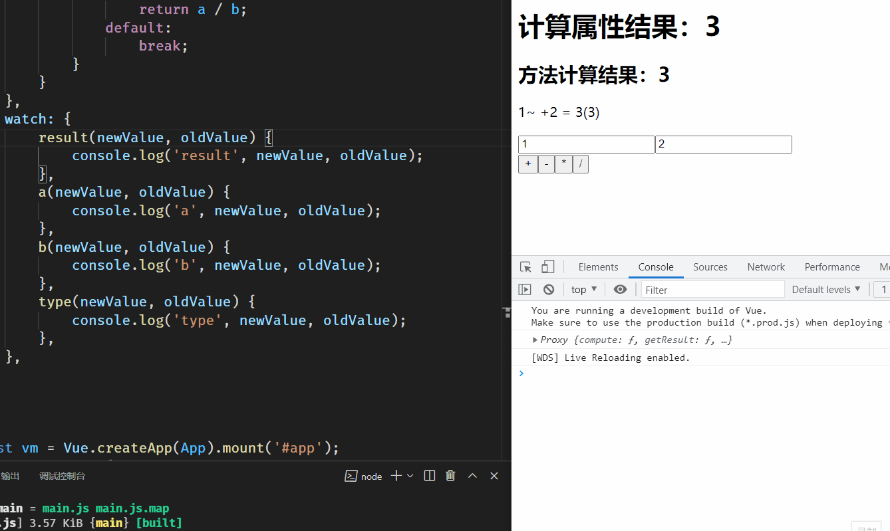

# `computed`和`watch`比较

## `computed`计算属性

`computed`计算属性主要用于抽离模板中的复杂逻辑计算。当依赖的响应式属性发生变化时，计算属性会重新计算并缓存结果到实例上。这意味着只有在相关依赖项变化时，计算属性才会重新执行，提升了性能和效率。

## `watch`侦听器

`watch`侦听器用于监听数据的更新，并在数据变化时执行相应的逻辑。它适用于需要在数据更新后完成特定操作的场景，例如在数据变化后发送`AJAX`请求。需要注意的是，`watch`仅在数据更新时触发，首次数据初始化时不会被侦听。

## `watch`代码示例

```javascript
watch: {
    result(newValue, oldValue) {
        console.log('result', newValue, oldValue);
    },
    a(newValue, oldValue) {
        console.log('a', newValue, oldValue);
    },
    b(newValue, oldValue) {
        console.log('b', newValue, oldValue);
    },
    type(newValue, oldValue) {
        console.log('type', newValue, oldValue);
    },
},
```

## 完整代码

[Vue 计算属性](https://www.yuque.com/sumingcheng/gs6i1z/vcgmee)

## 执行效果


