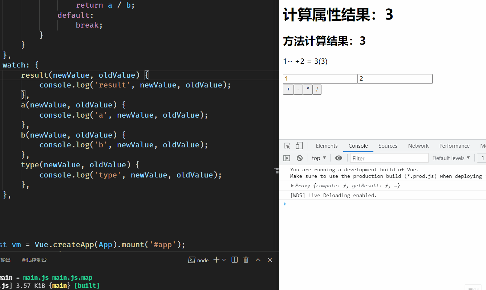

# watch 与 computed 的深入比较

## watch 侦听器

`watch`侦听器关注于数据的更新。它为数据添加侦听器，当数据发生变化时，侦听器函数会被执行。`watch`的特点是在数据更新时完成特定的逻辑操作，例如在数据变化后发送`AJAX`请求。

## computed 计算属性

`computed`计算属性主要关注于模板中的逻辑处理。它用于抽离和复用模板中复杂的逻辑运算。当计算属性依赖的响应式属性发生变化时，计算属性会重新调用并更新其值。

## watch 的应用

### 即时回调侦听器

即时回调侦听器允许在侦听器初始化时立即执行回调函数。通过设置`immediate`为`true`，可以在数据初始化时也触发回调。

```javascript
watch: {
    question: {
        handler(newQuestion) {
            // 处理新的问题
            console.log('问题已更新:', newQuestion);
        },
        immediate: true
    }
}
```

### 侦听器回调触发的时机

可以通过设置`flush`选项来控制侦听器回调的触发时机。将`flush`设置为`'post'`，侦听器将在 Vue 完成 DOM 更新之后执行回调函数。

```javascript
watch: {
    question: {
        handler(newQuestion) {
            // 在DOM更新后处理新的问题
            console.log('问题已更新并且DOM已刷新:', newQuestion);
        },
        flush: 'post'
    }
}
```

## watch 与 computed 的实战对比

在实际开发中，选择使用`watch`还是`computed`取决于具体的需求。如果需要基于多个数据源进行复杂计算并在模板中使用，`computed`是更合适的选择，因为它具有缓存机制，能提升性能。而如果需要在数据变化时执行异步操作或进行一些副作用处理，如发送网络请求，`watch`则更为适用。

例如，假设我们有一个搜索功能，需要根据用户输入动态过滤结果：

### 使用 computed

```javascript
computed: {
    filteredResults() {
        return this.items.filter(item => item.includes(this.searchQuery));
    }
}
```

### 使用 watch

```javascript
watch: {
    searchQuery(newQuery) {
        this.fetchResults(newQuery);
    }
},
methods: {
    fetchResults(query) {
        // 发送AJAX请求获取结果
        axios.get(`/api/search?q=${query}`).then(response => {
            this.items = response.data;
        });
    }
}
```

在上述例子中，`computed`用于实时计算过滤后的结果，而`watch`则用于在搜索查询变化时触发数据的异步获取。

## 完整代码示例

[Vue watch 与 computed 应用示例](https://www.yuque.com/sumingcheng/gs6i1z/vcgmee)

## 执行效果


