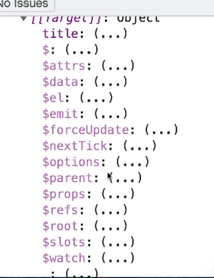
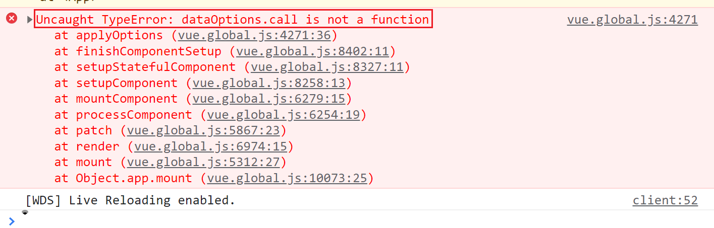

# Data

`data` 在 Vue 实例中扮演着核心角色，负责存储和管理应用的状态。以下是关于 `data` 的关键要点：

`data` 必须是一个函数。在创建 Vue 实例时，Vue 会调用 `data` 函数并返回一个数据对象。这确保了每个实例都有自己独立的数据副本，避免了数据共享带来的潜在问题。

通过响应式包装，`data` 中的属性被存储在实例的 `$data` 对象中。这样，实例可以直接访问这些属性，而无需通过 `$data` 进行中介。例如，`vm.title` 直接访问的是 `vm.$data.title`，两者效果相同。

## 两种 `data` 的使用方式

Vue 提供了两种访问 `data` 中属性的方式：

`$data` 是响应式数据对象。通常情况下，实例上的属性与 `data` 中的属性是一一对应的。如果不一致，Vue 在渲染时会报错。因此，开发者应尽量避免在 `data` 中使用以 `$`、`_` 等前缀命名的属性，以防与 Vue 的内置 API 冲突。

实例上可以通过 `this._` 进行访问。这种方式允许我们通过 `get` 和 `set` 方法来访问和修改数据。例如：

```javascript
vm.$data.title;
vm.title;
```

两者都可以用来获取或设置 `title` 属性的值，效果相同。



## 为什么 `data` 是一个函数？

将 `data` 定义为函数有以下几个原因：

1. **确保数据的独立性**：每个 Vue 实例在创建时都会调用 `data` 函数，返回一个新的数据对象。这确保了每个实例的数据是独立的，互不干扰。

2. **避免数据共享**：如果 `data` 是一个对象，那么所有实例将共享同一个数据引用，这可能导致意想不到的副作用。通过使用函数返回独立的数据对象，可以避免这种情况。

3. **简化数据管理**：尽管可以通过深拷贝来确保 `data` 对象的独立性，但将 `data` 定义为函数更加简洁和高效，符合 Vue 的设计理念。



## **defineGetter** 和 **defineSetter**

在 Vue 中，数据的响应式实现依赖于 `Object.defineProperty` 方法。然而，为了兼容性，Vue 也使用了 `__defineGetter__` 和 `__defineSetter__` 方法。这些方法允许我们通过 `get` 和 `set` 来访问和修改数据属性。

以下是一个示例：

```javascript
// 使用 Object.defineProperty 实现响应式
Object.defineProperty(_this, k, {
  get: function () {
    return _this.$data[k];
  },
  set: function (newValue) {
    _this.$data[k] = newValue;
  },
});

// 使用 __defineGetter__ 和 __defineSetter__ 实现响应式
_this.__defineGetter__(k, function () {
  return _this.$data[k];
});

_this.__defineSetter__(k, function (newValue) {
  _this.$data[k] = newValue;
});
```

这种方法确保了当数据属性发生变化时，视图能够自动更新，从而实现数据与视图的双向绑定。

## 最佳实践

在使用 `data` 时，遵循以下最佳实践可以提升代码的可维护性和性能：

- **避免使用保留前缀**：不要在 `data` 属性名中使用 `$`、`_` 等前缀，以免与 Vue 的内置属性和方法发生冲突。

- **保持数据简单**：尽量保持 `data` 中的数据结构简单，避免嵌套过深，以便更容易进行管理和调试。

- **使用描述性变量名**：选择具有描述性的变量名，使代码更具可读性。例如，使用 `userName` 而不是 `name1`。

- **初始化所有属性**：在 `data` 中初始化所有需要的属性，即使它们暂时没有值。这有助于避免在后续开发中出现未定义的属性错误。

通过合理地设计和管理 `data`，可以确保 Vue 应用的稳定性和可扩展性。
