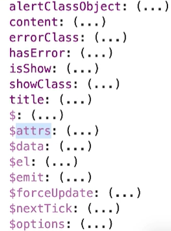

# Vue.js 视图绑定指南

## class 的视图绑定

`v-bind`用于在标签上绑定属性，`Vue`对`v-bind:class`和`v-bind:style`进行了特殊的封装，支持多种绑定形式，包括对象和数组的方式。

### 字符串形式

在字符串形式下，类名是静态的，直接写在`class`属性中。

```javascript
<template>
  <div class="active">This is active</div>
  <div class="container">This is container</div>
</template>
```

### 对象形式

对象形式允许根据数据动态绑定类名。通过布尔值来控制类名的添加与移除。

```javascript
<template>
  <div :class="{ active: isActive }">This is active</div>
  <div :class="{ active: isActive2 }">This is active</div>
</template>

<script>
export default {
  name: 'App',
  data() {
    return {
      isActive: true,
      isActive2: false
    }
  }
}
</script>
```

### 静态类名和动态类名共存

可以同时使用静态类名和动态类名，通过`:class`绑定对象来控制动态部分。

```javascript
<template>
  <div
    class="static"
    :class="{ active: isActive, error: hasError}"
  >This is active</div>
</template>

<script>
export default {
  name: 'App',
  data() {
    return {
      isActive: true,
      hasError: true
    }
  }
}
</script>
```

### 抽离样式逻辑

将类名逻辑抽离到计算属性中，使模板更加简洁，并便于维护。

```javascript
<template>
  <div :class="classObject">This is active</div>
</template>

<script>
export default {
  name: 'App',
  data() {
    return {
      isActive: true,
      error: null
    }
  },
  computed: {
    classObject() {
      return {
        active: this.isActive && !this.error,
        error: this.error
      }
    }
  }
}
</script>
```

### 数组形式

数组形式允许同时绑定多个类名，静态类名以字符串形式，动态类名通过变量传递。

```javascript
<template>
  <div :class="[activeClass, errorClass]"></div>
  <div :class="['static', activeClass]"></div>
</template>

<script>
export default {
  data() {
    return {
      activeClass: 'active',
      errorClass: 'text-danger'
    }
  }
}
</script>
```

### 组件上使用

在`Vue2`中，父组件的`class`值会传递到子组件上。

```javascript
// 子组件
const MyComponent = {
  template: `
    <div class="active">this is component</div>
  `
}

// 父组件
const App = {
  data() {
    return {}
  },
  components: {
    MyComponent
  },
  template: `
    <div class="my-app">
      <my-component class="my-component"></my-component>
    </div>
  `
}
</script>
```

#### $attrs

在`Vue3`中，可以使用`$attrs.class`接收父组件传递的类名。



```javascript
const MyComponent = {
  mounted() {
    console.log(this);
  },
  template: `
    <div class="active1">div</div>
    <div :class="['active2', $attrs.class]">div2</div>
  `
}

const App = {
  data() {
    return {}
  },
  components: {
    MyComponent
  },
  template: `
    <div class="my-app">
      <my-component class="my-component"></my-component>
    </div>
  `
}
</script>
```

## style 的视图绑定

### 对象形式

通过对象形式绑定样式，可以直接在模板中定义样式对象，或者将样式对象抽离到`data`中。

```javascript
<template>
  <button :style="{
    color: '#fff',
    'background-color': 'red',
    backgroundColor: btnBgColor
  }"></button>

  <button :style="btnStyle"></button>
</template>

<script>
export default {
  data() {
    return {
      btnBgColor: 'blue',
      btnStyle: {
        backgroundColor: 'red'
      }
    }
  }
}
</script>
```

### 数组形式

数组形式允许绑定多个样式对象，便于复用公共样式。

```javascript
<template>
  <div :style="[btnStyle, commonBtnStyle]"></div>
</template>

<script>
export default {
  data() {
    return {
      btnStyle: {
        color: '#fff',
        backgroundColor: 'red'
      },
      commonBtnStyle: {
        borderRadius: '17px'
      }
    }
  }
}
</script>
```

#### 样式多值

`Vue`会渲染数组中最后一个被浏览器支持的值。如果浏览器支持不带前缀的值，则渲染不带前缀的值。需要注意，这种检测是在代码运行时进行的，而不是在编译时。

```javascript
<template>
  <div :style="{ display: ['-webkit-box', '-ms-flexbox', 'flex'] }"></div>
</template>
```
