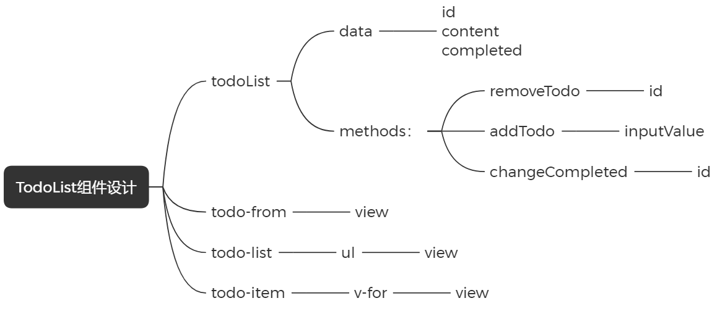

# 什么是组件化

`Vue` 使用 `ES Module` 进行模块化，构建了 `Vue` 的组件系统。组件化是指将页面拆分为多个小型、独立、可预先定义配置且可复用的组件。

小型意味着将页面拆分成多个小单元。独立则表示这些小单元可以独立开发。预先定义指每个小单元可以提前定义好，按需导入使用。预先配置允许小单元接收在使用时需要的配置。可复用性意味着这些小单元可以多次使用。然而，复用性需要适当考量，因为有些组件不需要复用。

组件的主要作用在于独立开发和预先配置，以便更好地维护和拓展。可配置性越高，组件的功能性就越强。为了减少依赖性，组件应尽可能提高纯度，尽量少使用外部资源。

# TodoList 案例

```javascript
{
    id: new Date().getTime(),
    content: inputValue,
    completed: false
}
```

## 组件



## 代码

### main.js

```javascript
const { createApp } = Vue;

const TodoList = {
  data() {
    return {
      todoList: [
        {
          id: 1,
          content: '123',
          completed: false,
        },
        {
          id: 2,
          content: '234',
          completed: false,
        },
        {
          id: 3,
          content: '345',
          completed: false,
        },
      ],
    };
  },
  methods: {
    removeTodo(id) {
      this.todoList = this.todoList.filter((item) => item.id !== id);
    },
    addTodo(value) {
      this.todoList.push({
        id: new Date().getTime(),
        content: value,
        completed: false,
      });
    },
    toggleCompleted(id) {
      this.todoList = this.todoList.map((item) => {
        if (item.id === id) {
          item.completed = !item.completed;
        }
        return item;
      });
    },
  },
};

const app = createApp(TodoList);

app.component('todo-form', {
  data() {
    return {
      inputValue: '',
    };
  },
  template: `
        <div>
            <input type="text" placeholder="请输入" v-model="inputValue"/>
            <button @click="addTodo">增加</button>
        </div>
    `,
  methods: {
    addTodo() {
      this.$emit('add-todo', this.inputValue);
      this.inputValue = '';
    },
  },
});

app.component('todo-item', {
  props: ['todo'],
  template: `
        <li>
            <input
                type="checkbox"
                :checked="todo.completed"
                @click="toggleCompleted(todo.id)"
            />
            <span 
                :style="{
                    textDecoration: todo.completed ? 'line-through' : 'none'
                }"
            >
                {{ todo.content }}
            </span>
            <button @click="removeTodo(todo.id)">删除</button>
        </li>
    `,
  methods: {
    toggleCompleted(id) {
      this.$emit('toggle-completed', id);
    },
    removeTodo(id) {
      this.$emit('remove-todo', id);
    },
  },
});

app.mount('#app');
```

### index.js

```html
<!DOCTYPE html>
<html lang="zh-CN">
  <head>
    <meta charset="UTF-8" />
    <meta http-equiv="X-UA-Compatible" content="IE=edge" />
    <meta name="viewport" content="width=device-width, initial-scale=1.0" />
    <title>TodoList</title>
  </head>
  <body>
    <div id="app">
      <div class="todo-list">
        <div>
          <todo-form @add-todo="addTodo"></todo-form>
        </div>
        <div>
          <ul>
            <todo-item v-for="item in todoList" :key="item.id" :todo="item" @toggle-completed="toggleCompleted" @remove-todo="removeTodo"></todo-item>
          </ul>
        </div>
      </div>
    </div>
    <script src="https://cdn.jsdelivr.net/npm/vue@3.1.2/dist/vue.global.js"></script>
    <script src="main.js"></script>
  </body>
</html>
```
