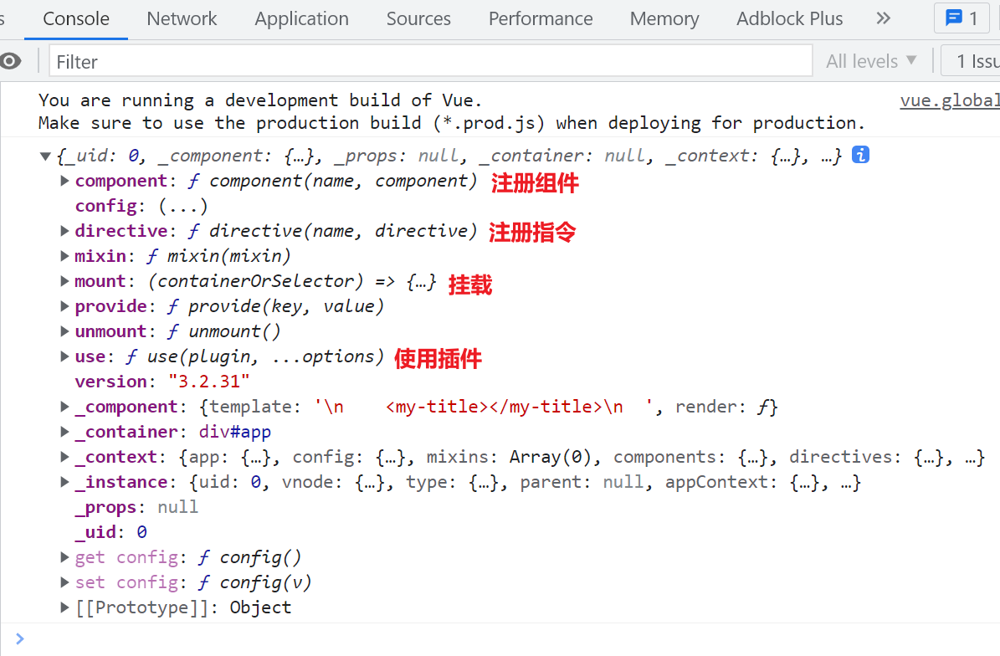
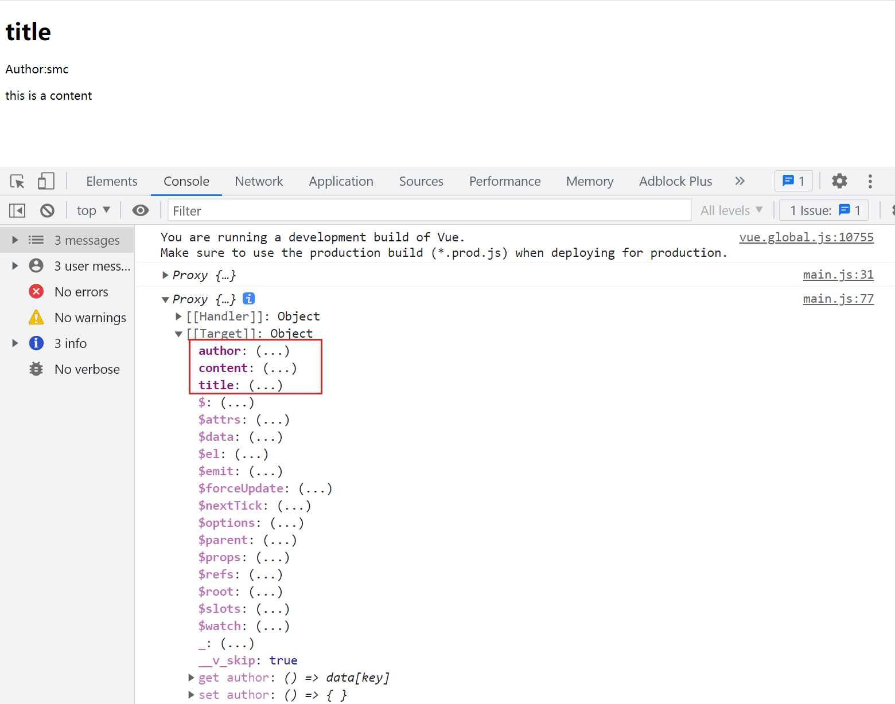

# 应用实例

`createApp` 创建 `APP` 并返回一个应用实例。

```javascript
const app = Vue.createApp({});
console.log(app);
```

应用实例提供了许多可用的方法。这些方法大多数都会返回通过 `createApp` 创建的应用实例，便于进行链式操作。

```javascript
const app = Vue.createApp({});
const appInstance = app.component('MyTitle', {
  data() {
    return {
      title: 'HTML',
    };
  },
  template: `<h1>{{ title }}</h1>`,
});
console.log(app === appInstance); // true

app.mount('#app');
```



## 实例上暴露了很多方法

`createApp` 创建的应用实例提供了多种方法：

- `component` 注册组件
- `directive` 注册指令
- `filter` 注册过滤器
- `use` 使用插件

这些方法大多数都会返回应用实例本身，支持链式调用。

## 链式调用

通过链式调用，可以简化应用实例的配置。例如，下面的代码展示了如何注册组件和指令，并挂载应用：

```javascript
const app = Vue.createApp({});
const appInstance = app
  .component('MyTitle', {
    data() {
      return {
        title: 'HTML',
      };
    },
    template: `<h1 v-to-lower-case>{{ title }}</h1>`,
  })
  .directive('toLowerCase', {
    mounted(el) {
      el.addEventListener(
        'click',
        function () {
          this.innerText = this.innerText.toLowerCase();
        },
        false
      );
    },
  })
  .mount('#app');
```

# 根组件（VM）

**根组件的本质是一个对象**

根组件是 Vue 渲染的起点，通过 `createApp({})` 创建时需要传入一个对象。根组件是 Vue 应用正常渲染的基础。

## mount

`mount` 方法返回的是根组件实例，而不是应用实例。

```javascript
// 返回的是根组件实例
const vm = app.mount('#app');
// 如果 HTML 中使用的是 class，也可以这样挂载
const vm = app.mount('.app');
```

## vm 命名

`Vue` 并不完全符合 `mvvm` 模型，仅参考了其中的 `vm`（viewmodel）部分。

# 根元素

根元素是一个 `HTML` 元素。当执行 `createApp` 创建 Vue 实例时，需要指定一个根元素。因此，需要在 HTML 中包含一个类似 `<div id="app">` 的元素来作为根元素。

# 组件实例

每个组件都有自己的组件实例，一个应用中的所有组件共享一个应用实例。无论是根组件还是其他组件，配置选项和组件行为都是一致的。

```javascript
const MyTitle = {
  template: `
      <h1>
        <slot></slot>
      </h1>
    `,
  mounted() {
    console.log(this);
  },
};

const MyAuthor = {
  template: `
      <p>
        Author:<slot></slot>
      </p>
    `,
};
const MyContent = {
  template: `
      <p>
        <slot></slot>
      </p>
    `,
};

const App = {
  components: {
    MyTitle,
    MyAuthor,
    MyContent,
  },
  data() {
    return {
      title: '标题',
      author: '作者',
      content: '这是内容',
    };
  },
  template: `
        <div>
          <my-title>{{ title }}</my-title>
          <my-author>{{ author }}</my-author>
          <my-content>{{ content }}</my-content>
        </div>
      `,
};

const app = Vue.createApp(App);

const vm = app.mount('#app');
console.log(vm);
```



组件实例可以添加自定义属性，例如 `property`。Vue 为组件实例自定义添加了一些属性，如 `data`、`props`、`components`、`methods` 等。同时，组件实例还包含内置方法如 `this.$attrs` 和 `this.$emit`。

# 生命周期函数

组件在初始化过程中会经历多个阶段，`Vue` 提供了相应的生命周期钩子函数，这些函数会在对应的初始化阶段自动执行。

## 初始化的整个过程

详细内容可参考 [生命周期钩子 | Vue.js](https://staging-cn.vuejs.org/guide/essentials/lifecycle.html)

## 虚拟节点

虚拟节点的存在是为了优化 DOM 操作，减少不必要的更新。例如：

```javascript
<span>123</span>;
span.innerText = 123;

// 直接操作 DOM 会导致不必要的更新
// 使用虚拟 DOM 可以避免这种情况
```

虚拟 DOM 通过在内存中维护一个虚拟节点树，只有在必要时才会更新实际的 DOM 节点，从而提高性能。

## 示例代码

### `index.html`

```html
<!DOCTYPE html>
<html lang="en">
  <head>
    <meta charset="UTF-8" />
    <meta http-equiv="X-UA-Compatible" content="IE=edge" />
    <meta name="viewport" content="width=device-width, initial-scale=1.0" />
    <title>Vue 应用示例</title>
    <!-- <script src="./src/main.js"></script> -->
  </head>
  <body>
    <div id="app">
      <!-- 组件使用时采用 kebab-case 命名法 -->
    </div>
    <script src="https://cdn.jsdelivr.net/npm/vue@3.1.2/dist/vue.global.js"></script>
  </body>
</html>
```

### `index.js`

```javascript
const MyTitle = {
  template: `
        <h1>
            <slot></slot>
        </h1>
    `,
  mounted() {
    console.log(this);
  },
};

const MyAuthor = {
  template: `
        <p>
            Author: <slot></slot>
        </p>
    `,
};

const MyContent = {
  template: `
        <p>
            <slot></slot>
        </p>
    `,
};

const App = {
  components: {
    // 组件定义时采用 PascalCase 命名法
    MyTitle,
    MyAuthor,
    MyContent,
  },
  data() {
    return {
      title: '这是一个标题',
      author: '小叶',
      content: '这是内容',
    };
  },
  template: `
        <div>
            <my-title>{{ title }}</my-title>
            <my-author>{{ author }}</my-author>
            <my-content>{{ content }}</my-content>
        </div>
    `,
};

const app = Vue.createApp(App);
const vm = app.mount('#app');
console.log('这里打印 Vue ↓');
console.log(Vue);
```
