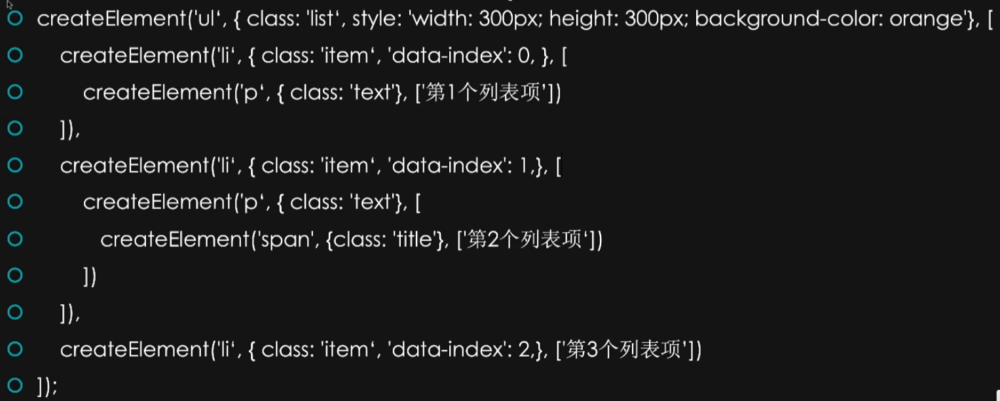
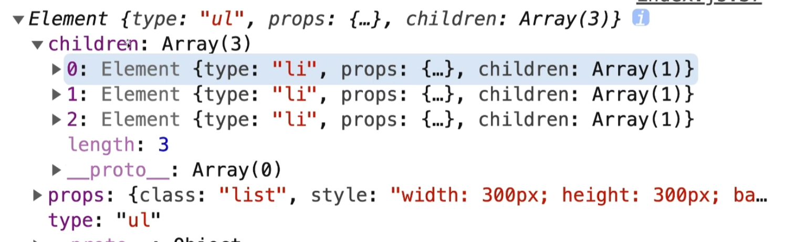

# 虚拟 DOM 概述

## 特点

同级比较  
深度优先  
位置不同直接替换

## 虚拟节点的结构

```javascript
createElement(tagName, props, children);
```



## 实际渲染



## 最佳实践

在使用虚拟 DOM 时，确保组件的唯一性和稳定性可以提高渲染效率。合理管理组件的状态和属性，有助于减少不必要的重新渲染。同时，理解虚拟 DOM 的工作原理，可以帮助开发者优化应用性能。

## 示例代码

以下示例展示了如何使用`createElement`创建一个简单的虚拟节点：

```javascript
const vnode = createElement('div', { className: 'container' }, [createElement('h1', null, 'Hello, Virtual DOM'), createElement('p', null, 'This is a simple example.')]);
```

在这个示例中，我们创建了一个包含标题和段落的`div`元素。通过这种方式，虚拟 DOM 能够高效地管理和更新 UI。
