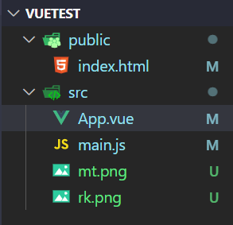

# 搭建vue项目
```javascript
vue create vue-xxx
```

## 删除除图中以外所有文件


# 实现功能
1. 实现一个符合浏览器解析规则的`.js`文件
2. 用标准的`JS`语法实现`Vue`的功能

# 建立服务应用
让文件可以`import`和`export default`

# 初始化package.json
通过`package.json`来管理依赖和版本还有启动命令。

```javascript
npm init -y
```

# 安装webpack
```powershell
yarn add webpack@4 webpack-cli@3 webpack-dev-server@3
```

## 配置webpack
```javascript
const { resolve } = require('path');
const HtmlWebpackPlugin = require('html-webpack-plugin')
// 导出一个对象
module.exports = {
  // 启动模式
  mode: "development",
  // 拿到入口文件
  entry: resolve(__dirname, 'src/main.js'),
  // 输出
  output: {
    filename: 'main.js',
    path: resolve(__dirname, 'dist')
  },
  // 省略掉.js 和 .vue
  resolve: {
    extensions: ['.js', '.vue']
  },
  // 先去node_modules找包，找不到去modules里找
  resolveLoader: {
    modules: [
      'node_modules',
      resolve(__dirname, './modules')
    ]
  },
  module: {
    // 处理相关文件
    rules: [{
      // 忽略大小写
      test: /.vue$/i,
      // 使用自己写的 vue-loader
      loader: 'vue-loader'
    },
            {
              test: /.css$/i,
              // 先经过css-loader处理再经过style-lodaer
              use: ['style-loader', 'css-loader']
            }
           ]
  },
  plugins: [
    // 使用它来处理HTML模版，帮忙把css和js放入html中
    new HtmlWebpackPlugin({
      template: resolve(__dirname, 'public/index.html')
    })
  ]
}
```

# 安装css相关loader
```powershell
 npm i style-loader@2 css-loader@5 -D
```

# 安装`html-webpack-plugin`
把我们处理好的`css`和`js`注入到`html`模版中

```powershell
npm i html-webpack-plugin@4.5 -D
```

# 项目代码
[GitHub - sumingcheng/From-webpack-to-vue-loader: 利用HtmlWebpackPlugin实现vue-loader的功能](https://github.com/sumingcheng/From-webpack-to-vue-loader)

