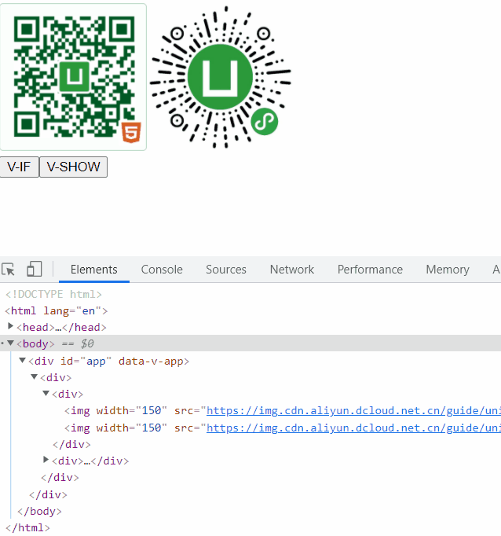
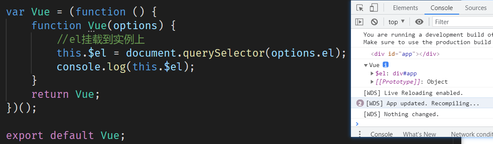
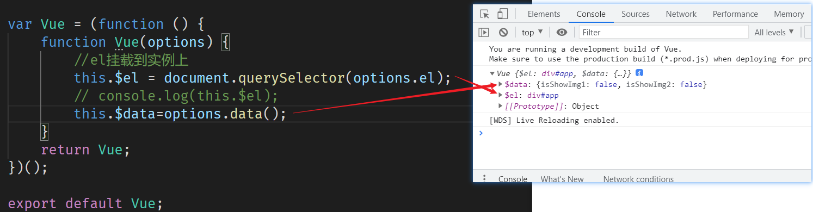

# v-if 和 v-show 比较


1. `v-if`直接把注释节点替换掉（改变`DOM`结构）
2. `v-show`从样式的角度把图片隐藏（不改变`DOM`结构）

## 代码
```javascript
const {
    createApp
} = Vue;

var App ={
    data() {
        return {
            isShowImg1:false,
            isShowImg2:false
        }
    },
    template:`
        <div>
        <div>
            
            
        </div>
        <div >
            <button @click="showImg1">V-IF</button>
            <button @click="showImg2">V-SHOW</button>    
        </div>
        </div>
    `,
    methods: {
        showImg1(){
            this.isShowImg1 = !this.isShowImg1;
        },
        showImg2(){
            this.isShowImg2 = !this.isShowImg2;
        }
    },
}
var vm= Vue.createApp(App).mount('#app');

console.log(vm);
```

# v-if和v-show实现
## 挂载到实例


# 总结
1. `v-show` 通过 `display` 来控制显示和隐藏。
2. `v-if` 将组建进行真正的渲染和销毁，不是控制显示和隐藏。
3. 频繁切换使用`v-show`，不频繁使用`v-if`。

