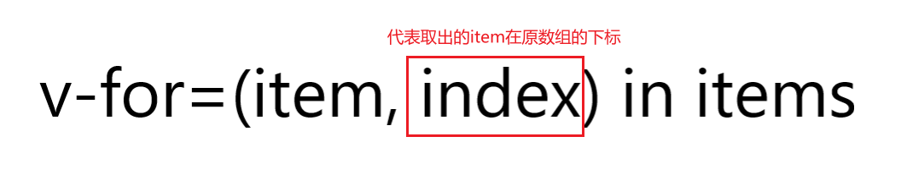
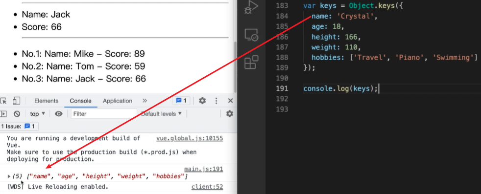
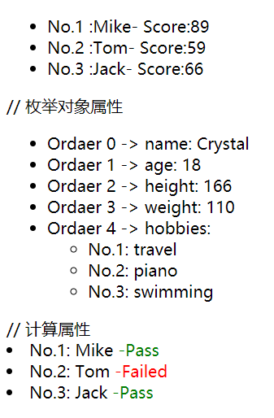
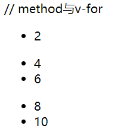
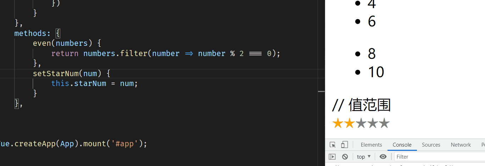
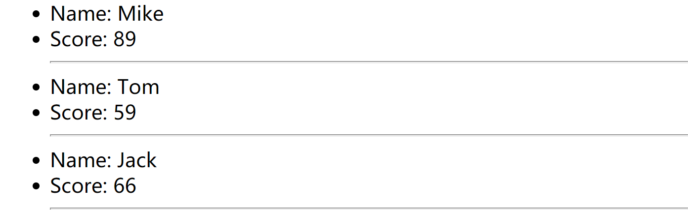
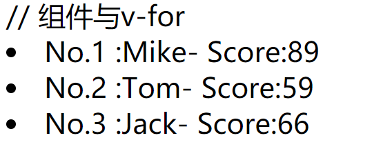

# v-for 列表渲染

1. 指令表达式 ->` (item，index) in/of list`
2. `index`可选项 ->`item in/of list `
3. `in/of` 都可以使用 数组|对象，在`Vue`中，两种都是一套定义方法
4. 在`JavaScript`中，枚举对象或者遍历概念里

## 对比

1. `for in` —> 一般都是**对象属性的枚举**
2. `for of` —> 是可迭代**对象的遍历**

# 二、如何使用

1. 遍历可迭代对象 —> `for of (item，index)`
2. 枚举对象属性 —> `for in  (value，key，index)`

## `v-for`语法`(item, index, list)`

```javascript
[1, 2, 3].forEach((item, index, list) => {
  // 名称任意取,符合变量命名规范,具备语义化表达
  console.log('数组元素别名', item);
  // 名称任意取,符合变量命名规范,具备语义化表达
  console.log('元素在数组中对应的下标：', index);
  // 名称是对应data里的数组数据的属性名
  console.log('需要遍历的数组', list);
});
```

## 以遍历数组为例

当我们有一组数组数据的时候，我们就可以用`v-for`指令来进行渲染。

```javascript
<div v-for="movie in movies">
```

这段的含义是，依次从数组`movies`中取出`movie`，并且我们可以使用`Mustache`语法，来使用`movie`。

## 在遍历过程中，我们怎么拿到元素在数组中的下标呢？

```javascript
  <div v-for="(item,index) of item">
```



# 三、v-for 搭配建议

1. `v-for` 建议搭配`:key`
2. `:key`的数据必须是唯一值（不可以变化）
3. `:key`的作用是为了方便`Vue`就地更新策略的实施
4. 当数组成员不变的时候，只操作数组内容的时候，加不加`:key`都一样，我们就可以使用`index`，但是数组所在的`dom`还有其他内容就得加`:key`做标记了因为这个时候`:key`的作用有两个
   1. 是为了高效的更新虚拟`DOM`
   2. 使用`:key`的时候，我们可以更方便的操作数组中的元素，并且不会出现删除数组所在`DOM`时，影响其他内容的`bug`。

```javascript
var App = {
  data() {
    return {
      list: [
        {
          id: 1,
          name: 'Mike',
          score: 89,
        },
        {
          id: 2,
          name: 'Tom',
          score: 59,
        },
        {
          id: 3,
          name: 'Jack',
          score: 66,
        },
      ],
    };
  },
  template: `
    <ul>
        <li v-for="(item,index) of list" :key="item.id">
            <span> No.{{ item.id }} </span>
            <span> :{{ item.name }}- </span>
            <span> Score:{{ item.score }} </span>
        </li>
    </ul>
    `,
};
Vue.createApp(App).mount('#app');
```

# 四、遍历对象

```javascript
var App = {
  data() {
    return {
      list: [
        {
          id: 1,
          name: 'Mike',
          score: 89,
        },
        {
          id: 2,
          name: 'Tom',
          score: 59,
        },
        {
          id: 3,
          name: 'Jack',
          score: 66,
        },
      ],
      privateInfo: {
        name: 'Crystal',
        age: 18,
        height: 166,
        weight: 110,
        hobbies: ['travel', 'piano', 'swimming'],
      },
    };
  },
  template: `
    <ul>
        <li v-for="(item,index) of list" :key="item.id">
            <span> No.{{ item.id }} </span>
            <span> :{{ item.name }}- </span>
            <span> Score:{{ item.score }} </span>
        </li>
    </ul>
    
    // 枚举对象属性
    <ul>
    <li v-for="(value,key,index) of privateInfo" :key="index">
        <span> Ordaer {{ index }} -> </span>
        <span> {{ key }}: </span>
				//这里的template相当于根节点，简单来理解是就最外层的div
        <template v-if="key === 'hobbies'">
            <ul>
                <li v-for="(item,index) of value" :key="index">
                    <span> No.{{ index + 1 }}: </span>
                    <span> {{ item }} </span>
                </li>
            </ul>
        </template>
        <template v-else>
            <span> {{ value }} </span>
        </template>
    </li>
    </ul>
   `,
};
Vue.createApp(App).mount('#app');
```

**这里的**`**template**`**相当于根节点，简单来理解是就最外层的**`**div**`

## 遍历对象的顺序

按照`object.keys()`的结果进行遍历



# 五、计算属性与`v-for`

```javascript
    // 计算属性
    <li v-for="item of computedList" :key="item.id">
        <span>No.{{ item.id }}: </span>
        <span>{{ item.name }}</span>
        <span :style="{ color: item.pass ? 'green' : 'red' }">
            -{{ item.pass ? 'Pass' : 'Failed' }}
        </span>
    </li>
```

## 结果



# 六、`method`与`v-for`

```javascript
var App = {
  data() {
    return {
      myArray: [
        [1, 2, 3],
        [4, 5, 6],
        [7, 8, 9, 10],
      ],
    };
  },
  template: `

    // method与v-for
    <ul v-for="numbers of myArray" >
        <li v-for="number of even(numbers)"> {{ number }} </li>
    </ul>
    // 值范围
    `,
  methods: {
    even(numbers) {
      return numbers.filter((number) => number % 2 === 0);
    },
    setStarNum(num) {
      this.starNum = num;
    },
  },
};

Vue.createApp(App).mount('#app');
```

## 结果



# 七、值范围的问题

```javascript
var App = {
  data() {
    return {
      myArray: [
        [1, 2, 3],
        [4, 5, 6],
        [7, 8, 9, 10],
      ],
      starNum: 3,
    };
  },
  template: `
    // 值范围
    <div>
        <span 
            v-for="s in 5"
            :key="s"
            :style="{  color:s <= starNum ? 'orange' : 'grey' }"
            @click="setStarNum(s)"
        >★</span>
    </div>  
    `,
  methods: {
    even(numbers) {
      return numbers.filter((number) => number % 2 === 0);
    },
    setStarNum(num) {
      this.starNum = num;
    },
  },
};
Vue.createApp(App).mount('#app');
```

## 效果图



# 八、`template`与`v-for`

```javascript
var App = {
  data() {
    return {
      list: [
        {
          id: 1,
          name: 'Mike',
          score: 89,
        },
        {
          id: 2,
          name: 'Tom',
          score: 59,
        },
        {
          id: 3,
          name: 'Jack',
          score: 66,
        },
      ],
    };
  },
  template: `
    // template与v-for
    <ul>
        <template v-for="item of list" :key="item.id">
            <li>
                Name: {{ item.name }}
            </li>
            <li>
                Score: {{ item.score }}
            </li>
            <hr>
        </template>
    </ul>
    `,
};

Vue.createApp(App).mount('#app');
```

## 结果



# 九、组件与`v-for`

```javascript
//组件定义
var ListItem = {
  props: {
    item: Object,
  },
  template: `
    <li>
        <span> No.{{ item.id }} </span>
        <span> :{{ item.name }}- </span>
        <span> Score:{{ item.score }} </span>
    </li>
    `,
};
var App = {
  data() {
    return {
      list: [
        {
          id: 1,
          name: 'Mike',
          score: 89,
        },
        {
          id: 2,
          name: 'Tom',
          score: 59,
        },
        {
          id: 3,
          name: 'Jack',
          score: 66,
        },
      ],
    };
  },
  template: `
    <ul>
        <li v-for="(item,index) of list" :key="item.id">
            <span> No.{{ item.id }} </span>
            <span> :{{ item.name }}- </span>
            <span> Score:{{ item.score }} </span>
        </li>
    </ul>
    // 组件与v-for
    <list-item 
        v-for="item of list"
        :key="item.id"
        :item="item"
        >
    </list-item>

    `,
  //组件注册
  components: {
    ListItem,
  },
};

Vue.createApp(App).mount('#app');
```

## 结果



## `:item="item"`

1. `item`是不会自动传入组件的
2. 避免`v-for`与组件功能和数据产生耦合
3. 保证组件有合理的配置性
4. 达到最好的复用效果
