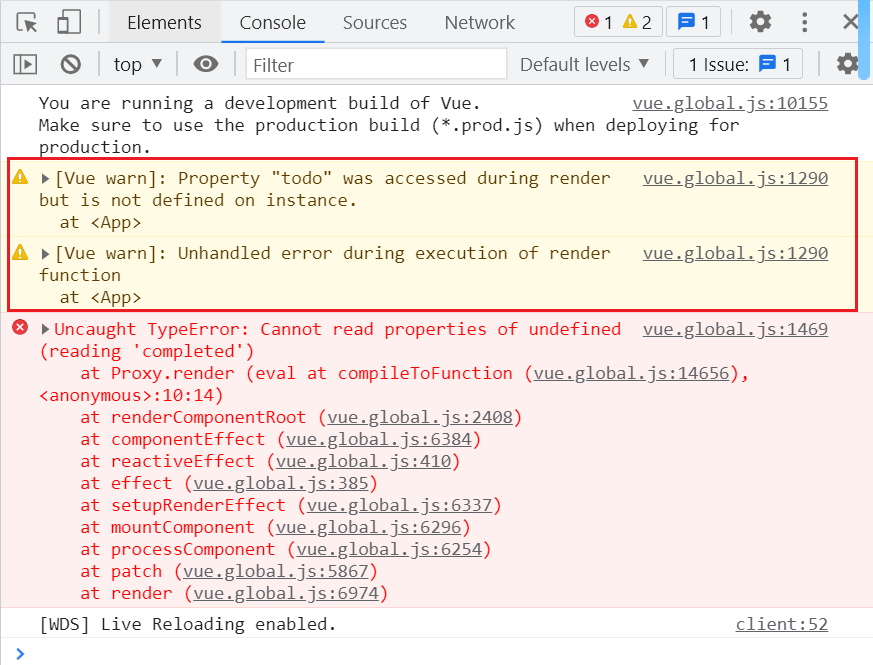

# v-for 和 v-if 联合使用指南

```javascript
const App = {
  data() {
    return {
      todoList: [
        {
          id: 1,
          content: 'Content 1',
          completed: true,
        },
        {
          id: 2,
          content: 'Content 2',
          completed: false,
        },
        {
          id: 3,
          content: 'Content 3',
          completed: true,
        },
      ],
    };
  },
  template: `
    <ul>
      <li 
        v-for="todo of todoList" 
        :key="todo.id"
        v-if="!todo.completed"
      >
        {{ todo.content }}
      </li>
    </ul>
  `,
};
Vue.createApp(App).mount('#app');
```

运行结果



访问 `todo` 时无法获取，因为在渲染阶段 `todo` 尚不存在。

## 优先级

`v-if` 和 `v-for` 同时用于一个元素时，`v-if` 的优先级高于 `v-for`。因此，`v-if` 无法直接访问 `todo`，只有在 `v-for` 执行后，`v-if` 才能访问到 `todo`。

在渲染期间，属性 `todo` 被访问，但未定义，因此无法获取。

## 如何解决这个问题

可以将 `v-for` 移至其他元素上，建议使用 `template`，因为 `template` 不会占据实际结构。

## template

```javascript
const App = {
  data() {
    return {
      todoList: [
        {
          id: 1,
          content: 'Content 1',
          completed: true,
        },
        {
          id: 2,
          content: 'Content 2',
          completed: false,
        },
        {
          id: 3,
          content: 'Content 3',
          completed: true,
        },
      ],
    };
  },
  template: `
    <ul>
      <template v-for="todo of todoList" :key="todo.id">
        <li>{{ todo.content }}</li>
      </template>
    </ul>
  `,
};

Vue.createApp(App).mount('#app');
```

## 使用 computed 控制

```vue
template: `
<ul>
    <li
      v-for="todo of notCompletedTodoList"
      :key="todo.id"
    >
      {{ todo.content }}
    </li>
  </ul>
`, computed: { notCompletedTodoList() { return this.todoList.filter(item => !item.completed); } },
```

控制 `ul` 的加载，避免 `v-for` 循环不必要的元素。

```vue
template: `
<ul v-if="todoList.length > 0">
    <li v-for="todo of todoList" :key="todo.id">
      {{ todo.content }}
    </li>
  </ul>
`, computed: { notCompletedTodoList() { return this.todoList.filter(item => !item.completed); } },
```

[风格指南 | Vue.js](https://v3.cn.vuejs.org/style-guide/#%E4%B8%BA-v-for-%E8%AE%BE%E7%BD%AE-key-%E5%80%BC%E5%BF%85%E8%A6%81)

# 为什么 Vue2 中 v-for 的优先级高于 v-if？

## 从逻辑层级来看

`if` 决定是否渲染，`for` 决定如何渲染。

`if` 优先于 `for`，首先决定是否渲染，再决定渲染的方式。

从性能角度，先决定是否渲染，避免不必要的渲染判断，提高性能。
