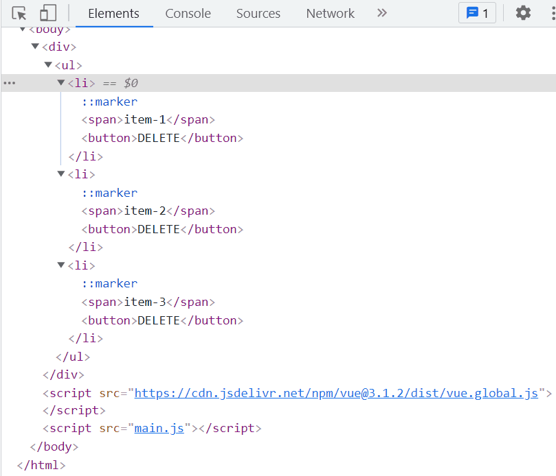

# 就地更新和 v-for 的 key 属性

```bash
yarn add vue
```

在 `webpack` 中配置

```javascript
resolve: {
  alias: {
    'vue$': 'vue/dist/vue.esm.js'
  }
}
```

`main.js`

```javascript
import Vue from 'vue';

const App = {
  data() {
    return {
      items: [
        { id: 1, name: 'item-1' },
        { id: 2, name: 'item-2' },
        { id: 3, name: 'item-3' },
      ],
    };
  },
  template: `
    <div>
      <ul>
        <li v-for="(item, index) in items" :key="item.id">
          <span>{{ item.name }}</span>
          <button @click="removeItem(index)">DELETE</button>
        </li>
      </ul>
    </div>
  `,
  methods: {
    removeItem(index) {
      this.items.splice(index, 1);
    },
  },
};

new Vue({
  render: (h) => h(App),
}).$mount('#app');
```

执行结果



# 就地更新

**点击 item-2 的 DELETE 按钮时发生了什么？**

点击 `item-2` 的 DELETE 按钮后，`item-3` 被移动到 `item-2` 的位置，然后 `item-3` 被删除。

## 就地更新的好处

Vue 尽可能复用现有的 `DOM` 元素，直接在已有的 `DOM` 上进行修改，这样可以提升性能。

## 就地更新的缺点

[Vue Template - CodeSandbox](https://codesandbox.io/s/vue-template-xmt14?fontsize=14&file=/src/main.js)

在删除 `item-3` 时，`item-2` 的内容被错误地替换为 `item-3` 的内容。为了解决这个问题，每个 `li` 元素需要一个唯一的 `key` 值。这可以防止 Vue 在更新时混淆元素。此外，在操作数据时，尽量避免使用数组的索引作为 `key`，因为这可能导致渲染错误。

# 最佳实践

为每个列表项提供一个唯一的 `key` 值，例如使用数据中的 `id`。避免使用数组索引作为 `key`，以确保 Vue 能够准确地跟踪每个元素，避免渲染错误和性能问题。

```javascript
<li v-for="item in items" :key="item.id">
  <span>{{ item.name }}</span>
  <button @click="removeItemById(item.id)">DELETE</button>
</li>
```

```javascript
methods: {
  removeItemById(id) {
    this.items = this.items.filter(item => item.id !== id)
  }
}
```

通过使用唯一的 `id` 作为 `key`，Vue 能够正确地识别和更新每个元素，避免不必要的重新渲染和潜在的错误。

# 相关链接

- [Vue 官方文档](https://vuejs.org/v2/guide/list.html#key)

# 代码演示

以下是完整的 `main.js` 示例，展示了如何正确使用 `key` 属性和删除列表项：

```javascript
import Vue from 'vue';

const App = {
  data() {
    return {
      items: [
        { id: 1, name: 'item-1' },
        { id: 2, name: 'item-2' },
        { id: 3, name: 'item-3' },
      ],
    };
  },
  template: `
    <div>
      <ul>
        <li v-for="item in items" :key="item.id">
          <span>{{ item.name }}</span>
          <button @click="removeItemById(item.id)">DELETE</button>
        </li>
      </ul>
    </div>
  `,
  methods: {
    removeItemById(id) {
      this.items = this.items.filter((item) => item.id !== id);
    },
  },
};

new Vue({
  render: (h) => h(App),
}).$mount('#app');
```

执行上述代码后，删除任意项都不会影响其他项的内容，确保渲染的正确性。

# 图片示例


