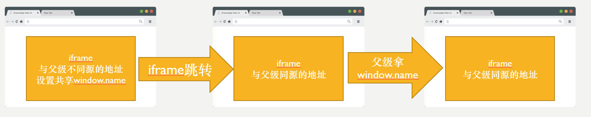
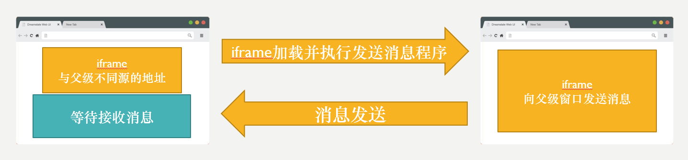
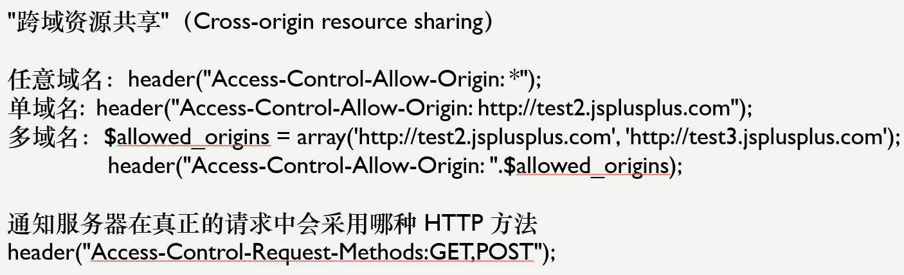
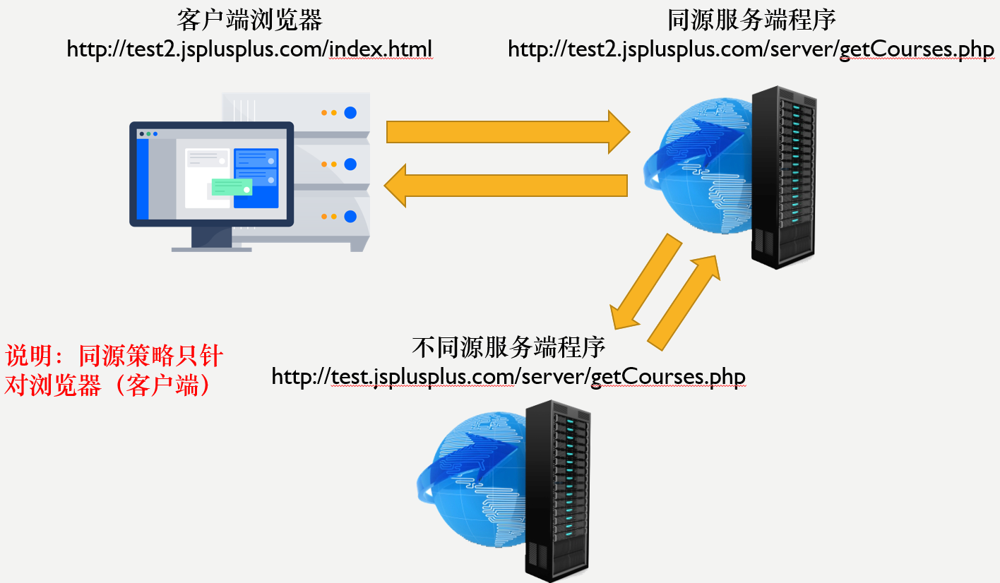
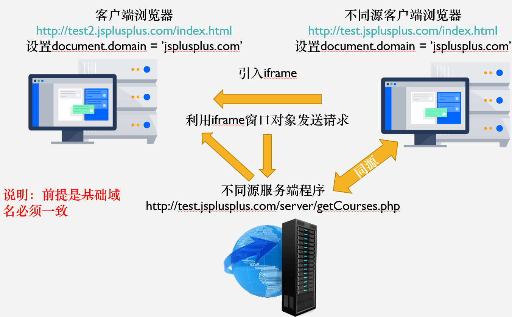
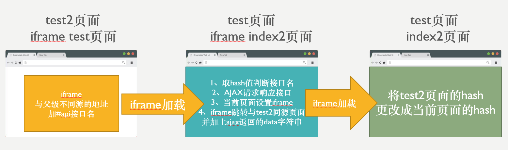

# 跨域 HTTP 请求的六种方法

## 同源策略与跨域

在讨论跨域方法之前，我们先来了解一下同源策略和跨域的概念。

源(域名)由三部分组成：协议 + 域名 + 端口。当两个 URL 的协议、域名和端口完全相同时，我们称它们是同源的。反之，如果协议、域名或端口有任意一项不同，就称为跨域。

## window.name 跨域

`window.name`是一个特殊的全局变量，它有以下特点：



每个浏览器窗口（包括`iframe`）都有一个全局的`window`对象，而`window.name`是`window`对象的一个属性。
同一个窗口的生命周期内，`window.name`的值可以被所有页面共享和修改。
即使在窗口加载了不同的页面，`window.name`的值也不会改变。
`window.name`可以存储约 2M 的数据。
如果父窗口和`iframe`的源不同，父窗口无法通过`iframe.contentWindow.name`获取值，但`iframe`内部不受此限制。

基于以上特点，我们可以利用`window.name`来实现跨域数据传输。具体方法是：先在`iframe`中保存需要传输的数据到`window.name`，然后将`iframe`跳转到一个与父窗口同源的页面，这时父窗口就可以获取到`iframe`的`window.name`了。

## postMessage 跨域

`postMessage`是一种安全的跨域通信方式，它的使用方法如下：

```javascript
otherWindow.postMessage(message, targetOrigin);
```

otherWindow：接收消息的窗口的引用，比如`iframe.contentWindow`。
message：需要发送的数据，可以是任意基本类型或可复制的对象。
targetOrigin：接收方窗口的源，格式为`协议://域名:端口`，或者`*`表示不限制域。



需要注意的是，接收方窗口需要监听`message`事件来接收数据。

虽然`postMessage`是一种安全的跨域方式，但在使用时仍需注意以下问题：

数据可能被恶意网页伪造。
可能引发 XSS 攻击。
浏览器兼容性问题。
调试时容易出错。

## 跨域资源共享（CORS）

CORS 是一个 W3C 标准，它允许浏览器向跨域的服务器发送请求。通过在服务端设置`Access-Control-Allow-Origin`就可以开启 CORS。



CORS 请求分为两类：简单请求和非简单请求。

简单请求需同时满足以下两个条件：

请求方法是 HEAD、GET 或 POST。
请求头的取值范围：Accept、Accept-Language、Content-Language、Last-Event-ID、Content-Type（只限于 application/x-www-form-urlencoded、multipart/form-data、text/plain）。

不满足以上条件的就是非简单请求，非简单请求会先发一次预检请求，询问服务器是否允许该请求，得到肯定答复后才会发送真正的请求。

虽然 CORS 是一种强大的跨域解决方案，但在使用时需要注意 CORS 请求可能会引发一些安全问题，需要在服务端做好防范。

## 其他跨域方法

除了上述几种主流的跨域方法，还有一些其他的跨域方式：

### 服务器中转

将跨域请求先发送到与页面同源的服务器，再由服务器转发到目标服务器，得到响应后再转发回页面。这种方式完全依赖后端实现。



### document.domain

对于主域名相同而子域名不同的情况，可以通过设置`document.domain`来实现跨域。



具体做法是在两个页面中分别设置`document.domain`为相同的主域名，然后就可以通过`iframe.contentWindow`来获取`iframe`页面的`window`对象，从而实现数据通信。

需要注意的是，这种方法只适用于主域名相同的情况。

### location.hash

`location.hash`可以用来传递少量的数据，传输方式是将数据写入 URL 的 hash 部分。



由于数据是明文传输的，所以只适合传输一些非敏感的小数据。
